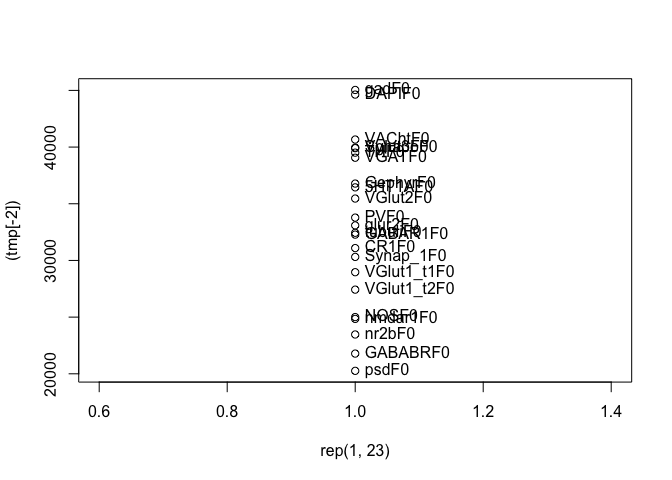

We are working with the linearly scaled \[0,1000\] dataset on Feature 0 (integrated brightness). The dataset has been randomly split into two relatively equal halves. We will be using the first half.

``` r
set.seed(317)  ## Set seed for reproducibility 
s1 <- sample(dim(dat)[1], 5e3)
d1 <- dat[s1]
```

Here we compute the total variational distance and minimize over markers:

\[ \min_K{\sum_i \Vert d(X^i_1 - X^i_2) - d(X^i_1 - X^i_k) \Vert} = \min_k{\sqrt{\langle X_1 - X_2, X_1 - X_k\rangle}} \]

``` r
d2 <- function(x, y){ sqrt(crossprod(as.matrix(x) - as.matrix(y)))}


X1 <- dat[, Synap_1F0]
X2 <- dat[, Synap_2F0]

tmp <- lapply(c(1:24), function(y) {sqrt(crossprod(d2(X1, X2) - d2(X1, dat[, y, with=FALSE])))})

tmp <- Reduce(cbind, tmp)

(tmp <-  t(tmp))
```

    ##             Synap_1F0
    ## Synap_1F0    30310.41
    ## Synap_2F0        0.00
    ## VGlut1_t1F0  28963.18
    ## VGlut1_t2F0  27424.28
    ## VGlut2F0     35459.61
    ## Vglut3F0     39903.44
    ## psdF0        20260.68
    ## glur2F0      33091.09
    ## nmdar1F0     24842.07
    ## nr2bF0       23468.31
    ## gadF0        45038.79
    ## VGATF0       39060.15
    ## PVF0         33778.63
    ## GephyrF0     36781.14
    ## GABAR1F0     32277.06
    ## GABABRF0     21783.07
    ## CR1F0        31090.53
    ## 5HT1AF0      36446.37
    ## NOSF0        25004.67
    ## THF0         39507.86
    ## VAChtF0      40666.00
    ## SynapoF0     39954.67
    ## tubuliF0     32438.33
    ## DAPIF0       44630.80

``` r
plot(rep(1,23),(tmp[-2]))
text(1,(tmp), label=rownames(tmp), pos=4)
```



So `psd` is the closest.
