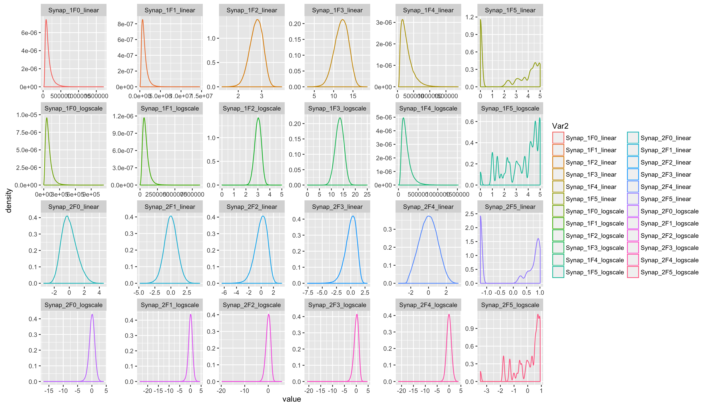
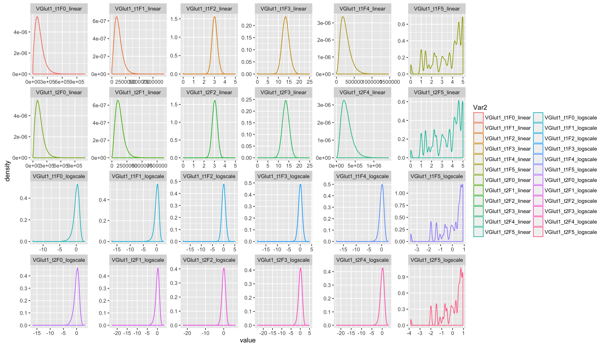
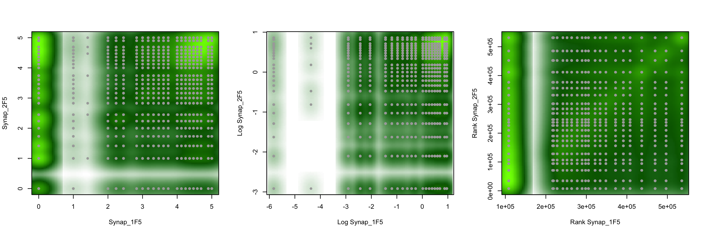
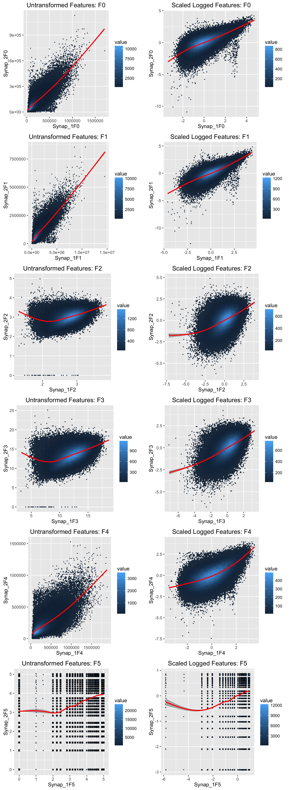
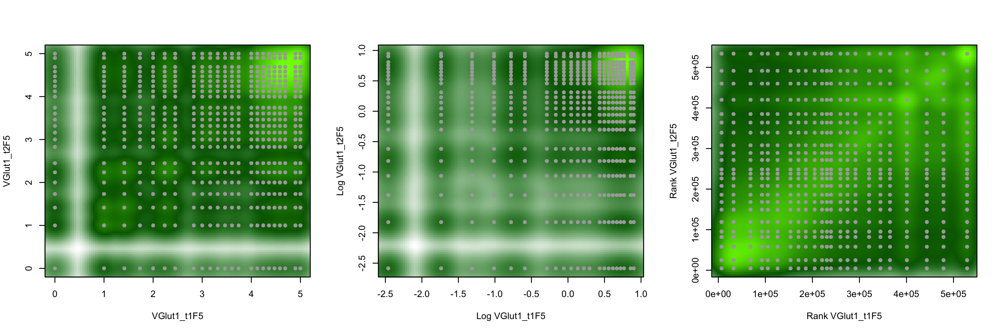

# Synaptome Stats: Feature Exploration
JLP  
`r Sys.Date()`  


[Homepage](http://docs.neurodata.io/synaptome-stats/)  
The formatted source code for this file is [here](https://github.com/neurodata/synaptome-stats/blob/gh-pages/Code/FeatureExploration.Rmd).  
And a [raw version here](https://raw.githubusercontent.com/neurodata/synaptome-stats/gh-pages/Code/FeatureExploration.Rmd).    
Previous work by Youngser Park can be found [here](http://www.cis.jhu.edu/~parky/Synapse/synapse.html).  


# Introduction

Following from previous pages, this page will focus on 
filtering the data before clustering 
to explore if filtering improves the outcome of clustering.

# Feature Definitions

The features defined below were found in [BBSS13][References] (F0-F3) and 
via correspondance with the authors (F4-F5):

Let $V$ be an 11x11x11 volume.  For every $i \in V$, let $b_i$
denote the brightness of pixel $i$ and $d_i$ the
pixelwise distance from $i$ to
the synaptic locus (which seems to be the center pixel).


- `F0` Integrated Brightness $:= \sum_{i\in V} b_i =: B$
- `F1` Local Brightness $:= \sum_{i\in V} b_i/d_{i}^{2}$
- `F2` Center of Mass $:= \sum_{i\in V} b_id_i/B$
- `F3` Moment of Inertia $:= \sum_{i\in V} b_id{_i}^{2}/B$

The local maximum $m$ in $V$ for each channel is noted and a smaller 5x5x5 
volume $V'$ is created about $m$.

- `F4` Restricted Integrated Brightness $:= \sum_{i\in V'} b_i$
- `F5` Distance between centers of $V'$ and $V$.


# Data 
Here we read in the data and select a random half of it for exploration. 


```r
featFull <- fread("../data/synapsinR_7thA.tif.Pivots.txt.2011Features.txt", 
                  showProgress=FALSE)

### Setting a seed and creating an index vector
### to select half of the data
set.seed(2^10)
half1 <- sample(dim(featFull)[1],dim(featFull)[1]/2)
half2 <- setdiff(1:dim(featFull)[1],half1)

feat <- featFull[half1,]
dim(feat)
```

```
# [1] 559649    144
```

```r
## Setting the channel names
channel <- c('Synap_1','Synap_2','VGlut1_t1','VGlut1_t2','VGlut2','Vglut3',
              'psd','glur2','nmdar1','nr2b','gad','VGAT',
              'PV','Gephyr','GABAR1','GABABR','CR1','5HT1A',
              'NOS','TH','VACht','Synapo','tubuli','DAPI')

## Setting the channel types
channel.type <- c('ex.pre','ex.pre','ex.pre','ex.pre','ex.pre','in.pre.small',
                  'ex.post','ex.post','ex.post','ex.post','in.pre','in.pre',
                  'in.pre','in.post','in.post','in.post','in.pre.small',
                  'other', 'ex.post','other','other','ex.post','none','none')

nchannel <- length(channel)
nfeat <- ncol(feat) / nchannel

## Createing factor variables for channel and channel type sorted properly
ffchannel <- (factor(channel.type,
                     levels= c("ex.pre", "ex.post", "in.pre",
                               "in.post", "in.pre.small", "other", "none")))
fchannel <- as.numeric(factor(channel.type,
                              levels= c("ex.pre", "ex.post", "in.pre",
                                        "in.post", "in.pre.small", 
                                        "other", "none")))
ford <- order(fchannel)


## Setting up colors for channel types
Syncol <- c("#197300", "#5ed155", "#660000", "#cc0000", "#ff9933",
            "mediumblue", "gold")

ccol <- Syncol[fchannel]

exType <- factor(c(rep("ex",11),rep("in",6),rep("other",7)),ordered=TRUE)
exCol<-exType;levels(exCol) <- c("#197300","#990000","mediumblue");
exCol <- as.character(exCol)

fname <- as.vector(sapply(channel,function(x) paste0(x,paste0("F",0:5))))
names(feat) <- fname
fcol <- rep(ccol, each=6)
mycol <- colorpanel(100, "purple", "black", "green")
mycol2 <- matlab.like(nchannel)
```

## Data transformations


```r
f <- lapply(1:6,function(x){seq(x,ncol(feat),by=nfeat)})
featF <- lapply(f,function(x){subset(feat,select=x)})

featF0 <- featF[[1]]
f01e3 <- 1e3*data.table(apply(X=featF0, 2, 
                              function(x){((x-min(x))/(max(x)-min(x)))}))

fs <- f01e3

### Taking log_10 on data with 0's removed
ans <- apply(featF0, 1, function(row){ any(row == 0)})

logF0 <- round(log10(featF0[!ans,]), 2)
slogF0 <- logF0[,lapply(.SD,scale, center=TRUE,scale=TRUE)]

rFeat <- feat[,lapply(.SD, rank, ties.method='average')]
```

We now have the following data sets:

- `featF0`: The feature vector looking only at the integrated brightness features.
- `fs`:  The feature vector scaled between $[0,1000]$.
- `logF0`: The feature vector, with 0's removed, then $log_{10}$ is applied. 
- `slogF0`: The feature vector, with 0's removed, then $log_{10}$, then scaled by
  subtracting the mean and dividing by the sample standard deviation.


# Feature Exploration

## KDE plots of chosen transformation/feature pair


```r
synF <- feat[, grep("Synap_", names(feat)),with=FALSE]
lsynF <- synF[,lapply(.SD,function(x){scale(log10(x+1),center=TRUE,scale=TRUE)})]

synF <- synF[, lapply(.SD, 
              function(x){
                qs <- quantile(x, probs=c(0.01,0.99))
                x[x < qs[1]] <- NA
                x[x > qs[2]] <- NA
                return(x)
                }
              )]
                   
lsynF <- lsynF[, lapply(.SD, 
              function(x){
                qs <- quantile(x, probs=c(0.01,0.99), na.rm=TRUE)
                x[x < qs[1]] <- NA
                x[x > qs[2]] <- NA
                return(x)
                }
              )]

names(synF) <- paste0(names(synF), "_linear")
names(lsynF) <- paste0(names(lsynF), "_logscale")

vglutF <- feat[,grep("VGlut1_t",names(feat)),with=FALSE]
lvglutF <- vglutF[,lapply(.SD,function(x){scale(log10(x+1),center=TRUE,scale=TRUE)})]

vglutF <- vglutF[, lapply(.SD, 
              function(x){
                qs <- quantile(x, probs=c(0.01,0.99))
                x[x < qs[1]] <- NA
                x[x > qs[2]] <- NA
                return(x)
                }
              )]
                   
lvglutF <- lvglutF[, lapply(.SD, 
              function(x){
                qs <- quantile(x, probs=c(0.01,0.99), na.rm=TRUE)
                x[x < qs[1]] <- NA
                x[x > qs[2]] <- NA
                return(x)
                }
              )]

names(vglutF) <- paste0(names(vglutF), "_linear")
names(lvglutF) <- paste0(names(lvglutF),"_logscale")
```


```r
df1 <- melt(as.matrix(cbind(synF,lsynF)))
ggplot(data=df1,aes(x=value,y=..density..,group=as.factor(Var2),colour=Var2)) + 
    geom_density(size = 1.5) + 
    facet_wrap( ~ Var2,scales='free',ncol=6) + 
    guides(col = guide_legend(ncol=1))
```

<figure><figcaption><b>Figure 1: KDE for Synapsin1 and Synapsin2 accross all features outer 2% trimmed.</b><br><br></figcaption></figure>


```r
df2 <- melt(as.matrix(cbind(vglutF,lvglutF)))
ggplot(data=df2,aes(x=value,y=..density..,group=as.factor(Var2),colour=Var2)) + 
    geom_density(size = 1.5) + 
    facet_wrap( ~ Var2,scales='free', ncol=6) +
    guides(col = guide_legend(ncol=1))
```

<figure><figcaption><b>Figure 2: KDE for VGlut1_t1 and VGlut1_t2 accross all features outer 2% trimmed.</b><br><br></figcaption></figure>

## Synapsin1 Vs. Synapsin2 for all features


```r
synF <- feat[, grep("Synap_", names(feat)),with=FALSE]
ans1 <- apply(synF, 1, function(row){ any(row == 0)})
lsynF <- synF[!ans1, lapply(.SD, 
                            function(x){ 
                             as.numeric(scale(log10(x),center=TRUE,scale=TRUE))
                            })]

rsynF <- synF[,lapply(.SD, rank, ties.method='average')]
print(paste("removed", sum(ans1), "zero entries"))
```

```
# [1] "removed 222681 zero entries"
```

The following block needs to be re-written. 

```r
gg1 <- list()
ind <- matrix(c(1:12), ncol=2)
rownames(ind) <- paste0("F", 0:5)
cols <- colorRampPalette(c("darkgreen", "chartreuse"))(10)

for ( i in c(1:6)) {
  tmp1 <- synF[,ind[i,], with=FALSE]
  tmp2 <- lsynF[,ind[i,], with=FALSE]
  tmp3 <- rsynF[,ind[i,], with=FALSE]
 
  gg1[[i]] <- list() 
  
   
  gg1[[i]][[1]] <- ggplot(data=tmp1,aes_string(x=names(tmp1)[1], y=names(tmp1)[2])) +
          geom_hex(bins=200,aes(fill=log10(..value..))) +
          geom_smooth(method='lm',colour='red', alpha=0.5)+
          ggtitle(paste0("Untransformed Feature:", rownames(ind)[i])) +
          scale_fill_gradientn(guide=guide_colorbar("Count on \nlog_10 scale"),
                               colours=cols) 

  gg1[[i]][[2]] <- 
    ggplot(data=tmp2,aes_string(x=names(tmp2)[1], y=names(tmp2)[2])) +
          geom_hex(bins=200,aes(fill=log10(..value..))) +
          geom_smooth(method='lm',colour='red', alpha=0.5)+
          ggtitle(paste0("Scale log Transformed Feature:", rownames(ind)[i])) +
          scale_fill_gradientn(guide=guide_colorbar("Count on \nlog_10 scale"),
                               colours= cols )

  gg1[[i]][[3]] <- 
    ggplot(data=tmp3,aes_string(x=names(tmp3)[1], y=names(tmp3)[2])) +
          geom_hex(bins=200,aes(fill=log10(..value..))) +
          #geom_point(alpha=0.2) + 
          geom_smooth(method='lm',colour='red', alpha=0.5)+
          ggtitle(paste0("Rank Transformed Feature:", rownames(ind)[i])) +
          scale_fill_gradientn(guide=guide_colorbar("Count on \nlog_10 scale"),
                               colours=cols)
}
ggS <- Reduce("c", gg1)
rm(gg1)
```


```r
do.call("grid.arrange",args=c(ggS[1:16], ncol=3))
```

<figure><figcaption><b>Figure 3: Scatter plots of Synapsin1 and Synapsin2 on linear and log scale.</b><br><br></figcaption></figure>

The folling is a 2d density of feature F5 

```r
cols.pal <- colorRampPalette(c("white", "darkgreen", "chartreuse"))

par(mfrow = c(1,3))
smoothScatter(synF[, Synap_1F5], synF[, Synap_2F5],colramp=cols.pal, 
              xlab="Synap_1F5", ylab="Synap_2F5")
points(synF[, Synap_1F5], synF[, Synap_2F5], pch= 20, col='darkgray')

smoothScatter(lsynF[, Synap_1F5], lsynF[, Synap_2F5],colramp=cols.pal, 
              xlab="Log Synap_1F5", ylab="Log Synap_2F5")
points(lsynF[, Synap_1F5], lsynF[, Synap_2F5], pch= 20, col='darkgray')

smoothScatter(rsynF[, Synap_1F5], rsynF[, Synap_2F5],colramp=cols.pal, 
              xlab="Rank Synap_1F5", ylab="Rank Synap_2F5")
points(rsynF[, Synap_1F5], rsynF[, Synap_2F5], pch= 20, col='darkgray')
```

<figure><figcaption></figcaption></figure>


```r
lm.fits1 <-lapply(ggS,function(x){x <- x$data;lm(as.formula(paste0(names(x)[2],"~",names(x)[1])),data=x)})
r2 <- sapply(lm.fits1, function(x){ summary(x)$r.squared })
pval<- sapply(lm.fits1,function(x){ anova(x)$'Pr(>F)'[1] })

data.frame(r2 = matrix(r2, nrow=6,byrow=TRUE),
           pval=matrix(pval,nrow=6,byrow=TRUE))
```

```
#         r2.1       r2.2       r2.3 pval.1 pval.2 pval.3
# 1 0.59414860 0.46592277 0.46670705      0      0      0
# 2 0.64299026 0.53775652 0.55420468      0      0      0
# 3 0.21262325 0.22616649 0.22034010      0      0      0
# 4 0.26428419 0.28882467 0.26871308      0      0      0
# 5 0.47390962 0.37414813 0.39062226      0      0      0
# 6 0.06430581 0.04556348 0.06615929      0      0      0
```

## VGlut1_t1 Vs. VGlut1_t2 for all features


```r
vglutF <- feat[,grep("VGlut1_t[1-2]", names(feat)),with=FALSE]
ans2 <- apply(vglutF,1,function(row){ any(row == 0)})
lvglutF <- vglutF[!ans2,lapply(.SD, 
                               function(x){
                                 as.numeric(scale(log10(x)),
                                            center=TRUE,scale=TRUE)})]

rvglutF <- vglutF[,lapply(.SD, rank, ties.method='average')]
print(paste("removed", sum(ans2), "zero entries"))
```

```
# [1] "removed 23063 zero entries"
```


```r
do.call("grid.arrange",args=c(ggV[1:16], ncol=3))
```

<figure><figcaption><b>Figure 4: Scatter plots of Synapsin1 and Synapsin2 on linear and log scale.</b><br><br></figcaption></figure>


```r
par(mfrow = c(1,3))
smoothScatter(vglutF[, VGlut1_t1F5], vglutF[, VGlut1_t2F5],colramp=cols.pal, 
              xlab="VGlut1_t11F5", ylab="VGlut1_t2F5")
points(vglutF[, VGlut1_t1F5], vglutF[, VGlut1_t2F5], pch= 20, col='darkgray')

smoothScatter(lvglutF[, VGlut1_t1F5], lvglutF[, VGlut1_t2F5],colramp=cols.pal, 
              xlab="Log VGlut1_t11F5", ylab="Log VGlut1_t2F5")
points(lvglutF[, VGlut1_t1F5], lvglutF[, VGlut1_t2F5], pch= 20, col='darkgray')

smoothScatter(rvglutF[, VGlut1_t1F5], rvglutF[, VGlut1_t2F5],colramp=cols.pal, 
              xlab="Rank VGlut1_t11F5", ylab="Rank VGlut1_t2F5")
points(rvglutF[, VGlut1_t1F5], rvglutF[, VGlut1_t2F5], pch= 20, col='darkgray')
```

<figure><figcaption></figcaption></figure>


```r
lm.fits2 <-lapply(ggV,function(x){x <- x$data;lm(as.formula(paste0(names(x)[2],"~",names(x)[1])),data=x)})
r2 <- sapply(lm.fits2, function(x){ summary(x)$r.squared })
pval<- sapply(lm.fits2,function(x){ anova(x)$'Pr(>F)'[1] })

data.frame(r2 = matrix(r2, nrow=6,byrow=TRUE),
           pval=matrix(pval,nrow=6,byrow=TRUE))
```

```
#        r2.1      r2.2      r2.3 pval.1 pval.2 pval.3
# 1 0.7350859 0.6507228 0.7179416      0      0      0
# 2 0.7788203 0.6748344 0.7588826      0      0      0
# 3 0.4391983 0.4803640 0.4975225      0      0      0
# 4 0.4989981 0.5177710 0.5248931      0      0      0
# 5 0.5526672 0.5081095 0.5238186      0      0      0
# 6 0.1384548 0.1205634 0.1270797      0      0      0
```


# References 

- [BBSS13] http://dx.doi.org/10.1371/journal.pcbi.1002976

<footer>
<p> [Back to Top][Introduction]</p>
</footer>

