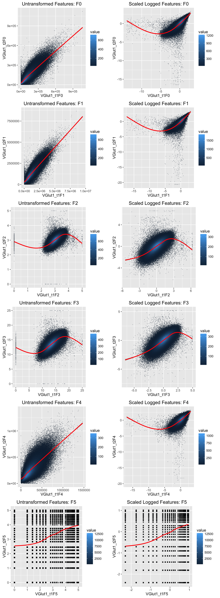

# Synapse Clustering: Feature Exploration
JLP  
`r Sys.Date()`  


[Homepage](http://docs.neurodata.io/synaptome-stats/)  
The formatted source code for this file is [here](https://github.com/neurodata/synaptome-stats/blob/gh-pages/Code/FeatureExploration.Rmd).  
And a [raw version here](https://raw.githubusercontent.com/neurodata/synaptome-stats/gh-pages/Code/FeatureExploration.Rmd).    
Previous work by Youngser Park can be found [here](http://www.cis.jhu.edu/~parky/Synapse/synapse.html).  


# Introduction

Following from previous pages, this page will focus on filtering the data before clustering 
to explore if filtering improves the outcome of clustering.

# Data 
Here we read in the data and select a random half of it for exploration. 


```r
featFull <- fread("../data/synapsinR_7thA.tif.Pivots.txt.2011Features.txt",showProgress=FALSE)

### Setting a seed and creating an index vector
### to select half of the data
set.seed(2^10)
half1 <- sample(dim(featFull)[1],dim(featFull)[1]/2)
half2 <- setdiff(1:dim(featFull)[1],half1)

feat <- featFull[half1,]
dim(feat)
```

```
# [1] 559649    144
```

```r
## Setting the channel names
channel <- c('Synap_1','Synap_2','VGlut1_t1','VGlut1_t2','VGlut2','Vglut3',
              'psd','glur2','nmdar1','nr2b','gad','VGAT',
              'PV','Gephyr','GABAR1','GABABR','CR1','5HT1A',
              'NOS','TH','VACht','Synapo','tubuli','DAPI')

## Setting the channel types
channel.type <- c('ex.pre','ex.pre','ex.pre','ex.pre','ex.pre','in.pre.small',
                  'ex.post','ex.post','ex.post','ex.post','in.pre','in.pre',
                  'in.pre','in.post','in.post','in.post','in.pre.small','other',
                  'ex.post','other','other','ex.post','none','none')

nchannel <- length(channel)
nfeat <- ncol(feat) / nchannel

## Createing factor variables for channel and channel type sorted properly
ffchannel <- (factor(channel.type,
    levels= c("ex.pre","ex.post","in.pre","in.post","in.pre.small","other","none")
    ))
fchannel <- as.numeric(factor(channel.type,
    levels= c("ex.pre","ex.post","in.pre","in.post","in.pre.small","other","none")
    ))
ford <- order(fchannel)


## Setting up colors for channel types
Syncol <- c("#197300","#5ed155","#660000","#cc0000","#ff9933","mediumblue","gold")
ccol <- Syncol[fchannel]

exType <- factor(c(rep("ex",11),rep("in",6),rep("other",7)),ordered=TRUE)
exCol<-exType;levels(exCol) <- c("#197300","#990000","mediumblue");
exCol <- as.character(exCol)

fname <- as.vector(sapply(channel,function(x) paste0(x,paste0("F",0:5))))
names(feat) <- fname
fcol <- rep(ccol, each=6)
mycol <- colorpanel(100, "purple", "black", "green")
mycol2 <- matlab.like(nchannel)
```

## Data transformations


```r
f <- lapply(1:6,function(x){seq(x,ncol(feat),by=nfeat)})
featF <- lapply(f,function(x){subset(feat,select=x)})

featF0 <- featF[[1]]
f01e3 <- 1e3*data.table(apply(X=featF0, 2, function(x){((x-min(x))/(max(x)-min(x)))}))

fs <- f01e3

### Taking log_10 on data with 0's removed
ans <- apply(featF0, 1, function(row){ any(row == 0)})

logF0 <- log10(featF0[!ans,])
slogF0 <- logF0[,lapply(.SD,scale, center=TRUE,scale=TRUE)]
```

We now have the following data sets:

- `featF0`: The feature vector looking only at the integrated brightness features.
- `fs`:  The feature vector scaled between $[0,1000]$.
- `logF0`: The feature vector, with 0's removed, then $log_{10}$ is applied. 
- `slogF0`: The feature vector, with 0's removed, then $log_{10}$, then scaled by
  subtracting the mean and dividing by the sample standard deviation.


# Feature Exploration

## Synapsin1 Vs. Synapsin2 for all features


```r
synF <- feat[, grep("Synap_", names(feat)),with=FALSE]
ans1 <- apply(synF, 1, function(row){ any(row == 0)})
lsynF <- synF[!ans1,lapply(.SD,function(x){scale(log10(x),center=TRUE,scale=TRUE)})]

print(paste("removed", sum(ans1), "zero entries"))
```

```
# [1] "removed 222681 zero entries"
```


```r
grid.arrange(gg1,gg2,gg3,gg4,gg5,gg6,gg7,gg8,gg09,gg10, gg11, gg12, ncol=2)
```

<figure><figcaption><b>Figure 1: Scatter plots of Synapsin1 and Synapsin2 on linear and log scale.</b><br><br></figcaption></figure>


```r
ggd1 <- list(gg1,gg2,gg3,gg4,gg5,gg6,gg7,gg8,gg09,gg10,gg11, gg12)

lm.fits1 <-lapply(ggd1,function(x){x <- x$data;lm(as.formula(paste0(names(x)[2],"~",names(x)[1])),data=x)})
r2 <- sapply(lm.fits1, function(x){ summary(x)$r.squared })
pval<- sapply(lm.fits1,function(x){ anova(x)$'Pr(>F)'[1] })

cbind(r2,pval)
```

```
#               r2 pval
#  [1,] 0.59414860    0
#  [2,] 0.46592277    0
#  [3,] 0.64299026    0
#  [4,] 0.53775652    0
#  [5,] 0.21262325    0
#  [6,] 0.22616649    0
#  [7,] 0.26428419    0
#  [8,] 0.28882467    0
#  [9,] 0.47390962    0
# [10,] 0.37414813    0
# [11,] 0.06430581    0
# [12,] 0.04556348    0
```

## VGlut1_t1 Vs. VGlut1_t2 for all features


```r
vglutF <- feat[,grep("VGlut", names(feat)),with=FALSE]
ans2 <- apply(vglutF,1,function(row){ any(row == 0)})
lvglutF <- vglutF[!ans2,lapply(.SD, function(x){scale(log10(x+1),center=TRUE,scale=TRUE)})]

print(paste("removed", sum(ans2), "zero entries"))
```

```
# [1] "removed 25365 zero entries"
```


```r
grid.arrange(gg13, gg14, gg15, gg16, gg17, gg18, gg19, gg20,gg21,gg22,gg23,gg24, ncol=2)
```

<figure><figcaption><b>Figure 2: Scatter plots of VGlut1_t1 and VGlut1_t2 on linear and log scale for all features.</b><br><br></figcaption></figure>


```r
ggd2 <- list(gg13, gg14, gg15, gg16, gg17, gg18, gg19, gg20,gg21,gg22,gg23,gg24)

lm.fits2 <-lapply(ggd2,function(x){x <- x$data;lm(as.formula(paste0(names(x)[2],"~",names(x)[1])),data=x)})
r2 <- sapply(lm.fits2, function(x){ summary(x)$r.squared })
pval<- sapply(lm.fits2,function(x){ anova(x)$'Pr(>F)'[1] })

cbind(r2,pval)
```

```
#              r2 pval
#  [1,] 0.7350859    0
#  [2,] 0.6550611    0
#  [3,] 0.7788203    0
#  [4,] 0.6753220    0
#  [5,] 0.4391983    0
#  [6,] 0.4799742    0
#  [7,] 0.4989981    0
#  [8,] 0.5178412    0
#  [9,] 0.5526672    0
# [10,] 0.5083601    0
# [11,] 0.1384548    0
# [12,] 0.1261750    0
```


## KDE plots of chosen transformation/feature pair


```r
synF <- feat[, grep("Synap_", names(feat)),with=FALSE]
lsynF <- synF[,lapply(.SD,function(x){scale(log10(x+1),center=TRUE,scale=TRUE)})]
names(synF) <- paste0(names(synF), "_linear")
names(lsynF) <- paste0(names(lsynF), "_logscale")

vglutF <- feat[,grep("VGlut1_t",names(feat)),with=FALSE]
lvglutF <- vglutF[,lapply(.SD,function(x){scale(log10(x+1),center=TRUE,scale=TRUE)})]
names(vglutF) <- paste0(names(vglutF), "_linear")
names(lvglutF) <- paste0(names(lvglutF),"_logscale")
```


```r
df1 <- melt(as.matrix(cbind(synF,lsynF)))
levels(df1$Var2)<-levels(df1$Var2)[c(1:6,13:18,7:12,19:24)]
ggplot(data=df1,aes(x=value,y=..density..,group=as.factor(Var2),colour=Var2)) + 
    geom_density() + 
    facet_wrap( ~ Var2,scales='free',ncol=6)
```

<figure><figcaption><b>Figure 3: KDE for Synapsin1 and Synapsin2 accross all features.</b><br><br></figcaption></figure>


```r
df2 <- melt(as.matrix(cbind(vglutF,lvglutF)))
levels(df2$Var2)<-levels(df2$Var2)[c(1:6,13:18,7:12,19:24)]
ggplot(data=df2,aes(x=value,y=..density..,group=as.factor(Var2),colour=Var2)) + 
    geom_density() + 
    facet_wrap( ~ Var2,scales='free', ncol=6)
```

<figure><figcaption><b>Figure 4: KDE for VGlut1_t1 and VGlut1_t2 accross all features.</b><br><br></figcaption></figure>


<footer>
<p> [Back to Top][Introduction]</p>
</footer>

