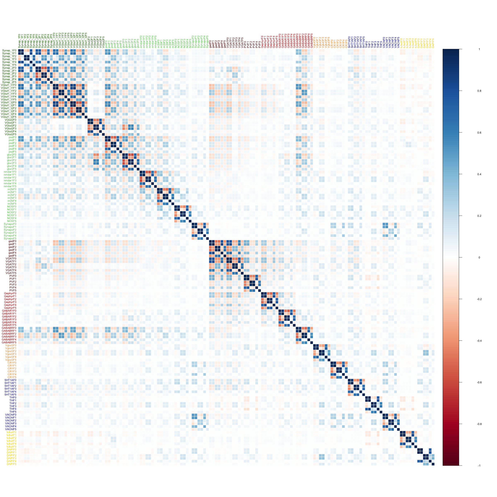

# Synaptome Stats: Marker Exploration
Jesse Leigh Patsolic  
`r Sys.Date()`  


# Data 


Here we read in the data and select a random half of it for exploration. 


```r
featFull <- fread("../data/synapsinR_7thA.tif.Pivots.txt.2011Features.txt",showProgress=FALSE)

### Setting a seed and creating an index vector
### to select half of the data
set.seed(2^10)
half1 <- sample(dim(featFull)[1],dim(featFull)[1]/2)
half2 <- setdiff(1:dim(featFull)[1],half1)

feat <- featFull[half1,]
dim(feat)
```

```
# [1] 559649    144
```

```r
## Setting the channel names
channel <- c('Synap_1','Synap_2','VGlut1_t1','VGlut1_t2','VGlut2','Vglut3',
              'psd','glur2','nmdar1','nr2b','gad','VGAT',
              'PV','Gephyr','GABAR1','GABABR','CR1','5HT1A',
              'NOS','TH','VACht','Synapo','tubuli','DAPI')

## Setting the channel types
channel.type <- c('ex.pre','ex.pre','ex.pre','ex.pre','ex.pre','in.pre.small',
                  'ex.post','ex.post','ex.post','ex.post','in.pre','in.pre',
                  'in.pre','in.post','in.post','in.post','in.pre.small','other',
                  'ex.post','other','other','ex.post','none','none')

nchannel <- length(channel)
nfeat <- ncol(feat) / nchannel

## Createing factor variables for channel and channel type sorted properly
ffchannel <- (factor(channel.type,
    levels= c("ex.pre","ex.post","in.pre","in.post","in.pre.small","other","none")
    ))
fchannel <- as.numeric(factor(channel.type,
    levels= c("ex.pre","ex.post","in.pre","in.post","in.pre.small","other","none")
    ))
ford <- order(fchannel)


## Setting up colors for channel types
Syncol <- c("#197300","#5ed155","#660000","#cc0000","#ff9933","mediumblue","gold")
ccol <- Syncol[fchannel]

exType <- factor(c(rep("ex",11),rep("in",6),rep("other",7)),ordered=TRUE)
exCol<-exType;levels(exCol) <- c("#197300","#990000","mediumblue");
exCol <- as.character(exCol)

fname <- as.vector(sapply(channel,function(x) paste0(x,paste0("F",0:5))))
names(feat) <- fname
fcol <- rep(ccol, each=6)
mycol <- colorpanel(100, "purple", "black", "green")
mycol2 <- matlab.like(nchannel)
```

## Data transformations


```r
f <- lapply(1:6,function(x){seq(x,ncol(feat),by=nfeat)})
featF <- lapply(f,function(x){subset(feat,select=x)})

featF0 <- featF[[1]]
f01e3 <- 1e3*data.table(apply(X=featF0,2,function(x){((x-min(x))/(max(x)-min(x)))}))

fs <- f01e3

### Taking log_10 on data + 1.
log1f <- log10(featF0 + 1)
slog1f <- data.table(scale(log1f, center=TRUE,scale=TRUE))
```

We now have the following data sets:

- `featF0`: The feature vector looking only at the integrated brightness features.
- `fs`:  The feature vector scaled between $[0,1000]$.
- `logf1`: The feature vector, plus one, then $log_{10}$ is applied. 
- `slog1f`: The feature vector, plus one, $log_{10}$, then scaled by
  subtracting the mean and dividing by the sample standard deviation.

# Marker Exploration 


## Top 1% of Synap_1


```r
top1synap1F0 <- slog1f[Synap_1F0 > quantile(Synap_1F0, 0.99),]
dim(top1synap1F0)
```

```
# [1] 5597   24
```

```r
lp1 <- splom(~top1synap1F0,
	panel=panel.hexbinplot, colramp=BTC, 
	diag.panel = function(x, ...){
	 yrng <- current.panel.limits()$ylim
	 d <- density(x, na.rm=TRUE)
	 d$y <- with(d, yrng[1] + 0.95 * diff(yrng) * y / max(y) )
	 panel.lines(d)
	 diag.panel.splom(x, ...)
	 },
	lower.panel = function(x, y, ...){
	 panel.hexbinplot(x, y, ...)
	 panel.loess(x, y, ..., col = 'red')
	 },
	pscale=0,varname.cex=0.9
 )

pdf("../Figures/MarkerExploration_figure/cc-top1synap1F0.pdf",height=25,width=25)
print(lp1)
dev.off()
```

```
# pdf 
#   2
```

Note that when we select only the top 1% of Synap_1F0 levels we end up with only 5597 
observations.  
This plot is too large to show inline, you can view it here:
[F0 Lattice Plot conditioned on top 1% of Synap_1F0](../Figures/MarkerExploration_figure/cc-top1synap1F0.pdf)


```r
top1gadF0 <- slog1f[gadF0 > quantile(gadF0, 0.99),]
dim(top1gadF0)
```

```
# [1] 5597   24
```

```r
lp2 <- splom(~top1gadF0,
	panel=panel.hexbinplot, colramp=BTC, 
	diag.panel = function(x, ...){
	 yrng <- current.panel.limits()$ylim
	 d <- density(x, na.rm=TRUE)
	 d$y <- with(d, yrng[1] + 0.95 * diff(yrng) * y / max(y) )
	 panel.lines(d)
	 diag.panel.splom(x, ...)
	 },
	lower.panel = function(x, y, ...){
	 panel.hexbinplot(x, y, ...)
	 panel.loess(x, y, ..., col = 'red')
	 },
	pscale=0,varname.cex=0.9
 )

pdf("../Figures/MarkerExploration_figure/cc-top1gadF0.pdf",height=25,width=25)
print(lp2)
dev.off()
```

```
# pdf 
#   2
```

This plot is too large to show inline, you can view it here:
[F0 Lattice Plot conditioned on top 1% of gadF0](../Figures/MarkerExploration_figure/cc-top1gadF0.pdf)

## Correlation Matrix of markers 


```r
tmp <- as.numeric(table(fchannel))
corrf <- cor(featF0)[ford,ford]
corrplot(corrf,method="color",tl.col=ccol[ford], tl.cex=0.8)
```

<figure><figcaption><b>Figure 1: Correlation on untransformed F0 data, reordered by synapse type.</b><br><br></figcaption></figure>


```r
tmp <- as.numeric(table(fchannel))
bford <- order(rep(fchannel,each=6))
nord <- Reduce('c', f)
cr <- rep(ccol, each=6)
corrf <- cor(feat)[bford,bford]
#corrf <- cor(feat)[nord,nord]
corrplot(corrf,method="color",tl.col=cr[bford],tl.cex=0.8)
```

<figure><figcaption><b>Figure 2: Correlation on untransformed data F0-5, reordered by synapse type.</b><br><br></figcaption></figure>

```r
#corrplot(corrf,method="color",tl.col=cr[nord],tl.cex=0.8)
```


## Distance Covariance Test


<footer>
<p> [Back to Top][Outline]</p>
</footer>

