# Synaptome Stats: Marker Exploration
Jesse Leigh Patsolic  
`r Sys.Date()`  


[Homepage](http://docs.neurodata.io/synaptome-stats/)  
The formatted source code for this file is [here](https://github.com/neurodata/synaptome-stats/blob/gh-pages/Code/MarkerExploration.Rmd).  
And a raw version [here](https://raw.githubusercontent.com/neurodata/synaptome-stats/gh-pages/Code/MarkerExploration.Rmd).    
Previous work by Youngser Park can be found [here](http://www.cis.jhu.edu/~parky/Synapse/synapse.html).  

# Data 

Here we read in the data and select a random half of it for exploration. 


```r
featFull <- fread("../data/synapsinR_7thA.tif.Pivots.txt.2011Features.txt",showProgress=FALSE)

### Setting a seed and creating an index vector
### to select half of the data
set.seed(2^10)
half1 <- sample(dim(featFull)[1],dim(featFull)[1]/2)
half2 <- setdiff(1:dim(featFull)[1],half1)

feat <- featFull[half1,]
dim(feat)
```

```
# [1] 559649    144
```

```r
## Setting the channel names
channel <- c('Synap_1','Synap_2','VGlut1_t1','VGlut1_t2','VGlut2','Vglut3',
              'psd','glur2','nmdar1','nr2b','gad','VGAT',
              'PV','Gephyr','GABAR1','GABABR','CR1','5HT1A',
              'NOS','TH','VACht','Synapo','tubuli','DAPI')

## Setting the channel types
channel.type <- c('ex.pre','ex.pre','ex.pre','ex.pre','ex.pre','in.pre.small',
                  'ex.post','ex.post','ex.post','ex.post','in.pre','in.pre',
                  'in.pre','in.post','in.post','in.post','in.pre.small','other',
                  'ex.post','other','other','ex.post','none','none')

channel.type2 <- c('ex.pre','ex.pre','ex.pre','ex.pre','ex.pre','other',
                   'ex.post','ex.post','ex.post','ex.post','in.pre','in.pre',
                   'in.pre','in.post','in.post','in.post','other','other',
                   'ex.post','other','other','ex.post','other','other')
nchannel <- length(channel)
nfeat <- ncol(feat) / nchannel

## Createing factor variables for channel and channel type sorted properly
ffchannel <- (factor(channel.type,
    levels= c("ex.pre","ex.post","in.pre","in.post","in.pre.small","other","none")
    ))
fchannel <- as.numeric(factor(channel.type,
    levels= c("ex.pre","ex.post","in.pre","in.post","in.pre.small","other","none")
    ))
ford <- order(fchannel)


## Setting up colors for channel types
Syncol <-  c("#197300","#5ed155","#660000","#cc0000","#ff9933","#0000cd","#ffd700")
Syncol3 <- c("#197300","#197300","#cc0000","#cc0000","#0000cd","#0000cd","#0000cd")
ccol <- Syncol[fchannel]
ccol3 <- Syncol3[fchannel]

exType <- factor(c(rep("ex",11),rep("in",6),rep("other",7)),ordered=TRUE)
exCol<-exType;levels(exCol) <- c("#197300","#990000","#0000cd");
exCol <- as.character(exCol)

fname <- as.vector(sapply(channel,function(x) paste0(x,paste0("F",0:5))))
names(feat) <- fname
fcol <- rep(ccol, each=6)
mycol <- colorpanel(100, "purple", "black", "green")
mycol2 <- matlab.like(nchannel)
mycol3 <- colorpanel(100, "blue","white","red")
```

## Data transformations


```r
f <- lapply(1:6,function(x){seq(x,ncol(feat),by=nfeat)})
featF <- lapply(f,function(x){subset(feat,select=x)})

featF0 <- featF[[1]]
f01e3 <- 1e3*data.table(apply(X=featF0,2,function(x){((x-min(x))/(max(x)-min(x)))}))

fs <- f01e3

### Taking log_10 on data + 1.
log1f <- log10(featF0 + 1)
slog1f <- data.table(scale(log1f, center=TRUE,scale=TRUE))
```

We now have the following data sets:

- `featF0`: The feature vector looking only at the integrated brightness features.
- `fs`:  The feature vector scaled between $[0,1000]$.
- `logf1`: The feature vector, plus one, then $log_{10}$ is applied. 
- `slog1f`: The feature vector, plus one, $log_{10}$, then scaled by
  subtracting the mean and dividing by the sample standard deviation.

# Marker Exploration 

## Correlation Matrix of markers 


```r
corrf <- lapply(lapply(featF, cor), function(x) x[ford, ford])

titles <- paste('Correlation Matrix of', paste0("F", 0:5))
par(mfrow = c(3,2))
for(i in 1:length(corrf)) {
  corrplot(corrf[[i]],method="color",tl.col=ccol[ford], 
           tl.cex=0.8, mar=c(1,0,1,1.5))
  title(titles[i])
}
```

<figure>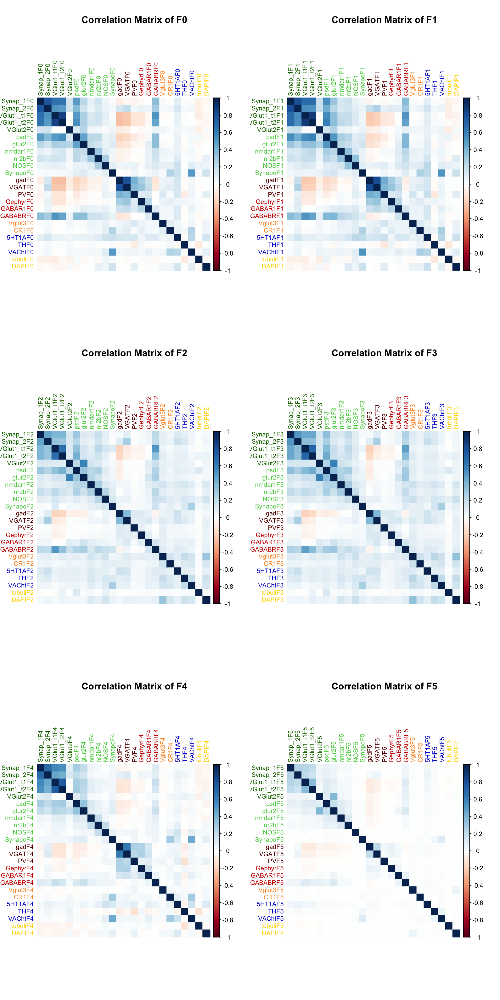<figcaption><b>Figure 1: Correlation on untransformed F0 data, reordered by synapse type.</b><br><br></figcaption></figure>


```r
bford <- order(rep(fchannel,each=6))
nord <- Reduce('c', f)
cr <- rep(ccol, each=6)
corrfB <- cor(feat)[bford,bford]
corrplot(corrfB,method="color",tl.col=cr[bford],tl.cex=0.75)
```

<figure>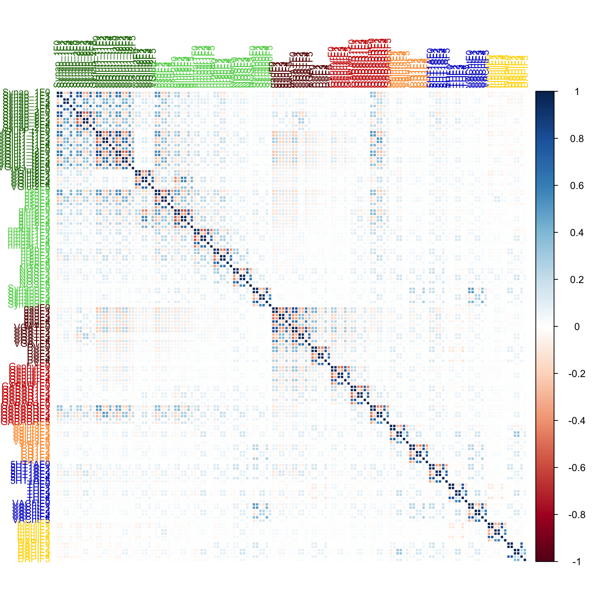<figcaption><b>Figure 2: Full Correlation on untransformed F0-F5 data, reordered by synapse type.</b><br><br></figcaption></figure>

## Distance Correlation T-tests


```r
computeDcor <- function(x) {
  set.seed(317)
  sam1 <- sample(dim(x)[1], min(1e3,dim(x)[1]))
  tmp <- as.data.frame((x[sam1,]))
  
  combcols <- t(combn(24,2))
  
  dc <- foreach(i = 1:dim(combcols)[1]) %dopar% {
         set.seed(331*i)
         dcor.ttest(x=tmp[,combcols[i,1]],y=tmp[,combcols[i,2]])
         }
  
  ms <- matrix(as.numeric(0),24,24)
  mp <- matrix(as.numeric(0),24,24)
  
  for(i in 1:length(dc)){
      ms[combcols[i,1],combcols[i,2]] <- dc[[i]]$statistic
      ms[combcols[i,2],combcols[i,1]] <- dc[[i]]$statistic
      mp[combcols[i,1],combcols[i,2]] <- dc[[i]]$p.val
      mp[combcols[i,2],combcols[i,1]] <- dc[[i]]$p.val
  }
  
  rownames(ms) <- colnames(x)
  rownames(mp) <- colnames(x)
  colnames(ms) <- colnames(x)
  colnames(mp) <- colnames(x)
  
  diag(ms) <- as.numeric(0)
  diag(mp) <- as.numeric(1)
  return(list(ms, mp))
}

mdcor <- lapply(featF, computeDcor)
```


```r
cl5 <- colorRampPalette(c("white", "blue"))
gr5 <- colorRampPalette(c("darkgreen", "white", "white"))
bl5 <- colorRampPalette(c("blue", "red"))

sTitle <- paste("dcor.ttest statistic", paste0("F", 0:5))
pTitle <- paste("dcor.ttest log10(p-value)", paste0("F", 0:5))


par(mfcol=c(6,2), oma=2*c(1,1,1,1))
for(i in 1:length(mdcor)){
  corrplot(mdcor[[i]][[1]][ford,ford],is.corr=FALSE,method="color",
           tl.col=ccol[ford], tl.cex=0.8, mar=3*c(1,0,1,1.5))
  corrRect(as.numeric(table(fchannel)),col=Syncol,lwd=4)
  title(sTitle[i]) 
}

for(i in 1:length(mdcor)){
  corrplot((log10(mdcor[[i]][[2]][ford,ford]+.Machine$double.eps)),is.corr=FALSE,method="color",tl.col=ccol[ford], 
           tl.cex=0.8, mar=3*c(1,0,1,1.5),
           p.mat=mdcor[[i]][[2]][ford,ford], 
           sig.level=0.01, pch = 'x', pch.cex=0.5)
  corrRect(as.numeric(table(fchannel)),col=Syncol,lwd=4)
  title(pTitle[i])
}
```

<figure>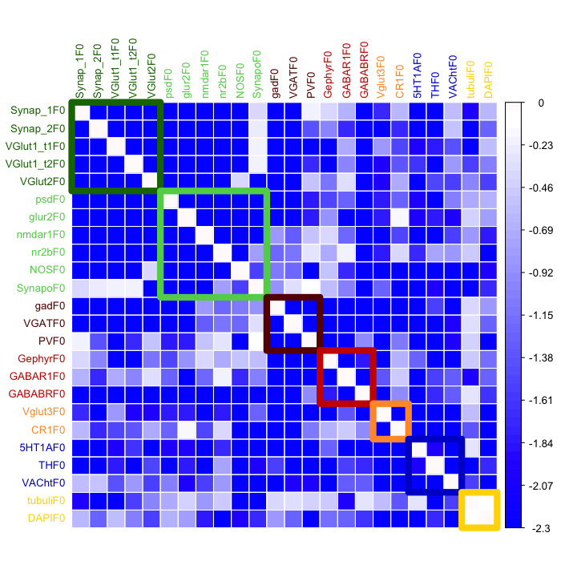<figcaption><b>Figure 3: F0-5: Distance correlation t-test statistic and p-value matrices.</b><br><br></figcaption></figure>

The `X`'s in the above right figure denote a p-value greater than 0.01.


## Scatterplots 

We will run PCA on the untransformed correlation matrix so the data can be 
viewed in 2-dimensions.  The colors correspond to synapse type.


```r
pcaL <- lapply(corrf, prcomp, center=TRUE, scale=TRUE)
titlepca <- paste("PCA on ", paste0("cor(F", 0:5, ')'))
for(i in 1:length(pcaL)) { 
  pairs(pcaL[[i]]$x[,1:3], col=ccol3[ford],pch=20, cex=2,
        main=titlepca[i])
}
```

<figure><figcaption><b>Figure 4: PCA of untransformed correlation matrix</b><br><br></figcaption></figure><figure>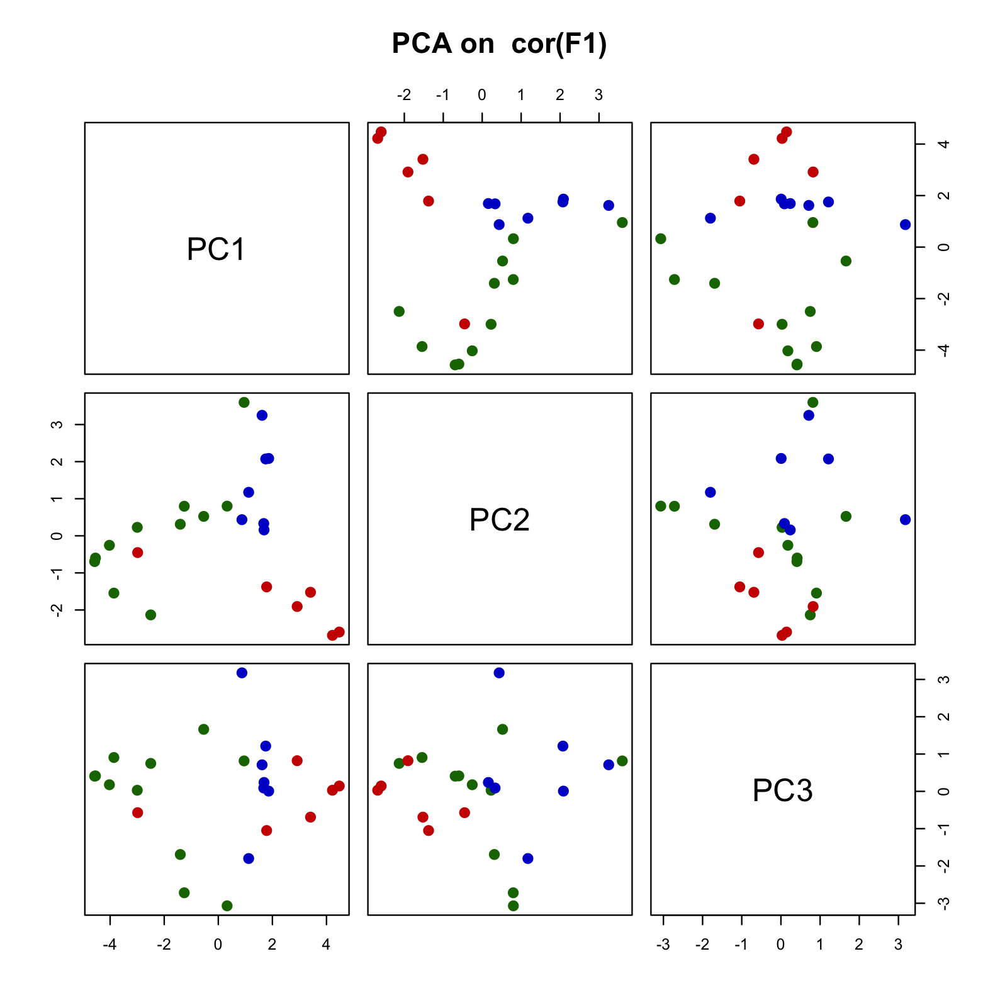<figcaption><b>Figure 4: PCA of untransformed correlation matrix</b><br><br></figcaption></figure><figure>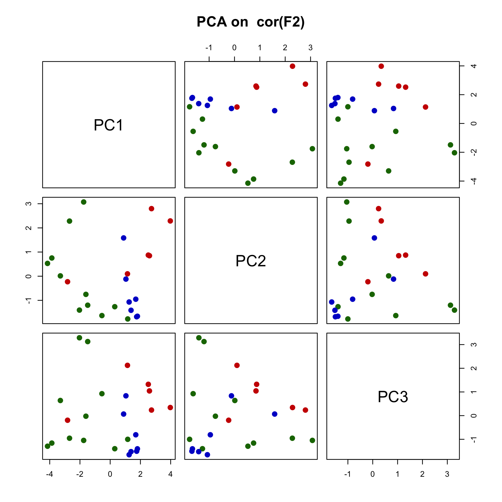<figcaption><b>Figure 4: PCA of untransformed correlation matrix</b><br><br></figcaption></figure><figure>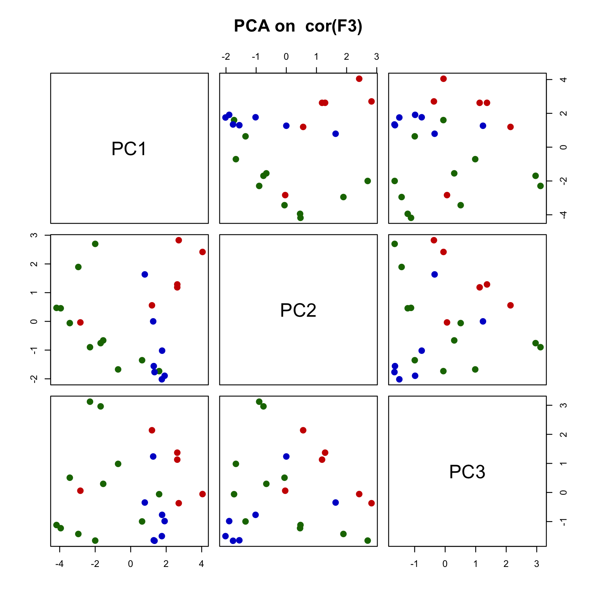<figcaption><b>Figure 4: PCA of untransformed correlation matrix</b><br><br></figcaption></figure><figure>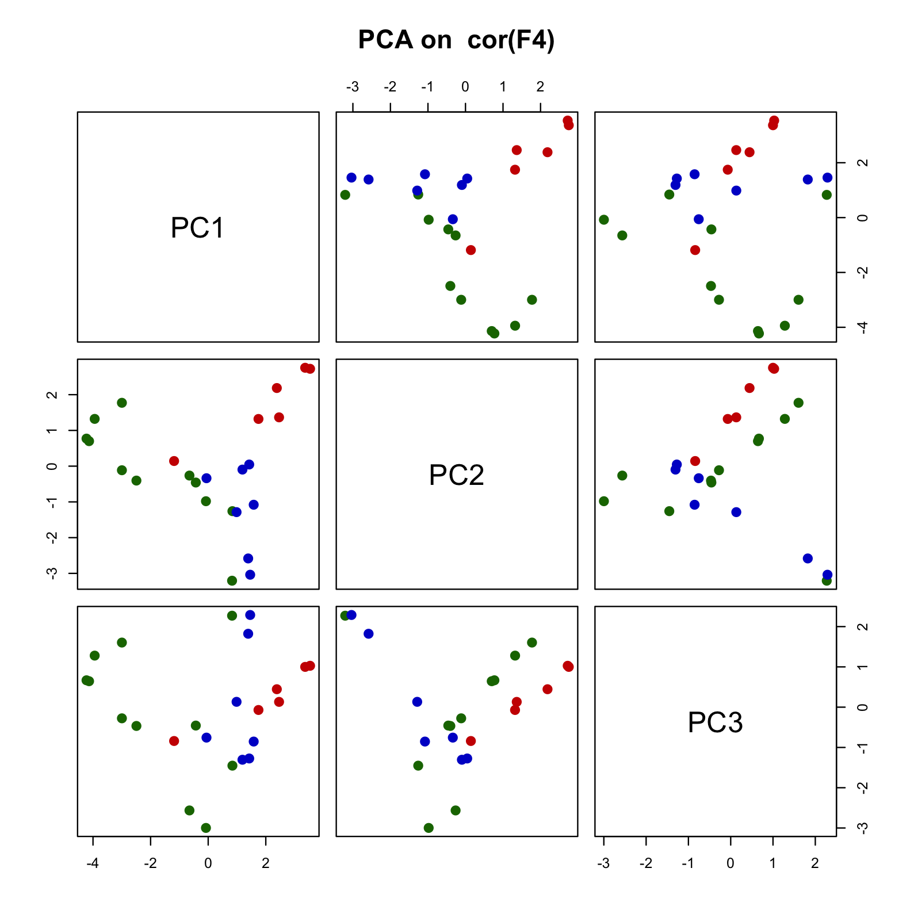<figcaption><b>Figure 4: PCA of untransformed correlation matrix</b><br><br></figcaption></figure><figure>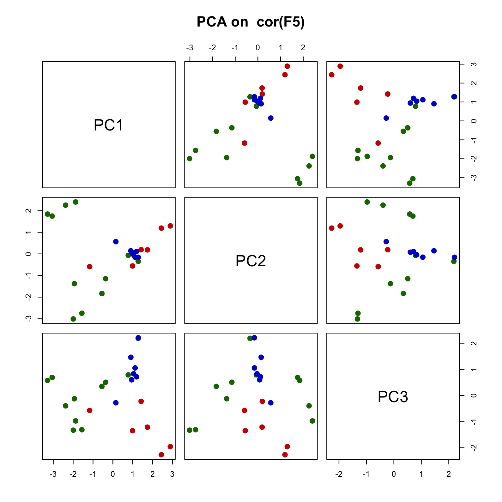<figcaption><b>Figure 4: PCA of untransformed correlation matrix</b><br><br></figcaption></figure>


```r
pcaB <- prcomp(corrfB,center=TRUE, scale=TRUE)
pairs(pcaB$x[,1:3], col=cr[bford],pch=20, cex=2)
```

<figure>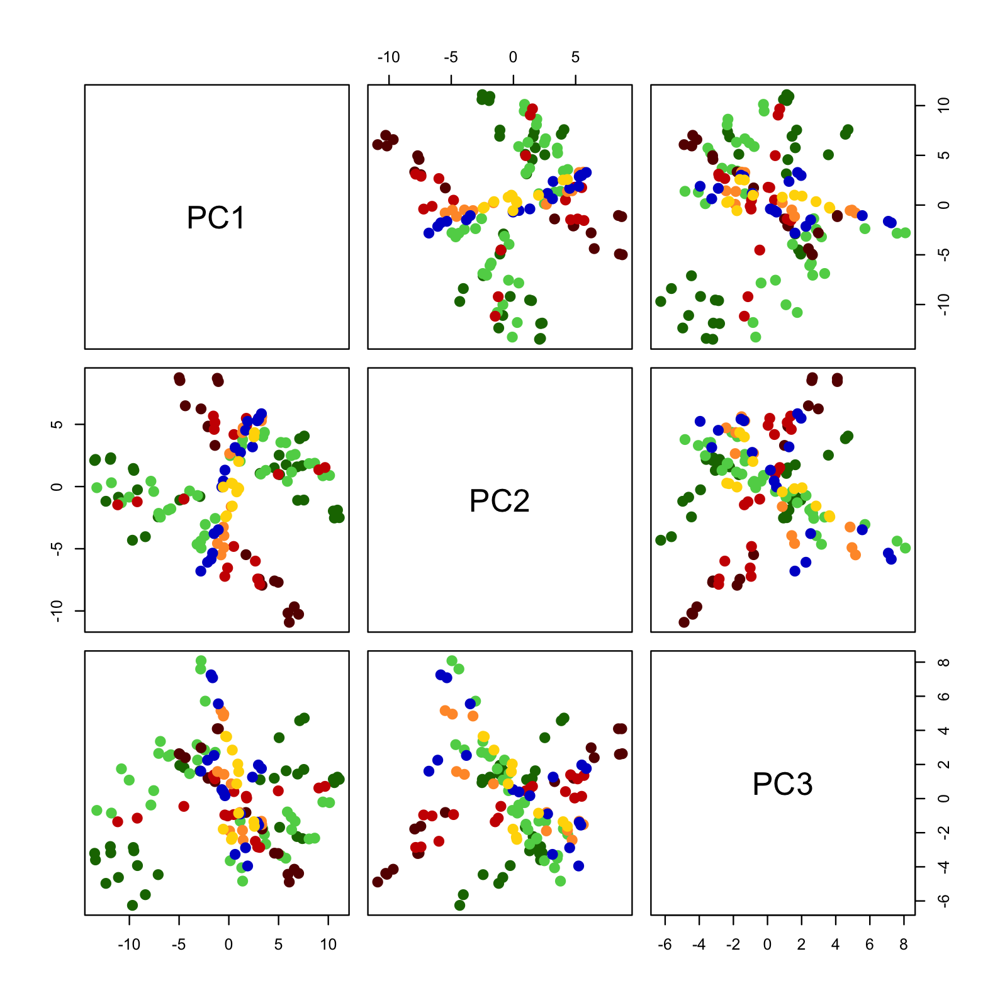<figcaption><b>Figure 5: PCA of untransformed correlation matrix</b><br><br></figcaption></figure>


```r
plot(pcaB$x[,1:3], col=cr[bford],pch=20, cex=2)
text(pcaB$x[,1:2], labels=rownames(pcaB$x), pos=4, col=cr[bford])
```

<figure>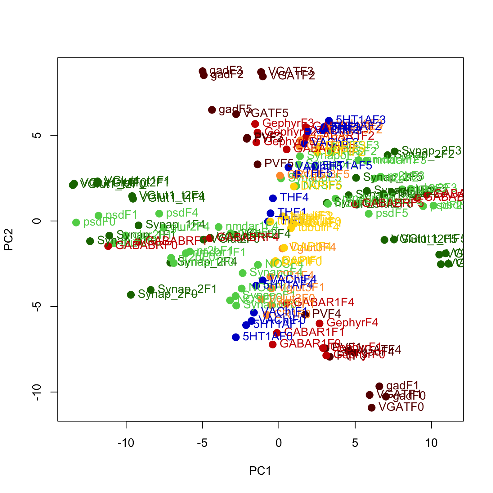<figcaption><b>Figure 6: PC2 v PC1 of untransformed correlation matrix</b><br><br></figcaption></figure>


```r
pcaB <- pcaB$x
rgl::plot3d(pcaB[,1],pcaB[,2],pcaB[,3],type='s',col=cr[bford], size=1)
rgl::rgl.texts(pcaB[,1],pcaB[,2],pcaB[,3],abbreviate(rownames(pcaB)), col=cr[bford], adj=c(0,2))
subid <- currentSubscene3d()
rglwidget(elementId="rgl-pcaB",width=720,height=720)
```

<!--html_preserve--><div id="rgl-pcaB" style="width:720px;height:720px;" class="rglWebGL html-widget"></div>
<script type="application/json" data-for="rgl-pcaB">{"x":{"material":{"color":["#197300","#197300","#197300","#197300","#197300","#197300","#197300","#197300","#197300","#197300","#197300","#197300","#197300","#197300","#197300","#197300","#197300","#197300","#197300","#197300","#197300","#197300","#197300","#197300","#197300","#197300","#197300","#197300","#197300","#197300","#5ED155","#5ED155","#5ED155","#5ED155","#5ED155","#5ED155","#5ED155","#5ED155","#5ED155","#5ED155","#5ED155","#5ED155","#5ED155","#5ED155","#5ED155","#5ED155","#5ED155","#5ED155","#5ED155","#5ED155","#5ED155","#5ED155","#5ED155","#5ED155","#5ED155","#5ED155","#5ED155","#5ED155","#5ED155","#5ED155","#5ED155","#5ED155","#5ED155","#5ED155","#5ED155","#5ED155","#660000","#660000","#660000","#660000","#660000","#660000","#660000","#660000","#660000","#660000","#660000","#660000","#660000","#660000","#660000","#660000","#660000","#660000","#CC0000","#CC0000","#CC0000","#CC0000","#CC0000","#CC0000","#CC0000","#CC0000","#CC0000","#CC0000","#CC0000","#CC0000","#CC0000","#CC0000","#CC0000","#CC0000","#CC0000","#CC0000","#FF9933","#FF9933","#FF9933","#FF9933","#FF9933","#FF9933","#FF9933","#FF9933","#FF9933","#FF9933","#FF9933","#FF9933","#0000CD","#0000CD","#0000CD","#0000CD","#0000CD","#0000CD","#0000CD","#0000CD","#0000CD","#0000CD","#0000CD","#0000CD","#0000CD","#0000CD","#0000CD","#0000CD","#0000CD","#0000CD","#FFD700","#FFD700","#FFD700","#FFD700","#FFD700","#FFD700","#FFD700","#FFD700","#FFD700","#FFD700","#FFD700","#FFD700"],"alpha":1,"lit":true,"ambient":"#000000","specular":"#FFFFFF","emission":"#000000","shininess":50,"smooth":true,"front":"filled","back":"filled","size":3,"lwd":1,"fog":true,"point_antialias":false,"line_antialias":false,"texture":null,"textype":"rgb","texmipmap":false,"texminfilter":"linear","texmagfilter":"linear","texenvmap":false,"depth_mask":true,"depth_test":"less"},"rootSubscene":1,"objects":{"7":{"id":7,"type":"spheres","material":{"fog":false},"vertices":[[-12.3589248657227,-1.18397653102875,-4.96998739242554],[-11.0988626480103,-0.857195556163788,-4.62237977981567],[4.56789207458496,1.50580382347107,1.19245100021362],[5.76383543014526,1.75286114215851,1.62932550907135],[-9.18723011016846,-0.260274082422256,-3.92627334594727],[3.14134407043457,1.05716013908386,1.10501945018768],[-9.69012928009033,-4.31565856933594,-6.25851631164551],[-8.39229393005371,-4.03045129776001,-5.63221406936646],[7.12074184417725,3.84598731994629,4.56588125228882],[7.58306741714478,4.06144189834595,4.71960258483887],[-7.1056809425354,-2.43868517875671,-4.45774221420288],[5.05709648132324,2.52129650115967,3.56961798667908],[-13.4072885513306,2.17958950996399,-3.59355282783508],[-11.8688020706177,2.31318974494934,-3.17901802062988],[10.612156867981,-2.52911019325256,0.936197578907013],[11.1027336120605,-2.50092220306396,1.12807083129883],[-9.54639911651611,1.3004949092865,-3.05957412719727],[7.54166650772095,-1.08543920516968,1.70874071121216],[-13.4918556213379,2.095782995224,-3.20833897590637],[-11.9144411087036,2.18586897850037,-2.81011486053467],[10.5045528411865,-1.96588814258575,1.1392707824707],[10.9256582260132,-1.89410209655762,1.25798833370209],[-9.6060676574707,1.45164012908936,-2.86756563186646],[6.91545057296753,-1.10878777503967,1.43773317337036],[-4.92848825454712,-1.0900856256485,1.95109748840332],[-4.50333547592163,-0.982031941413879,1.81789481639862],[6.8524603843689,1.58149111270905,-2.22412991523743],[7.39734745025635,1.67871606349945,-2.34440469741821],[-2.90371680259705,-0.799552202224731,1.62292218208313],[5.10712242126465,0.953866541385651,-1.68142008781433],[-13.272837638855,-0.0907142087817192,-0.692883014678955],[-11.8074970245361,0.305824100971222,-0.848557710647583],[9.45172023773193,0.865906894207001,-0.198363348841667],[10.1273679733276,0.894913375377655,-0.23717500269413],[-7.83478879928589,0.427870035171509,-0.377368986606598],[5.88367605209351,0.419435262680054,-0.783401548862457],[-10.7985496520996,-1.30087995529175,1.74415016174316],[-10.020073890686,-0.849460005760193,1.08344209194183],[8.06806755065918,1.84920239448547,-2.36554408073425],[8.63493728637695,1.87845396995544,-2.31866860389709],[-7.55223608016968,-0.393838375806808,0.467339724302292],[6.31061792373657,1.1656379699707,-1.82111084461212],[-6.88079023361206,-2.45881390571594,3.35198950767517],[-6.08638191223145,-1.88546049594879,2.47580027580261],[5.22884178161621,3.55016708374023,-3.33606815338135],[5.72944831848145,3.52050614356995,-3.49504280090332],[-3.94388937950134,-0.354359358549118,1.4632865190506],[3.70838403701782,1.30207800865173,-2.66568994522095],[-7.05171537399292,-2.15463471412659,2.64842987060547],[-5.82924127578735,-1.7884418964386,2.56904220581055],[6.26384782791138,2.4833505153656,-1.07140815258026],[6.66574478149414,2.5880606174469,-1.32791531085968],[-3.14309144020081,-0.71980744600296,2.25848007202148],[3.21443462371826,1.00335824489594,-1.50113344192505],[-3.19359946250916,-4.6414532661438,3.1631646156311],[-2.43372440338135,-3.94894051551819,2.85617613792419],[3.41924476623535,4.01321411132812,-1.76464653015137],[3.57765293121338,4.35939073562622,-2.09607315063477],[-1.36829745769501,-2.56279897689819,2.71272873878479],[1.13947308063507,2.04219627380371,-1.31870543956757],[-2.78880667686462,-4.94498777389526,8.08055591583252],[-2.83349108695984,-4.38602495193481,7.59578037261963],[1.29882645606995,3.30213785171509,-4.05477714538574],[1.38544476032257,3.7795352935791,-4.83600950241089],[-2.36943125724792,-3.04684495925903,5.71240043640137],[0.139828503131866,2.48639607429504,-3.64322233200073],[7.01405143737793,-10.265965461731,-4.38281774520874],[6.58257627487183,-9.66499042510986,-4.14084959030151],[-4.91590976715088,8.51967620849609,2.59557962417603],[-4.99298810958862,8.75129127502441,2.63222026824951],[4.96023273468018,-7.69821882247925,-3.21883463859558],[-4.37722682952881,6.49427890777588,2.39761662483215],[6.07669353485107,-10.9134902954102,-4.88971376419067],[5.94345569610596,-10.168848991394,-4.43702793121338],[-1.04843723773956,8.44133186340332,4.09317398071289],[-1.16152250766754,8.70150375366211,4.09369993209839],[4.59185314178467,-7.58635520935059,-3.19916772842407],[-2.79645013809204,6.24388360977173,2.97865962982178],[3.33466124534607,-7.93496417999268,-1.78281807899475],[3.05614709854126,-7.44614362716675,-1.62097752094269],[-2.09859013557434,4.80365562438965,1.22679388523102],[-2.07052731513977,4.8582181930542,1.18787777423859],[1.72339069843292,-5.47631406784058,-0.814202964305878],[-1.39443302154541,3.30776500701904,0.996254682540894],[3.10751032829285,-7.86042928695679,-2.86254048347473],[2.89732098579407,-7.4282341003418,-2.83447074890137],[-1.39760994911194,5.15856838226318,1.15539693832397],[-1.55202269554138,5.66712141036987,1.35594737529755],[2.66638135910034,-5.99217748641968,-2.50184750556946],[-1.47061634063721,4.59585905075073,1.39463376998901],[-0.402263760566711,-7.21943140029907,-0.960318267345428],[-0.125285401940346,-6.54258489608765,-1.0162490606308],[1.79263877868652,4.9210262298584,0.0337610170245171],[1.75647938251495,5.48506832122803,0.132616594433784],[0.488561540842056,-4.81565999984741,-0.937849819660187],[0.512629866600037,4.18291473388672,0.409427404403687],[-11.174165725708,-1.46832025051117,-1.35796201229095],[-9.21016025543213,-1.2227611541748,-1.14653646945953],[9.0496129989624,1.35125732421875,0.619508266448975],[9.67491054534912,1.5299961566925,0.716948628425598],[-4.52356243133545,-1.01158726215363,-0.455396831035614],[4.9710955619812,0.984877228736877,0.453774094581604],[-1.14402711391449,-4.57508230209351,1.5864155292511],[-0.490302264690399,-3.94163155555725,1.42041432857513],[3.27357912063599,5.28136920928955,-1.32912027835846],[3.31256008148193,5.61502122879028,-1.52193164825439],[0.235482454299927,-1.60892701148987,0.864908158779144],[1.10738778114319,2.677898645401,-0.816358625888824],[-0.789898097515106,-5.49170970916748,5.15772771835327],[-0.504901170730591,-4.90854501724243,4.9515962600708],[1.37003982067108,4.34254312515259,-1.86171019077301],[1.4364652633667,4.7163462638855,-2.43073105812073],[-0.55333411693573,-3.25329327583313,4.84004211425781],[0.077997624874115,2.6485767364502,-1.89242625236511],[-2.81581997871399,-6.79696941375732,1.60616040229797],[-2.14105272293091,-6.08637094497681,2.25297784805298],[2.97483611106873,5.49267196655273,1.96942973136902],[3.2773449420929,5.85641145706177,1.76241397857666],[-1.48519706726074,-3.78082489967346,2.52982449531555],[2.37776041030884,3.18914723396301,1.25950729846954],[-0.704252123832703,-0.031133234500885,0.527074694633484],[-0.544602036476135,0.446542054414749,0.389925420284271],[2.85823035240173,5.29032802581787,-1.38323926925659],[3.00163745880127,5.41649007797241,-1.55465364456177],[-0.386827379465103,1.31967735290527,0.168110743165016],[1.17491149902344,2.74578642845154,-0.895477712154388],[-1.78518414497375,-5.84237718582153,7.25416040420532],[-1.6322158575058,-5.3544545173645,7.0829815864563],[1.68049728870392,4.51868486404419,-2.88343954086304],[1.88851022720337,5.24194383621216,-3.94975090026855],[-1.05847132205963,-3.47280669212341,5.55492305755615],[0.631421148777008,3.13860487937927,-3.27013421058655],[0.900650143623352,-0.0965069755911827,2.02539157867432],[0.995502889156342,-0.166837185621262,1.57875680923462],[0.369403094053268,0.233296468853951,-2.2553129196167],[0.261089146137238,0.271868884563446,-2.39035534858704],[0.792712330818176,-0.425540894269943,0.865071654319763],[-0.563436150550842,-0.0373890623450279,-1.79227221012115],[-0.31729131937027,-2.44267654418945,3.6531548500061],[-0.218089386820793,-2.34411478042603,3.62717723846436],[2.51739978790283,3.99109411239624,-1.35516476631165],[2.57049989700317,4.3377161026001,-1.62512636184692],[0.346705764532089,-1.56568896770477,2.845627784729],[0.98512202501297,2.01584005355835,-0.856461644172668]],"colors":[[0.0980392172932625,0.450980395078659,0,1],[0.0980392172932625,0.450980395078659,0,1],[0.0980392172932625,0.450980395078659,0,1],[0.0980392172932625,0.450980395078659,0,1],[0.0980392172932625,0.450980395078659,0,1],[0.0980392172932625,0.450980395078659,0,1],[0.0980392172932625,0.450980395078659,0,1],[0.0980392172932625,0.450980395078659,0,1],[0.0980392172932625,0.450980395078659,0,1],[0.0980392172932625,0.450980395078659,0,1],[0.0980392172932625,0.450980395078659,0,1],[0.0980392172932625,0.450980395078659,0,1],[0.0980392172932625,0.450980395078659,0,1],[0.0980392172932625,0.450980395078659,0,1],[0.0980392172932625,0.450980395078659,0,1],[0.0980392172932625,0.450980395078659,0,1],[0.0980392172932625,0.450980395078659,0,1],[0.0980392172932625,0.450980395078659,0,1],[0.0980392172932625,0.450980395078659,0,1],[0.0980392172932625,0.450980395078659,0,1],[0.0980392172932625,0.450980395078659,0,1],[0.0980392172932625,0.450980395078659,0,1],[0.0980392172932625,0.450980395078659,0,1],[0.0980392172932625,0.450980395078659,0,1],[0.0980392172932625,0.450980395078659,0,1],[0.0980392172932625,0.450980395078659,0,1],[0.0980392172932625,0.450980395078659,0,1],[0.0980392172932625,0.450980395078659,0,1],[0.0980392172932625,0.450980395078659,0,1],[0.0980392172932625,0.450980395078659,0,1],[0.368627458810806,0.819607853889465,0.333333343267441,1],[0.368627458810806,0.819607853889465,0.333333343267441,1],[0.368627458810806,0.819607853889465,0.333333343267441,1],[0.368627458810806,0.819607853889465,0.333333343267441,1],[0.368627458810806,0.819607853889465,0.333333343267441,1],[0.368627458810806,0.819607853889465,0.333333343267441,1],[0.368627458810806,0.819607853889465,0.333333343267441,1],[0.368627458810806,0.819607853889465,0.333333343267441,1],[0.368627458810806,0.819607853889465,0.333333343267441,1],[0.368627458810806,0.819607853889465,0.333333343267441,1],[0.368627458810806,0.819607853889465,0.333333343267441,1],[0.368627458810806,0.819607853889465,0.333333343267441,1],[0.368627458810806,0.819607853889465,0.333333343267441,1],[0.368627458810806,0.819607853889465,0.333333343267441,1],[0.368627458810806,0.819607853889465,0.333333343267441,1],[0.368627458810806,0.819607853889465,0.333333343267441,1],[0.368627458810806,0.819607853889465,0.333333343267441,1],[0.368627458810806,0.819607853889465,0.333333343267441,1],[0.368627458810806,0.819607853889465,0.333333343267441,1],[0.368627458810806,0.819607853889465,0.333333343267441,1],[0.368627458810806,0.819607853889465,0.333333343267441,1],[0.368627458810806,0.819607853889465,0.333333343267441,1],[0.368627458810806,0.819607853889465,0.333333343267441,1],[0.368627458810806,0.819607853889465,0.333333343267441,1],[0.368627458810806,0.819607853889465,0.333333343267441,1],[0.368627458810806,0.819607853889465,0.333333343267441,1],[0.368627458810806,0.819607853889465,0.333333343267441,1],[0.368627458810806,0.819607853889465,0.333333343267441,1],[0.368627458810806,0.819607853889465,0.333333343267441,1],[0.368627458810806,0.819607853889465,0.333333343267441,1],[0.368627458810806,0.819607853889465,0.333333343267441,1],[0.368627458810806,0.819607853889465,0.333333343267441,1],[0.368627458810806,0.819607853889465,0.333333343267441,1],[0.368627458810806,0.819607853889465,0.333333343267441,1],[0.368627458810806,0.819607853889465,0.333333343267441,1],[0.368627458810806,0.819607853889465,0.333333343267441,1],[0.400000005960464,0,0,1],[0.400000005960464,0,0,1],[0.400000005960464,0,0,1],[0.400000005960464,0,0,1],[0.400000005960464,0,0,1],[0.400000005960464,0,0,1],[0.400000005960464,0,0,1],[0.400000005960464,0,0,1],[0.400000005960464,0,0,1],[0.400000005960464,0,0,1],[0.400000005960464,0,0,1],[0.400000005960464,0,0,1],[0.400000005960464,0,0,1],[0.400000005960464,0,0,1],[0.400000005960464,0,0,1],[0.400000005960464,0,0,1],[0.400000005960464,0,0,1],[0.400000005960464,0,0,1],[0.800000011920929,0,0,1],[0.800000011920929,0,0,1],[0.800000011920929,0,0,1],[0.800000011920929,0,0,1],[0.800000011920929,0,0,1],[0.800000011920929,0,0,1],[0.800000011920929,0,0,1],[0.800000011920929,0,0,1],[0.800000011920929,0,0,1],[0.800000011920929,0,0,1],[0.800000011920929,0,0,1],[0.800000011920929,0,0,1],[0.800000011920929,0,0,1],[0.800000011920929,0,0,1],[0.800000011920929,0,0,1],[0.800000011920929,0,0,1],[0.800000011920929,0,0,1],[0.800000011920929,0,0,1],[1,0.600000023841858,0.200000002980232,1],[1,0.600000023841858,0.200000002980232,1],[1,0.600000023841858,0.200000002980232,1],[1,0.600000023841858,0.200000002980232,1],[1,0.600000023841858,0.200000002980232,1],[1,0.600000023841858,0.200000002980232,1],[1,0.600000023841858,0.200000002980232,1],[1,0.600000023841858,0.200000002980232,1],[1,0.600000023841858,0.200000002980232,1],[1,0.600000023841858,0.200000002980232,1],[1,0.600000023841858,0.200000002980232,1],[1,0.600000023841858,0.200000002980232,1],[0,0,0.803921580314636,1],[0,0,0.803921580314636,1],[0,0,0.803921580314636,1],[0,0,0.803921580314636,1],[0,0,0.803921580314636,1],[0,0,0.803921580314636,1],[0,0,0.803921580314636,1],[0,0,0.803921580314636,1],[0,0,0.803921580314636,1],[0,0,0.803921580314636,1],[0,0,0.803921580314636,1],[0,0,0.803921580314636,1],[0,0,0.803921580314636,1],[0,0,0.803921580314636,1],[0,0,0.803921580314636,1],[0,0,0.803921580314636,1],[0,0,0.803921580314636,1],[0,0,0.803921580314636,1],[1,0.843137264251709,0,1],[1,0.843137264251709,0,1],[1,0.843137264251709,0,1],[1,0.843137264251709,0,1],[1,0.843137264251709,0,1],[1,0.843137264251709,0,1],[1,0.843137264251709,0,1],[1,0.843137264251709,0,1],[1,0.843137264251709,0,1],[1,0.843137264251709,0,1],[1,0.843137264251709,0,1],[1,0.843137264251709,0,1]],"radii":[[0.332945108413696]],"centers":[[-12.3589248657227,-1.18397653102875,-4.96998739242554],[-11.0988626480103,-0.857195556163788,-4.62237977981567],[4.56789207458496,1.50580382347107,1.19245100021362],[5.76383543014526,1.75286114215851,1.62932550907135],[-9.18723011016846,-0.260274082422256,-3.92627334594727],[3.14134407043457,1.05716013908386,1.10501945018768],[-9.69012928009033,-4.31565856933594,-6.25851631164551],[-8.39229393005371,-4.03045129776001,-5.63221406936646],[7.12074184417725,3.84598731994629,4.56588125228882],[7.58306741714478,4.06144189834595,4.71960258483887],[-7.1056809425354,-2.43868517875671,-4.45774221420288],[5.05709648132324,2.52129650115967,3.56961798667908],[-13.4072885513306,2.17958950996399,-3.59355282783508],[-11.8688020706177,2.31318974494934,-3.17901802062988],[10.612156867981,-2.52911019325256,0.936197578907013],[11.1027336120605,-2.50092220306396,1.12807083129883],[-9.54639911651611,1.3004949092865,-3.05957412719727],[7.54166650772095,-1.08543920516968,1.70874071121216],[-13.4918556213379,2.095782995224,-3.20833897590637],[-11.9144411087036,2.18586897850037,-2.81011486053467],[10.5045528411865,-1.96588814258575,1.1392707824707],[10.9256582260132,-1.89410209655762,1.25798833370209],[-9.6060676574707,1.45164012908936,-2.86756563186646],[6.91545057296753,-1.10878777503967,1.43773317337036],[-4.92848825454712,-1.0900856256485,1.95109748840332],[-4.50333547592163,-0.982031941413879,1.81789481639862],[6.8524603843689,1.58149111270905,-2.22412991523743],[7.39734745025635,1.67871606349945,-2.34440469741821],[-2.90371680259705,-0.799552202224731,1.62292218208313],[5.10712242126465,0.953866541385651,-1.68142008781433],[-13.272837638855,-0.0907142087817192,-0.692883014678955],[-11.8074970245361,0.305824100971222,-0.848557710647583],[9.45172023773193,0.865906894207001,-0.198363348841667],[10.1273679733276,0.894913375377655,-0.23717500269413],[-7.83478879928589,0.427870035171509,-0.377368986606598],[5.88367605209351,0.419435262680054,-0.783401548862457],[-10.7985496520996,-1.30087995529175,1.74415016174316],[-10.020073890686,-0.849460005760193,1.08344209194183],[8.06806755065918,1.84920239448547,-2.36554408073425],[8.63493728637695,1.87845396995544,-2.31866860389709],[-7.55223608016968,-0.393838375806808,0.467339724302292],[6.31061792373657,1.1656379699707,-1.82111084461212],[-6.88079023361206,-2.45881390571594,3.35198950767517],[-6.08638191223145,-1.88546049594879,2.47580027580261],[5.22884178161621,3.55016708374023,-3.33606815338135],[5.72944831848145,3.52050614356995,-3.49504280090332],[-3.94388937950134,-0.354359358549118,1.4632865190506],[3.70838403701782,1.30207800865173,-2.66568994522095],[-7.05171537399292,-2.15463471412659,2.64842987060547],[-5.82924127578735,-1.7884418964386,2.56904220581055],[6.26384782791138,2.4833505153656,-1.07140815258026],[6.66574478149414,2.5880606174469,-1.32791531085968],[-3.14309144020081,-0.71980744600296,2.25848007202148],[3.21443462371826,1.00335824489594,-1.50113344192505],[-3.19359946250916,-4.6414532661438,3.1631646156311],[-2.43372440338135,-3.94894051551819,2.85617613792419],[3.41924476623535,4.01321411132812,-1.76464653015137],[3.57765293121338,4.35939073562622,-2.09607315063477],[-1.36829745769501,-2.56279897689819,2.71272873878479],[1.13947308063507,2.04219627380371,-1.31870543956757],[-2.78880667686462,-4.94498777389526,8.08055591583252],[-2.83349108695984,-4.38602495193481,7.59578037261963],[1.29882645606995,3.30213785171509,-4.05477714538574],[1.38544476032257,3.7795352935791,-4.83600950241089],[-2.36943125724792,-3.04684495925903,5.71240043640137],[0.139828503131866,2.48639607429504,-3.64322233200073],[7.01405143737793,-10.265965461731,-4.38281774520874],[6.58257627487183,-9.66499042510986,-4.14084959030151],[-4.91590976715088,8.51967620849609,2.59557962417603],[-4.99298810958862,8.75129127502441,2.63222026824951],[4.96023273468018,-7.69821882247925,-3.21883463859558],[-4.37722682952881,6.49427890777588,2.39761662483215],[6.07669353485107,-10.9134902954102,-4.88971376419067],[5.94345569610596,-10.168848991394,-4.43702793121338],[-1.04843723773956,8.44133186340332,4.09317398071289],[-1.16152250766754,8.70150375366211,4.09369993209839],[4.59185314178467,-7.58635520935059,-3.19916772842407],[-2.79645013809204,6.24388360977173,2.97865962982178],[3.33466124534607,-7.93496417999268,-1.78281807899475],[3.05614709854126,-7.44614362716675,-1.62097752094269],[-2.09859013557434,4.80365562438965,1.22679388523102],[-2.07052731513977,4.8582181930542,1.18787777423859],[1.72339069843292,-5.47631406784058,-0.814202964305878],[-1.39443302154541,3.30776500701904,0.996254682540894],[3.10751032829285,-7.86042928695679,-2.86254048347473],[2.89732098579407,-7.4282341003418,-2.83447074890137],[-1.39760994911194,5.15856838226318,1.15539693832397],[-1.55202269554138,5.66712141036987,1.35594737529755],[2.66638135910034,-5.99217748641968,-2.50184750556946],[-1.47061634063721,4.59585905075073,1.39463376998901],[-0.402263760566711,-7.21943140029907,-0.960318267345428],[-0.125285401940346,-6.54258489608765,-1.0162490606308],[1.79263877868652,4.9210262298584,0.0337610170245171],[1.75647938251495,5.48506832122803,0.132616594433784],[0.488561540842056,-4.81565999984741,-0.937849819660187],[0.512629866600037,4.18291473388672,0.409427404403687],[-11.174165725708,-1.46832025051117,-1.35796201229095],[-9.21016025543213,-1.2227611541748,-1.14653646945953],[9.0496129989624,1.35125732421875,0.619508266448975],[9.67491054534912,1.5299961566925,0.716948628425598],[-4.52356243133545,-1.01158726215363,-0.455396831035614],[4.9710955619812,0.984877228736877,0.453774094581604],[-1.14402711391449,-4.57508230209351,1.5864155292511],[-0.490302264690399,-3.94163155555725,1.42041432857513],[3.27357912063599,5.28136920928955,-1.32912027835846],[3.31256008148193,5.61502122879028,-1.52193164825439],[0.235482454299927,-1.60892701148987,0.864908158779144],[1.10738778114319,2.677898645401,-0.816358625888824],[-0.789898097515106,-5.49170970916748,5.15772771835327],[-0.504901170730591,-4.90854501724243,4.9515962600708],[1.37003982067108,4.34254312515259,-1.86171019077301],[1.4364652633667,4.7163462638855,-2.43073105812073],[-0.55333411693573,-3.25329327583313,4.84004211425781],[0.077997624874115,2.6485767364502,-1.89242625236511],[-2.81581997871399,-6.79696941375732,1.60616040229797],[-2.14105272293091,-6.08637094497681,2.25297784805298],[2.97483611106873,5.49267196655273,1.96942973136902],[3.2773449420929,5.85641145706177,1.76241397857666],[-1.48519706726074,-3.78082489967346,2.52982449531555],[2.37776041030884,3.18914723396301,1.25950729846954],[-0.704252123832703,-0.031133234500885,0.527074694633484],[-0.544602036476135,0.446542054414749,0.389925420284271],[2.85823035240173,5.29032802581787,-1.38323926925659],[3.00163745880127,5.41649007797241,-1.55465364456177],[-0.386827379465103,1.31967735290527,0.168110743165016],[1.17491149902344,2.74578642845154,-0.895477712154388],[-1.78518414497375,-5.84237718582153,7.25416040420532],[-1.6322158575058,-5.3544545173645,7.0829815864563],[1.68049728870392,4.51868486404419,-2.88343954086304],[1.88851022720337,5.24194383621216,-3.94975090026855],[-1.05847132205963,-3.47280669212341,5.55492305755615],[0.631421148777008,3.13860487937927,-3.27013421058655],[0.900650143623352,-0.0965069755911827,2.02539157867432],[0.995502889156342,-0.166837185621262,1.57875680923462],[0.369403094053268,0.233296468853951,-2.2553129196167],[0.261089146137238,0.271868884563446,-2.39035534858704],[0.792712330818176,-0.425540894269943,0.865071654319763],[-0.563436150550842,-0.0373890623450279,-1.79227221012115],[-0.31729131937027,-2.44267654418945,3.6531548500061],[-0.218089386820793,-2.34411478042603,3.62717723846436],[2.51739978790283,3.99109411239624,-1.35516476631165],[2.57049989700317,4.3377161026001,-1.62512636184692],[0.346705764532089,-1.56568896770477,2.845627784729],[0.98512202501297,2.01584005355835,-0.856461644172668]],"ignoreExtent":false,"flags":3},"9":{"id":9,"type":"text","material":{"lit":false,"fog":false},"vertices":[[-1.19456100463867,-14.6855230331421,-9.00898933410645]],"colors":[[0,0,0,1]],"texts":[["pcaB[, 1]"]],"cex":[[1]],"adj":[[0.5,0.5]],"centers":[[-1.19456100463867,-14.6855230331421,-9.00898933410645]],"family":[["sans"]],"font":[[1]],"ignoreExtent":true,"flags":40},"10":{"id":10,"type":"text","material":{"lit":false,"fog":false},"vertices":[[-18.209508895874,-1.08109951019287,-9.00898933410645]],"colors":[[0,0,0,1]],"texts":[["pcaB[, 2]"]],"cex":[[1]],"adj":[[0.5,0.5]],"centers":[[-18.209508895874,-1.08109951019287,-9.00898933410645]],"family":[["sans"]],"font":[[1]],"ignoreExtent":true,"flags":40},"11":{"id":11,"type":"text","material":{"lit":false,"fog":false},"vertices":[[-18.209508895874,-14.6855230331421,0.911019563674927]],"colors":[[0,0,0,1]],"texts":[["pcaB[, 3]"]],"cex":[[1]],"adj":[[0.5,0.5]],"centers":[[-18.209508895874,-14.6855230331421,0.911019563674927]],"family":[["sans"]],"font":[[1]],"ignoreExtent":true,"flags":40},"12":{"id":12,"type":"text","material":{"lit":false},"vertices":[[-12.3589248657227,-1.18397653102875,-4.96998739242554],[-11.0988626480103,-0.857195556163788,-4.62237977981567],[4.56789207458496,1.50580382347107,1.19245100021362],[5.76383543014526,1.75286114215851,1.62932550907135],[-9.18723011016846,-0.260274082422256,-3.92627334594727],[3.14134407043457,1.05716013908386,1.10501945018768],[-9.69012928009033,-4.31565856933594,-6.25851631164551],[-8.39229393005371,-4.03045129776001,-5.63221406936646],[7.12074184417725,3.84598731994629,4.56588125228882],[7.58306741714478,4.06144189834595,4.71960258483887],[-7.1056809425354,-2.43868517875671,-4.45774221420288],[5.05709648132324,2.52129650115967,3.56961798667908],[-13.4072885513306,2.17958950996399,-3.59355282783508],[-11.8688020706177,2.31318974494934,-3.17901802062988],[10.612156867981,-2.52911019325256,0.936197578907013],[11.1027336120605,-2.50092220306396,1.12807083129883],[-9.54639911651611,1.3004949092865,-3.05957412719727],[7.54166650772095,-1.08543920516968,1.70874071121216],[-13.4918556213379,2.095782995224,-3.20833897590637],[-11.9144411087036,2.18586897850037,-2.81011486053467],[10.5045528411865,-1.96588814258575,1.1392707824707],[10.9256582260132,-1.89410209655762,1.25798833370209],[-9.6060676574707,1.45164012908936,-2.86756563186646],[6.91545057296753,-1.10878777503967,1.43773317337036],[-4.92848825454712,-1.0900856256485,1.95109748840332],[-4.50333547592163,-0.982031941413879,1.81789481639862],[6.8524603843689,1.58149111270905,-2.22412991523743],[7.39734745025635,1.67871606349945,-2.34440469741821],[-2.90371680259705,-0.799552202224731,1.62292218208313],[5.10712242126465,0.953866541385651,-1.68142008781433],[-13.272837638855,-0.0907142087817192,-0.692883014678955],[-11.8074970245361,0.305824100971222,-0.848557710647583],[9.45172023773193,0.865906894207001,-0.198363348841667],[10.1273679733276,0.894913375377655,-0.23717500269413],[-7.83478879928589,0.427870035171509,-0.377368986606598],[5.88367605209351,0.419435262680054,-0.783401548862457],[-10.7985496520996,-1.30087995529175,1.74415016174316],[-10.020073890686,-0.849460005760193,1.08344209194183],[8.06806755065918,1.84920239448547,-2.36554408073425],[8.63493728637695,1.87845396995544,-2.31866860389709],[-7.55223608016968,-0.393838375806808,0.467339724302292],[6.31061792373657,1.1656379699707,-1.82111084461212],[-6.88079023361206,-2.45881390571594,3.35198950767517],[-6.08638191223145,-1.88546049594879,2.47580027580261],[5.22884178161621,3.55016708374023,-3.33606815338135],[5.72944831848145,3.52050614356995,-3.49504280090332],[-3.94388937950134,-0.354359358549118,1.4632865190506],[3.70838403701782,1.30207800865173,-2.66568994522095],[-7.05171537399292,-2.15463471412659,2.64842987060547],[-5.82924127578735,-1.7884418964386,2.56904220581055],[6.26384782791138,2.4833505153656,-1.07140815258026],[6.66574478149414,2.5880606174469,-1.32791531085968],[-3.14309144020081,-0.71980744600296,2.25848007202148],[3.21443462371826,1.00335824489594,-1.50113344192505],[-3.19359946250916,-4.6414532661438,3.1631646156311],[-2.43372440338135,-3.94894051551819,2.85617613792419],[3.41924476623535,4.01321411132812,-1.76464653015137],[3.57765293121338,4.35939073562622,-2.09607315063477],[-1.36829745769501,-2.56279897689819,2.71272873878479],[1.13947308063507,2.04219627380371,-1.31870543956757],[-2.78880667686462,-4.94498777389526,8.08055591583252],[-2.83349108695984,-4.38602495193481,7.59578037261963],[1.29882645606995,3.30213785171509,-4.05477714538574],[1.38544476032257,3.7795352935791,-4.83600950241089],[-2.36943125724792,-3.04684495925903,5.71240043640137],[0.139828503131866,2.48639607429504,-3.64322233200073],[7.01405143737793,-10.265965461731,-4.38281774520874],[6.58257627487183,-9.66499042510986,-4.14084959030151],[-4.91590976715088,8.51967620849609,2.59557962417603],[-4.99298810958862,8.75129127502441,2.63222026824951],[4.96023273468018,-7.69821882247925,-3.21883463859558],[-4.37722682952881,6.49427890777588,2.39761662483215],[6.07669353485107,-10.9134902954102,-4.88971376419067],[5.94345569610596,-10.168848991394,-4.43702793121338],[-1.04843723773956,8.44133186340332,4.09317398071289],[-1.16152250766754,8.70150375366211,4.09369993209839],[4.59185314178467,-7.58635520935059,-3.19916772842407],[-2.79645013809204,6.24388360977173,2.97865962982178],[3.33466124534607,-7.93496417999268,-1.78281807899475],[3.05614709854126,-7.44614362716675,-1.62097752094269],[-2.09859013557434,4.80365562438965,1.22679388523102],[-2.07052731513977,4.8582181930542,1.18787777423859],[1.72339069843292,-5.47631406784058,-0.814202964305878],[-1.39443302154541,3.30776500701904,0.996254682540894],[3.10751032829285,-7.86042928695679,-2.86254048347473],[2.89732098579407,-7.4282341003418,-2.83447074890137],[-1.39760994911194,5.15856838226318,1.15539693832397],[-1.55202269554138,5.66712141036987,1.35594737529755],[2.66638135910034,-5.99217748641968,-2.50184750556946],[-1.47061634063721,4.59585905075073,1.39463376998901],[-0.402263760566711,-7.21943140029907,-0.960318267345428],[-0.125285401940346,-6.54258489608765,-1.0162490606308],[1.79263877868652,4.9210262298584,0.0337610170245171],[1.75647938251495,5.48506832122803,0.132616594433784],[0.488561540842056,-4.81565999984741,-0.937849819660187],[0.512629866600037,4.18291473388672,0.409427404403687],[-11.174165725708,-1.46832025051117,-1.35796201229095],[-9.21016025543213,-1.2227611541748,-1.14653646945953],[9.0496129989624,1.35125732421875,0.619508266448975],[9.67491054534912,1.5299961566925,0.716948628425598],[-4.52356243133545,-1.01158726215363,-0.455396831035614],[4.9710955619812,0.984877228736877,0.453774094581604],[-1.14402711391449,-4.57508230209351,1.5864155292511],[-0.490302264690399,-3.94163155555725,1.42041432857513],[3.27357912063599,5.28136920928955,-1.32912027835846],[3.31256008148193,5.61502122879028,-1.52193164825439],[0.235482454299927,-1.60892701148987,0.864908158779144],[1.10738778114319,2.677898645401,-0.816358625888824],[-0.789898097515106,-5.49170970916748,5.15772771835327],[-0.504901170730591,-4.90854501724243,4.9515962600708],[1.37003982067108,4.34254312515259,-1.86171019077301],[1.4364652633667,4.7163462638855,-2.43073105812073],[-0.55333411693573,-3.25329327583313,4.84004211425781],[0.077997624874115,2.6485767364502,-1.89242625236511],[-2.81581997871399,-6.79696941375732,1.60616040229797],[-2.14105272293091,-6.08637094497681,2.25297784805298],[2.97483611106873,5.49267196655273,1.96942973136902],[3.2773449420929,5.85641145706177,1.76241397857666],[-1.48519706726074,-3.78082489967346,2.52982449531555],[2.37776041030884,3.18914723396301,1.25950729846954],[-0.704252123832703,-0.031133234500885,0.527074694633484],[-0.544602036476135,0.446542054414749,0.389925420284271],[2.85823035240173,5.29032802581787,-1.38323926925659],[3.00163745880127,5.41649007797241,-1.55465364456177],[-0.386827379465103,1.31967735290527,0.168110743165016],[1.17491149902344,2.74578642845154,-0.895477712154388],[-1.78518414497375,-5.84237718582153,7.25416040420532],[-1.6322158575058,-5.3544545173645,7.0829815864563],[1.68049728870392,4.51868486404419,-2.88343954086304],[1.88851022720337,5.24194383621216,-3.94975090026855],[-1.05847132205963,-3.47280669212341,5.55492305755615],[0.631421148777008,3.13860487937927,-3.27013421058655],[0.900650143623352,-0.0965069755911827,2.02539157867432],[0.995502889156342,-0.166837185621262,1.57875680923462],[0.369403094053268,0.233296468853951,-2.2553129196167],[0.261089146137238,0.271868884563446,-2.39035534858704],[0.792712330818176,-0.425540894269943,0.865071654319763],[-0.563436150550842,-0.0373890623450279,-1.79227221012115],[-0.31729131937027,-2.44267654418945,3.6531548500061],[-0.218089386820793,-2.34411478042603,3.62717723846436],[2.51739978790283,3.99109411239624,-1.35516476631165],[2.57049989700317,4.3377161026001,-1.62512636184692],[0.346705764532089,-1.56568896770477,2.845627784729],[0.98512202501297,2.01584005355835,-0.856461644172668]],"colors":[[0.0980392172932625,0.450980395078659,0,1],[0.0980392172932625,0.450980395078659,0,1],[0.0980392172932625,0.450980395078659,0,1],[0.0980392172932625,0.450980395078659,0,1],[0.0980392172932625,0.450980395078659,0,1],[0.0980392172932625,0.450980395078659,0,1],[0.0980392172932625,0.450980395078659,0,1],[0.0980392172932625,0.450980395078659,0,1],[0.0980392172932625,0.450980395078659,0,1],[0.0980392172932625,0.450980395078659,0,1],[0.0980392172932625,0.450980395078659,0,1],[0.0980392172932625,0.450980395078659,0,1],[0.0980392172932625,0.450980395078659,0,1],[0.0980392172932625,0.450980395078659,0,1],[0.0980392172932625,0.450980395078659,0,1],[0.0980392172932625,0.450980395078659,0,1],[0.0980392172932625,0.450980395078659,0,1],[0.0980392172932625,0.450980395078659,0,1],[0.0980392172932625,0.450980395078659,0,1],[0.0980392172932625,0.450980395078659,0,1],[0.0980392172932625,0.450980395078659,0,1],[0.0980392172932625,0.450980395078659,0,1],[0.0980392172932625,0.450980395078659,0,1],[0.0980392172932625,0.450980395078659,0,1],[0.0980392172932625,0.450980395078659,0,1],[0.0980392172932625,0.450980395078659,0,1],[0.0980392172932625,0.450980395078659,0,1],[0.0980392172932625,0.450980395078659,0,1],[0.0980392172932625,0.450980395078659,0,1],[0.0980392172932625,0.450980395078659,0,1],[0.368627458810806,0.819607853889465,0.333333343267441,1],[0.368627458810806,0.819607853889465,0.333333343267441,1],[0.368627458810806,0.819607853889465,0.333333343267441,1],[0.368627458810806,0.819607853889465,0.333333343267441,1],[0.368627458810806,0.819607853889465,0.333333343267441,1],[0.368627458810806,0.819607853889465,0.333333343267441,1],[0.368627458810806,0.819607853889465,0.333333343267441,1],[0.368627458810806,0.819607853889465,0.333333343267441,1],[0.368627458810806,0.819607853889465,0.333333343267441,1],[0.368627458810806,0.819607853889465,0.333333343267441,1],[0.368627458810806,0.819607853889465,0.333333343267441,1],[0.368627458810806,0.819607853889465,0.333333343267441,1],[0.368627458810806,0.819607853889465,0.333333343267441,1],[0.368627458810806,0.819607853889465,0.333333343267441,1],[0.368627458810806,0.819607853889465,0.333333343267441,1],[0.368627458810806,0.819607853889465,0.333333343267441,1],[0.368627458810806,0.819607853889465,0.333333343267441,1],[0.368627458810806,0.819607853889465,0.333333343267441,1],[0.368627458810806,0.819607853889465,0.333333343267441,1],[0.368627458810806,0.819607853889465,0.333333343267441,1],[0.368627458810806,0.819607853889465,0.333333343267441,1],[0.368627458810806,0.819607853889465,0.333333343267441,1],[0.368627458810806,0.819607853889465,0.333333343267441,1],[0.368627458810806,0.819607853889465,0.333333343267441,1],[0.368627458810806,0.819607853889465,0.333333343267441,1],[0.368627458810806,0.819607853889465,0.333333343267441,1],[0.368627458810806,0.819607853889465,0.333333343267441,1],[0.368627458810806,0.819607853889465,0.333333343267441,1],[0.368627458810806,0.819607853889465,0.333333343267441,1],[0.368627458810806,0.819607853889465,0.333333343267441,1],[0.368627458810806,0.819607853889465,0.333333343267441,1],[0.368627458810806,0.819607853889465,0.333333343267441,1],[0.368627458810806,0.819607853889465,0.333333343267441,1],[0.368627458810806,0.819607853889465,0.333333343267441,1],[0.368627458810806,0.819607853889465,0.333333343267441,1],[0.368627458810806,0.819607853889465,0.333333343267441,1],[0.400000005960464,0,0,1],[0.400000005960464,0,0,1],[0.400000005960464,0,0,1],[0.400000005960464,0,0,1],[0.400000005960464,0,0,1],[0.400000005960464,0,0,1],[0.400000005960464,0,0,1],[0.400000005960464,0,0,1],[0.400000005960464,0,0,1],[0.400000005960464,0,0,1],[0.400000005960464,0,0,1],[0.400000005960464,0,0,1],[0.400000005960464,0,0,1],[0.400000005960464,0,0,1],[0.400000005960464,0,0,1],[0.400000005960464,0,0,1],[0.400000005960464,0,0,1],[0.400000005960464,0,0,1],[0.800000011920929,0,0,1],[0.800000011920929,0,0,1],[0.800000011920929,0,0,1],[0.800000011920929,0,0,1],[0.800000011920929,0,0,1],[0.800000011920929,0,0,1],[0.800000011920929,0,0,1],[0.800000011920929,0,0,1],[0.800000011920929,0,0,1],[0.800000011920929,0,0,1],[0.800000011920929,0,0,1],[0.800000011920929,0,0,1],[0.800000011920929,0,0,1],[0.800000011920929,0,0,1],[0.800000011920929,0,0,1],[0.800000011920929,0,0,1],[0.800000011920929,0,0,1],[0.800000011920929,0,0,1],[1,0.600000023841858,0.200000002980232,1],[1,0.600000023841858,0.200000002980232,1],[1,0.600000023841858,0.200000002980232,1],[1,0.600000023841858,0.200000002980232,1],[1,0.600000023841858,0.200000002980232,1],[1,0.600000023841858,0.200000002980232,1],[1,0.600000023841858,0.200000002980232,1],[1,0.600000023841858,0.200000002980232,1],[1,0.600000023841858,0.200000002980232,1],[1,0.600000023841858,0.200000002980232,1],[1,0.600000023841858,0.200000002980232,1],[1,0.600000023841858,0.200000002980232,1],[0,0,0.803921580314636,1],[0,0,0.803921580314636,1],[0,0,0.803921580314636,1],[0,0,0.803921580314636,1],[0,0,0.803921580314636,1],[0,0,0.803921580314636,1],[0,0,0.803921580314636,1],[0,0,0.803921580314636,1],[0,0,0.803921580314636,1],[0,0,0.803921580314636,1],[0,0,0.803921580314636,1],[0,0,0.803921580314636,1],[0,0,0.803921580314636,1],[0,0,0.803921580314636,1],[0,0,0.803921580314636,1],[0,0,0.803921580314636,1],[0,0,0.803921580314636,1],[0,0,0.803921580314636,1],[1,0.843137264251709,0,1],[1,0.843137264251709,0,1],[1,0.843137264251709,0,1],[1,0.843137264251709,0,1],[1,0.843137264251709,0,1],[1,0.843137264251709,0,1],[1,0.843137264251709,0,1],[1,0.843137264251709,0,1],[1,0.843137264251709,0,1],[1,0.843137264251709,0,1],[1,0.843137264251709,0,1],[1,0.843137264251709,0,1]],"texts":[["S_1F0"],["S_1F1"],["S_1F2"],["S_1F3"],["S_1F4"],["S_1F5"],["S_2F0"],["S_2F1"],["S_2F2"],["S_2F3"],["S_2F4"],["S_2F5"],["VG1_1F0"],["VG1_1F1"],["VG1_1F2"],["VG1_1F3"],["VG1_1F4"],["VG1_1F5"],["VG1_2F0"],["VG1_2F1"],["VG1_2F2"],["VG1_2F3"],["VG1_2F4"],["VG1_2F5"],["VG2F0"],["VG2F1"],["VG2F2"],["VG2F3"],["VG2F4"],["VG2F5"],["psF0"],["psF1"],["psF2"],["psF3"],["psF4"],["psF5"],["g2F0"],["g2F1"],["g2F2"],["g2F3"],["g2F4"],["g2F5"],["n1F0"],["n1F1"],["n1F2"],["n1F3"],["n1F4"],["n1F5"],["n2F0"],["n2F1"],["n2F2"],["n2F3"],["n2F4"],["n2F5"],["NOSF0"],["NOSF1"],["NOSF2"],["NOSF3"],["NOSF4"],["NOSF5"],["SyF0"],["SyF1"],["SyF2"],["SyF3"],["SyF4"],["SyF5"],["gdF0"],["gdF1"],["gdF2"],["gdF3"],["gdF4"],["gdF5"],["VGATF0"],["VGATF1"],["VGATF2"],["VGATF3"],["VGATF4"],["VGATF5"],["PVF0"],["PVF1"],["PVF2"],["PVF3"],["PVF4"],["PVF5"],["GpF0"],["GpF1"],["GpF2"],["GpF3"],["GpF4"],["GpF5"],["GABAR1F0"],["GABAR1F1"],["GABAR1F2"],["GABAR1F3"],["GABAR1F4"],["GABAR1F5"],["GABABRF0"],["GABABRF1"],["GABABRF2"],["GABABRF3"],["GABABRF4"],["GABABRF5"],["V3F0"],["V3F1"],["V3F2"],["V3F3"],["V3F4"],["V3F5"],["CR1F0"],["CR1F1"],["CR1F2"],["CR1F3"],["CR1F4"],["CR1F5"],["5HT1AF0"],["5HT1AF1"],["5HT1AF2"],["5HT1AF3"],["5HT1AF4"],["5HT1AF5"],["THF0"],["THF1"],["THF2"],["THF3"],["THF4"],["THF5"],["VACF0"],["VACF1"],["VACF2"],["VACF3"],["VACF4"],["VACF5"],["tbF0"],["tbF1"],["tbF2"],["tbF3"],["tbF4"],["tbF5"],["DAPIF0"],["DAPIF1"],["DAPIF2"],["DAPIF3"],["DAPIF4"],["DAPIF5"]],"cex":[[1]],"adj":[[0,2]],"centers":[[-12.3589248657227,-1.18397653102875,-4.96998739242554],[-11.0988626480103,-0.857195556163788,-4.62237977981567],[4.56789207458496,1.50580382347107,1.19245100021362],[5.76383543014526,1.75286114215851,1.62932550907135],[-9.18723011016846,-0.260274082422256,-3.92627334594727],[3.14134407043457,1.05716013908386,1.10501945018768],[-9.69012928009033,-4.31565856933594,-6.25851631164551],[-8.39229393005371,-4.03045129776001,-5.63221406936646],[7.12074184417725,3.84598731994629,4.56588125228882],[7.58306741714478,4.06144189834595,4.71960258483887],[-7.1056809425354,-2.43868517875671,-4.45774221420288],[5.05709648132324,2.52129650115967,3.56961798667908],[-13.4072885513306,2.17958950996399,-3.59355282783508],[-11.8688020706177,2.31318974494934,-3.17901802062988],[10.612156867981,-2.52911019325256,0.936197578907013],[11.1027336120605,-2.50092220306396,1.12807083129883],[-9.54639911651611,1.3004949092865,-3.05957412719727],[7.54166650772095,-1.08543920516968,1.70874071121216],[-13.4918556213379,2.095782995224,-3.20833897590637],[-11.9144411087036,2.18586897850037,-2.81011486053467],[10.5045528411865,-1.96588814258575,1.1392707824707],[10.9256582260132,-1.89410209655762,1.25798833370209],[-9.6060676574707,1.45164012908936,-2.86756563186646],[6.91545057296753,-1.10878777503967,1.43773317337036],[-4.92848825454712,-1.0900856256485,1.95109748840332],[-4.50333547592163,-0.982031941413879,1.81789481639862],[6.8524603843689,1.58149111270905,-2.22412991523743],[7.39734745025635,1.67871606349945,-2.34440469741821],[-2.90371680259705,-0.799552202224731,1.62292218208313],[5.10712242126465,0.953866541385651,-1.68142008781433],[-13.272837638855,-0.0907142087817192,-0.692883014678955],[-11.8074970245361,0.305824100971222,-0.848557710647583],[9.45172023773193,0.865906894207001,-0.198363348841667],[10.1273679733276,0.894913375377655,-0.23717500269413],[-7.83478879928589,0.427870035171509,-0.377368986606598],[5.88367605209351,0.419435262680054,-0.783401548862457],[-10.7985496520996,-1.30087995529175,1.74415016174316],[-10.020073890686,-0.849460005760193,1.08344209194183],[8.06806755065918,1.84920239448547,-2.36554408073425],[8.63493728637695,1.87845396995544,-2.31866860389709],[-7.55223608016968,-0.393838375806808,0.467339724302292],[6.31061792373657,1.1656379699707,-1.82111084461212],[-6.88079023361206,-2.45881390571594,3.35198950767517],[-6.08638191223145,-1.88546049594879,2.47580027580261],[5.22884178161621,3.55016708374023,-3.33606815338135],[5.72944831848145,3.52050614356995,-3.49504280090332],[-3.94388937950134,-0.354359358549118,1.4632865190506],[3.70838403701782,1.30207800865173,-2.66568994522095],[-7.05171537399292,-2.15463471412659,2.64842987060547],[-5.82924127578735,-1.7884418964386,2.56904220581055],[6.26384782791138,2.4833505153656,-1.07140815258026],[6.66574478149414,2.5880606174469,-1.32791531085968],[-3.14309144020081,-0.71980744600296,2.25848007202148],[3.21443462371826,1.00335824489594,-1.50113344192505],[-3.19359946250916,-4.6414532661438,3.1631646156311],[-2.43372440338135,-3.94894051551819,2.85617613792419],[3.41924476623535,4.01321411132812,-1.76464653015137],[3.57765293121338,4.35939073562622,-2.09607315063477],[-1.36829745769501,-2.56279897689819,2.71272873878479],[1.13947308063507,2.04219627380371,-1.31870543956757],[-2.78880667686462,-4.94498777389526,8.08055591583252],[-2.83349108695984,-4.38602495193481,7.59578037261963],[1.29882645606995,3.30213785171509,-4.05477714538574],[1.38544476032257,3.7795352935791,-4.83600950241089],[-2.36943125724792,-3.04684495925903,5.71240043640137],[0.139828503131866,2.48639607429504,-3.64322233200073],[7.01405143737793,-10.265965461731,-4.38281774520874],[6.58257627487183,-9.66499042510986,-4.14084959030151],[-4.91590976715088,8.51967620849609,2.59557962417603],[-4.99298810958862,8.75129127502441,2.63222026824951],[4.96023273468018,-7.69821882247925,-3.21883463859558],[-4.37722682952881,6.49427890777588,2.39761662483215],[6.07669353485107,-10.9134902954102,-4.88971376419067],[5.94345569610596,-10.168848991394,-4.43702793121338],[-1.04843723773956,8.44133186340332,4.09317398071289],[-1.16152250766754,8.70150375366211,4.09369993209839],[4.59185314178467,-7.58635520935059,-3.19916772842407],[-2.79645013809204,6.24388360977173,2.97865962982178],[3.33466124534607,-7.93496417999268,-1.78281807899475],[3.05614709854126,-7.44614362716675,-1.62097752094269],[-2.09859013557434,4.80365562438965,1.22679388523102],[-2.07052731513977,4.8582181930542,1.18787777423859],[1.72339069843292,-5.47631406784058,-0.814202964305878],[-1.39443302154541,3.30776500701904,0.996254682540894],[3.10751032829285,-7.86042928695679,-2.86254048347473],[2.89732098579407,-7.4282341003418,-2.83447074890137],[-1.39760994911194,5.15856838226318,1.15539693832397],[-1.55202269554138,5.66712141036987,1.35594737529755],[2.66638135910034,-5.99217748641968,-2.50184750556946],[-1.47061634063721,4.59585905075073,1.39463376998901],[-0.402263760566711,-7.21943140029907,-0.960318267345428],[-0.125285401940346,-6.54258489608765,-1.0162490606308],[1.79263877868652,4.9210262298584,0.0337610170245171],[1.75647938251495,5.48506832122803,0.132616594433784],[0.488561540842056,-4.81565999984741,-0.937849819660187],[0.512629866600037,4.18291473388672,0.409427404403687],[-11.174165725708,-1.46832025051117,-1.35796201229095],[-9.21016025543213,-1.2227611541748,-1.14653646945953],[9.0496129989624,1.35125732421875,0.619508266448975],[9.67491054534912,1.5299961566925,0.716948628425598],[-4.52356243133545,-1.01158726215363,-0.455396831035614],[4.9710955619812,0.984877228736877,0.453774094581604],[-1.14402711391449,-4.57508230209351,1.5864155292511],[-0.490302264690399,-3.94163155555725,1.42041432857513],[3.27357912063599,5.28136920928955,-1.32912027835846],[3.31256008148193,5.61502122879028,-1.52193164825439],[0.235482454299927,-1.60892701148987,0.864908158779144],[1.10738778114319,2.677898645401,-0.816358625888824],[-0.789898097515106,-5.49170970916748,5.15772771835327],[-0.504901170730591,-4.90854501724243,4.9515962600708],[1.37003982067108,4.34254312515259,-1.86171019077301],[1.4364652633667,4.7163462638855,-2.43073105812073],[-0.55333411693573,-3.25329327583313,4.84004211425781],[0.077997624874115,2.6485767364502,-1.89242625236511],[-2.81581997871399,-6.79696941375732,1.60616040229797],[-2.14105272293091,-6.08637094497681,2.25297784805298],[2.97483611106873,5.49267196655273,1.96942973136902],[3.2773449420929,5.85641145706177,1.76241397857666],[-1.48519706726074,-3.78082489967346,2.52982449531555],[2.37776041030884,3.18914723396301,1.25950729846954],[-0.704252123832703,-0.031133234500885,0.527074694633484],[-0.544602036476135,0.446542054414749,0.389925420284271],[2.85823035240173,5.29032802581787,-1.38323926925659],[3.00163745880127,5.41649007797241,-1.55465364456177],[-0.386827379465103,1.31967735290527,0.168110743165016],[1.17491149902344,2.74578642845154,-0.895477712154388],[-1.78518414497375,-5.84237718582153,7.25416040420532],[-1.6322158575058,-5.3544545173645,7.0829815864563],[1.68049728870392,4.51868486404419,-2.88343954086304],[1.88851022720337,5.24194383621216,-3.94975090026855],[-1.05847132205963,-3.47280669212341,5.55492305755615],[0.631421148777008,3.13860487937927,-3.27013421058655],[0.900650143623352,-0.0965069755911827,2.02539157867432],[0.995502889156342,-0.166837185621262,1.57875680923462],[0.369403094053268,0.233296468853951,-2.2553129196167],[0.261089146137238,0.271868884563446,-2.39035534858704],[0.792712330818176,-0.425540894269943,0.865071654319763],[-0.563436150550842,-0.0373890623450279,-1.79227221012115],[-0.31729131937027,-2.44267654418945,3.6531548500061],[-0.218089386820793,-2.34411478042603,3.62717723846436],[2.51739978790283,3.99109411239624,-1.35516476631165],[2.57049989700317,4.3377161026001,-1.62512636184692],[0.346705764532089,-1.56568896770477,2.845627784729],[0.98512202501297,2.01584005355835,-0.856461644172668]],"family":[["sans"]],"font":[[1]],"ignoreExtent":false,"flags":40},"5":{"id":5,"type":"light","vertices":[[0,0,1]],"colors":[[1,1,1,1],[1,1,1,1],[1,1,1,1]],"viewpoint":true,"finite":false},"4":{"id":4,"type":"background","colors":[[0.298039227724075,0.298039227724075,0.298039227724075,1]],"centers":[[0,0,0]],"sphere":false,"fogtype":"none"},"6":{"id":6,"type":"background","colors":[[1,1,1,1]],"centers":[[0,0,0]],"sphere":false,"fogtype":"none"},"8":{"id":8,"type":"bboxdeco","material":{"color":"#000000","front":"lines","back":"lines","fog":false},"vertices":[[-10,null,null],[-5,null,null],[0,null,null],[5,null,null],[10,null,null],[null,-10,null],[null,-5,null],[null,0,null],[null,5,null],[null,null,-5],[null,null,0],[null,null,5]],"colors":[[0,0,0,1]],"draw_front":true,"newIds":[20,21,22,23,24,25,26]},"1":{"id":1,"type":"subscene","par3d":{"antialias":8,"FOV":30,"ignoreExtent":false,"listeners":1,"mouseMode":{"left":"trackball","right":"zoom","middle":"fov","wheel":"pull"},"observer":[0,0,87.4905395507812],"modelMatrix":[[0.8122398853302,0,0,0.970270097255707],[0,0.34744530916214,1.30914771556854,-0.817036509513855],[0,-0.954598128795624,0.476490825414658,-88.9566497802734],[0,0,0,1]],"projMatrix":[[3.73205089569092,0,0,0],[0,3.73205089569092,0,0],[0,0,-3.86370325088501,-315.393280029297],[0,0,-1,0]],"skipRedraw":false,"userMatrix":[[1,0,0,0],[0,0.342020143325668,0.939692620785909,0],[0,-0.939692620785909,0.342020143325668,0],[0,0,0,1]],"scale":[0.8122398853302,1.01586210727692,1.39316594600677],"viewport":{"x":0,"y":0,"width":1,"height":1},"zoom":1,"bbox":[-13.9017658233643,11.5126438140869,-11.2412366867065,9.0790376663208,-6.49750089645386,8.31954002380371],"windowRect":[0,1992,256,2248],"family":"sans","font":1,"cex":1,"useFreeType":true,"fontname":"/Users/JLP/R_libs/rgl/fonts/FreeSans.ttf","maxClipPlanes":6},"embeddings":{"viewport":"replace","projection":"replace","model":"replace"},"objects":[6,8,7,9,10,11,12,5,20,21,22,23,24,25,26],"subscenes":[],"flags":1195},"20":{"id":20,"type":"lines","material":{"lit":false,"front":"lines","back":"lines"},"vertices":[[-10,-11.5460405349731,-6.71975660324097],[10,-11.5460405349731,-6.71975660324097],[-10,-11.5460405349731,-6.71975660324097],[-10,-12.0692882537842,-7.10129547119141],[-5,-11.5460405349731,-6.71975660324097],[-5,-12.0692882537842,-7.10129547119141],[0,-11.5460405349731,-6.71975660324097],[0,-12.0692882537842,-7.10129547119141],[5,-11.5460405349731,-6.71975660324097],[5,-12.0692882537842,-7.10129547119141],[10,-11.5460405349731,-6.71975660324097],[10,-12.0692882537842,-7.10129547119141]],"colors":[[0,0,0,1]],"centers":[[0,-11.5460405349731,-6.71975660324097],[-10,-11.8076648712158,-6.91052627563477],[-5,-11.8076648712158,-6.91052627563477],[0,-11.8076648712158,-6.91052627563477],[5,-11.8076648712158,-6.91052627563477],[10,-11.8076648712158,-6.91052627563477]],"ignoreExtent":true,"origId":8,"flags":128},"21":{"id":21,"type":"text","material":{"lit":false,"front":"lines","back":"lines"},"vertices":[[-10,-13.1157817840576,-7.86437273025513],[-5,-13.1157817840576,-7.86437273025513],[0,-13.1157817840576,-7.86437273025513],[5,-13.1157817840576,-7.86437273025513],[10,-13.1157817840576,-7.86437273025513]],"colors":[[0,0,0,1]],"texts":[["-10"],["-5"],["0"],["5"],["10"]],"cex":[[1]],"adj":[[0.5,0.5]],"centers":[[-10,-13.1157817840576,-7.86437273025513],[-5,-13.1157817840576,-7.86437273025513],[0,-13.1157817840576,-7.86437273025513],[5,-13.1157817840576,-7.86437273025513],[10,-13.1157817840576,-7.86437273025513]],"family":[["sans"]],"font":[[1]],"ignoreExtent":true,"origId":8,"flags":40},"22":{"id":22,"type":"lines","material":{"lit":false,"front":"lines","back":"lines"},"vertices":[[-14.2829818725586,-10,-6.71975660324097],[-14.2829818725586,5,-6.71975660324097],[-14.2829818725586,-10,-6.71975660324097],[-14.9374027252197,-10,-7.10129547119141],[-14.2829818725586,-5,-6.71975660324097],[-14.9374027252197,-5,-7.10129547119141],[-14.2829818725586,0,-6.71975660324097],[-14.9374027252197,0,-7.10129547119141],[-14.2829818725586,5,-6.71975660324097],[-14.9374027252197,5,-7.10129547119141]],"colors":[[0,0,0,1]],"centers":[[-14.2829818725586,-2.5,-6.71975660324097],[-14.6101922988892,-10,-6.91052627563477],[-14.6101922988892,-5,-6.91052627563477],[-14.6101922988892,0,-6.91052627563477],[-14.6101922988892,5,-6.91052627563477]],"ignoreExtent":true,"origId":8,"flags":128},"23":{"id":23,"type":"text","material":{"lit":false,"front":"lines","back":"lines"},"vertices":[[-16.246244430542,-10,-7.86437273025513],[-16.246244430542,-5,-7.86437273025513],[-16.246244430542,0,-7.86437273025513],[-16.246244430542,5,-7.86437273025513]],"colors":[[0,0,0,1]],"texts":[["-10"],["-5"],["0"],["5"]],"cex":[[1]],"adj":[[0.5,0.5]],"centers":[[-16.246244430542,-10,-7.86437273025513],[-16.246244430542,-5,-7.86437273025513],[-16.246244430542,0,-7.86437273025513],[-16.246244430542,5,-7.86437273025513]],"family":[["sans"]],"font":[[1]],"ignoreExtent":true,"origId":8,"flags":40},"24":{"id":24,"type":"lines","material":{"lit":false,"front":"lines","back":"lines"},"vertices":[[-14.2829818725586,-11.5460405349731,-5],[-14.2829818725586,-11.5460405349731,5],[-14.2829818725586,-11.5460405349731,-5],[-14.9374027252197,-12.0692882537842,-5],[-14.2829818725586,-11.5460405349731,0],[-14.9374027252197,-12.0692882537842,0],[-14.2829818725586,-11.5460405349731,5],[-14.9374027252197,-12.0692882537842,5]],"colors":[[0,0,0,1]],"centers":[[-14.2829818725586,-11.5460405349731,0],[-14.6101922988892,-11.8076648712158,-5],[-14.6101922988892,-11.8076648712158,0],[-14.6101922988892,-11.8076648712158,5]],"ignoreExtent":true,"origId":8,"flags":128},"25":{"id":25,"type":"text","material":{"lit":false,"front":"lines","back":"lines"},"vertices":[[-16.246244430542,-13.1157817840576,-5],[-16.246244430542,-13.1157817840576,0],[-16.246244430542,-13.1157817840576,5]],"colors":[[0,0,0,1]],"texts":[["-5"],["0"],["5"]],"cex":[[1]],"adj":[[0.5,0.5]],"centers":[[-16.246244430542,-13.1157817840576,-5],[-16.246244430542,-13.1157817840576,0],[-16.246244430542,-13.1157817840576,5]],"family":[["sans"]],"font":[[1]],"ignoreExtent":true,"origId":8,"flags":40},"26":{"id":26,"type":"lines","material":{"lit":false,"front":"lines","back":"lines"},"vertices":[[-14.2829818725586,-11.5460405349731,-6.71975660324097],[-14.2829818725586,9.3838415145874,-6.71975660324097],[-14.2829818725586,-11.5460405349731,8.54179573059082],[-14.2829818725586,9.3838415145874,8.54179573059082],[-14.2829818725586,-11.5460405349731,-6.71975660324097],[-14.2829818725586,-11.5460405349731,8.54179573059082],[-14.2829818725586,9.3838415145874,-6.71975660324097],[-14.2829818725586,9.3838415145874,8.54179573059082],[-14.2829818725586,-11.5460405349731,-6.71975660324097],[11.8938598632812,-11.5460405349731,-6.71975660324097],[-14.2829818725586,-11.5460405349731,8.54179573059082],[11.8938598632812,-11.5460405349731,8.54179573059082],[-14.2829818725586,9.3838415145874,-6.71975660324097],[11.8938598632812,9.3838415145874,-6.71975660324097],[-14.2829818725586,9.3838415145874,8.54179573059082],[11.8938598632812,9.3838415145874,8.54179573059082],[11.8938598632812,-11.5460405349731,-6.71975660324097],[11.8938598632812,9.3838415145874,-6.71975660324097],[11.8938598632812,-11.5460405349731,8.54179573059082],[11.8938598632812,9.3838415145874,8.54179573059082],[11.8938598632812,-11.5460405349731,-6.71975660324097],[11.8938598632812,-11.5460405349731,8.54179573059082],[11.8938598632812,9.3838415145874,-6.71975660324097],[11.8938598632812,9.3838415145874,8.54179573059082]],"colors":[[0,0,0,1]],"centers":[[-14.2829818725586,-1.08109951019287,-6.71975660324097],[-14.2829818725586,-1.08109951019287,8.54179573059082],[-14.2829818725586,-11.5460405349731,0.911019563674927],[-14.2829818725586,9.3838415145874,0.911019563674927],[-1.19456100463867,-11.5460405349731,-6.71975660324097],[-1.19456100463867,-11.5460405349731,8.54179573059082],[-1.19456100463867,9.3838415145874,-6.71975660324097],[-1.19456100463867,9.3838415145874,8.54179573059082],[11.8938598632812,-1.08109951019287,-6.71975660324097],[11.8938598632812,-1.08109951019287,8.54179573059082],[11.8938598632812,-11.5460405349731,0.911019563674927],[11.8938598632812,9.3838415145874,0.911019563674927]],"ignoreExtent":true,"origId":8,"flags":128}},"width":720,"height":720,"sphereVerts":{"material":[],"it":[[0,6,7,19,4,8,6,22,2,7,8,25,7,6,8,26,0,7,9,27,2,10,7,24,5,9,10,32,9,7,10,33,0,11,6,18,3,12,11,37,4,6,12,39,6,11,12,40,0,9,11,34,5,13,9,31,3,11,13,44,11,9,13,45,1,14,15,47,2,8,14,49,4,15,8,21,15,14,8,52,1,16,14,46,5,10,16,55,2,14,10,29,14,16,10,57,1,15,17,58,4,12,15,51,3,17,12,36,17,15,12,62,1,17,16,53,3,13,17,61,5,16,13,42,16,17,13,65],[18,20,19,18,21,23,22,21,24,26,25,24,20,23,26,20,19,28,27,19,29,30,24,29,31,33,32,31,28,30,33,28,34,35,18,34,36,38,37,36,22,40,39,22,35,38,40,35,27,41,34,27,42,43,31,42,37,45,44,37,41,43,45,41,46,48,47,46,25,50,49,25,51,52,21,51,48,50,52,48,53,54,46,53,32,56,55,32,49,57,29,49,54,56,57,54,47,59,58,47,39,60,51,39,61,62,36,61,59,60,62,59,58,63,53,58,44,64,61,44,55,65,42,55,63,64,65,63],[19,18,20,20,22,21,23,23,25,24,26,26,26,20,23,23,27,19,28,28,24,29,30,30,32,31,33,33,33,28,30,30,18,34,35,35,37,36,38,38,39,22,40,40,40,35,38,38,34,27,41,41,31,42,43,43,44,37,45,45,45,41,43,43,47,46,48,48,49,25,50,50,21,51,52,52,52,48,50,50,46,53,54,54,55,32,56,56,29,49,57,57,57,54,56,56,58,47,59,59,51,39,60,60,36,61,62,62,62,59,60,60,53,58,63,63,61,44,64,64,42,55,65,65,65,63,64,64]],"vb":[[-1,1,0,0,0,0,-0.707106781186548,-0.707106781186548,0,-0.707106781186548,0,-0.707106781186548,0,0,0.707106781186548,0.707106781186548,0.707106781186548,0.707106781186548,-0.934997526317783,-0.934997526317783,-0.770440042047682,0,-0.354654234120539,-0.450789386304495,-0.354654234120539,0,-0.450789386304495,-0.934997526317783,-0.770440042047682,0,-0.450789386304495,-0.354654234120539,0,-0.450789386304495,-0.934997526317783,-0.770440042047682,0,-0.354654234120539,-0.450789386304495,0,-0.450789386304495,-0.770440042047682,0,-0.450789386304495,0,-0.450789386304495,0.934997526317783,0.934997526317783,0.770440042047682,0.354654234120539,0.450789386304495,0.354654234120539,0.450789386304495,0.934997526317783,0.770440042047682,0.354654234120539,0.450789386304495,0.450789386304495,0.934997526317783,0.770440042047682,0.450789386304495,0.354654234120539,0.450789386304495,0.770440042047682,0.450789386304495,0.450789386304495],[0,0,-1,1,0,0,0,-0.707106781186548,-0.707106781186548,0,-0.707106781186548,0.707106781186548,0.707106781186548,0.707106781186548,-0.707106781186548,0,0,0.707106781186548,0,-0.354654234120539,-0.450789386304495,-0.354654234120539,0,-0.450789386304495,-0.934997526317783,-0.934997526317783,-0.770440042047682,0,-0.450789386304495,-0.934997526317783,-0.770440042047682,0,-0.354654234120539,-0.450789386304495,0.354654234120539,0.450789386304495,0.934997526317783,0.934997526317783,0.770440042047682,0.354654234120539,0.450789386304495,0.450789386304495,0.354654234120539,0.450789386304495,0.934997526317783,0.770440042047682,-0.354654234120539,0,-0.450789386304495,-0.934997526317783,-0.770440042047682,0,-0.450789386304495,0,-0.450789386304495,0,-0.450789386304495,-0.770440042047682,0.354654234120539,0.450789386304495,0.450789386304495,0.934997526317783,0.770440042047682,0.450789386304495,0.770440042047682,0.450789386304495],[0,0,0,0,-1,1,-0.707106781186548,0,-0.707106781186548,0.707106781186548,0.707106781186548,0,-0.707106781186548,0.707106781186548,0,-0.707106781186548,0.707106781186548,0,-0.354654234120539,0,-0.450789386304495,-0.934997526317783,-0.934997526317783,-0.770440042047682,0,-0.354654234120539,-0.450789386304495,0.354654234120539,0.450789386304495,0.354654234120539,0.450789386304495,0.934997526317783,0.934997526317783,0.770440042047682,0,-0.450789386304495,-0.354654234120539,0,-0.450789386304495,-0.934997526317783,-0.770440042047682,0.450789386304495,0.934997526317783,0.770440042047682,0.354654234120539,0.450789386304495,0,-0.354654234120539,-0.450789386304495,0,-0.450789386304495,-0.934997526317783,-0.770440042047682,0.354654234120539,0.450789386304495,0.934997526317783,0.770440042047682,0.450789386304495,0,-0.450789386304495,-0.770440042047682,0,-0.450789386304495,0.450789386304495,0.450789386304495,0.770440042047682]],"primitivetype":"triangle"}},"evals":[],"jsHooks":[]}</script><!--/html_preserve-->

# LDA 

## Scree Plots
First we will take a look at the scree plots for each of the primitives
along with their corresponding elbows as given by Zhu and Ghodsi 2006.


<figure>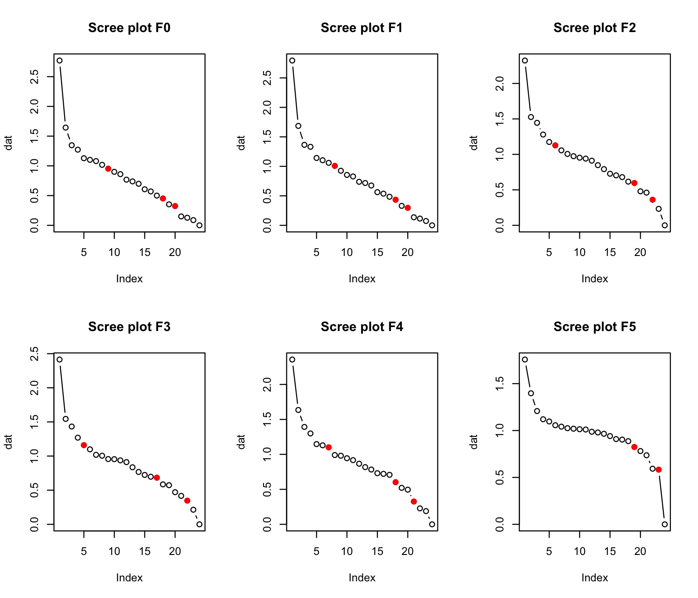<figcaption><b>Figure 8: Scree plots for F0-F5</b><br><br></figcaption></figure>

## Cumulative Variance plots


```r
par(mfrow= c(2,3))
for(i in 1:length(pcaL)){
  zs <- rep(1, dim(pcaL[[i]]$x)[2])
  zb <- rep(0, dim(pcaL[[i]]$x)[2])
  zs[el2[[i]]] <- 2
  zb[el2[[i]]] <- 2
  plot(100 * cumsum(pcaL[[i]]$sdev) / sum(pcaL[[i]]$sdev), 
       axes = TRUE,
       type='b', pch = 21, 
       bg = zb, col = zs, 
       xlab = 'd', ylab = '% Var',
       main = paste0('% Var Explained for F', i - 1))
  axis(side = 1, at = el2[[i]], padj = 1.25)
}
```

<figure>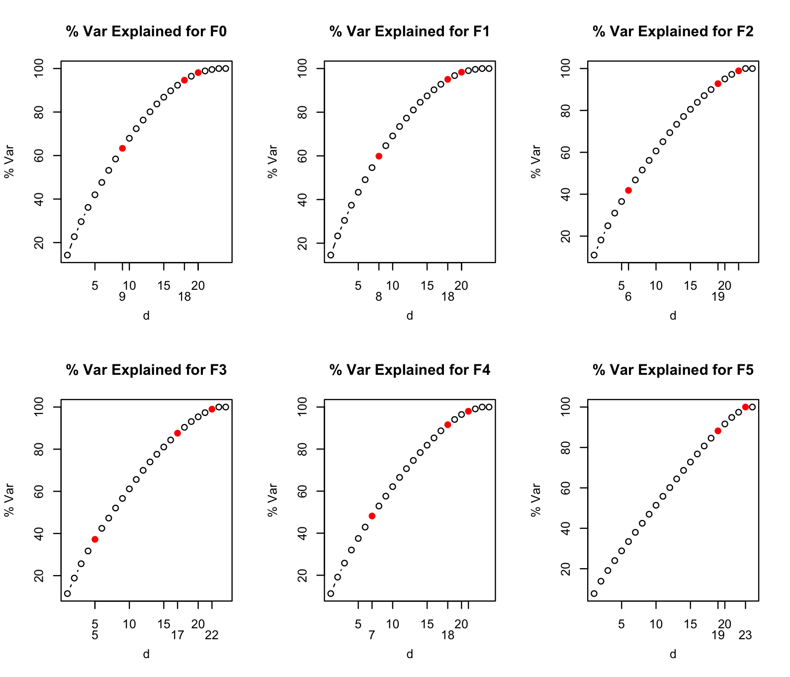<figcaption><b>Figure 9: % Variance Explained for  F0-F5</b><br><br></figcaption></figure>


```r
dat <- lapply(pcaL, function(x) data.frame(x$x))
type <- truth <- factor(exType, ordered = FALSE)
tr <- as.numeric(truth)

lda.fit <- list()

lda.fit[[1]] <- lda(type ~ ., data = dat[[1]][,1:el2[[1]][2]])
lda.fit[[2]] <- lda(type ~ ., data = dat[[2]][,1:el2[[2]][2]])
lda.fit[[3]] <- lda(type ~ ., data = dat[[3]][,1:el2[[3]][2]])
lda.fit[[4]] <- lda(type ~ ., data = dat[[4]][,1:el2[[4]][2]])
lda.fit[[5]] <- lda(type ~ ., data = dat[[5]][,1:el2[[5]][2]])
lda.fit[[6]] <- lda(type ~ ., data = dat[[6]][,1:el2[[6]][1]])

lda.pred <- lapply(lda.fit, predict)
```


```r
Lm <- 
foreach(i = 1:6, .combine=rbind) %:% 
foreach(j = 1:24, .combine=rbind) %do% {
  out <- NULL
  try({
    set.seed(12)
    ldapred <- as.numeric(predict(lda(type ~ ., dat[[i]][1:j]))$class)
    er <- 1/24 * sum(ldapred != as.numeric(truth))
    out <- data.frame(Lhat = er, d = j, feat = as.factor(i - 1))
    }, silent=TRUE)
  out
}

rownames(Lm) <- NULL

Lm <- data.table(Lm)

Lcvm <- 
foreach(i = 1:6, .combine=rbind) %:% 
foreach(j = 1:24, .combine=rbind) %do% {
  out <- NULL
  try({
    set.seed(12)
    ldapred <- as.numeric((lda(type ~ ., dat[[i]][1:j], CV = TRUE))$class)
    er <- 1/24 * sum(ldapred != as.numeric(truth))
    out <- data.frame(Lhat = er, d = j, feat = as.factor(i - 1))
    }, silent=TRUE)
  out
}

rownames(Lcvm) <- NULL

Lcvm <- data.table(Lcvm)


Lm$CV <- "Without CV"
Lcvm$CV <- "With CV"

tmp <- data.table(rbind(Lm, Lcvm))
tmp$CV <- factor(tmp$CV)
tmp$feat <- factor(tmp$feat)

size <- foreach(i = 1:6, .combine=c) %do% {
  size <- rep(1, 23)
  size[el2[[i]]] <- 2
  size
}

tmp$size <- factor(c(size,size))
levels(tmp$size) <- c("non-elbow", "elbow")
```

## Misclassification rates for LDA w/ and w/o CV.


```r
xvalVr <- 
ggplot(tmp, aes(x = d, y = Lhat, color = feat)) + 
  facet_grid(. ~ CV) +
  geom_line(alpha = 0.5) +
  geom_point(alpha = 0.65, aes(size = size)) + 
  geom_hline(yintercept = 0.64236) +
  ggtitle("FLD (LDA): xval vs. re-substitution")

print(xvalVr)
```

<figure>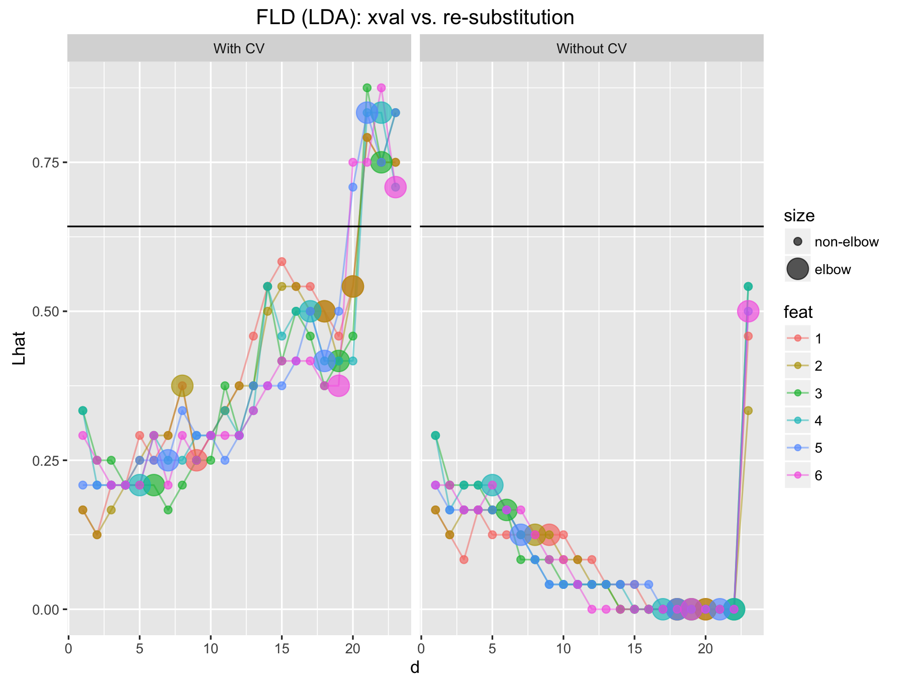<figcaption><b>Figure 10: Lhat vs $d$ for FLD on F0-F5 with an h-line at chance</b><br><br></figcaption></figure>

## Misclasifications vs $\hat d$.


```r
L <- 
foreach(i = 1:6) %:% 
foreach(j = 1:24, .combine = cbind) %do% {
  out <- NULL
  try({
    set.seed(12)
    ldapredcv <- as.numeric(lda(type ~ ., dat[[i]][1:j], CV = TRUE)$class)
    out <- ldapredcv
    }, silent=TRUE)
  out 
}

A <- lapply(L, function(x) { apply(x, 2, function(y) y != tr ) })
B <- lapply(A, function(x) { x[,1:10] } )

B <- lapply(B, function(x) { 
                 rownames(x) <- channel[ford]
                 colnames(x) <- paste0('d', 1:dim(x)[2]) 
                 return(x)
    }) 

par(mfrow = c(2,3))
corT <- paste0("Misclassifications ", "F", 0:5)
for(i in 1:6) {
corrplot(B[[i]], method='color', addgrid.col=1, 
         tl.col = ccol[ford],
         mar=3*c(1,0,1,1.5))
title(corT[i])
}
```

<figure><figcaption><b>Figure 11: Misclassifications using LDA with CV for various $d$.</b><br><br></figcaption></figure>

The above plots show when LDA with cross-validation misclassifies each
datapoint.  A misclassification is denoted by a filled block and columns
denote the embedding dimension $\hat d$.


```r
titlesvor <- paste("LDA decision boundaries for", paste0("F", 0:5))
voronoidf <- lapply(lapply(lda.fit, '[[', 3), data.frame)
#voronoidf <- data.frame(x=lda.fit$means[,1],y=lda.fit$means[,2])

#This creates the voronoi line segments

par(mfrow = c(3,2))
for(i in 1:length(dat)){
  plot(dat[[i]][,1:2], col=ccol3[ford], pch=20, cex=1.5)
  title(titlesvor[i])
  text(dat[[i]][,1:2], labels=rownames(dat[[i]]), 
       pos=ifelse(dat[[i]][,1]<max(dat[[i]][,1] -0.5),4,2), 
       col=ccol3[ford], cex=1.2)

  deldir(x = voronoidf[[i]][,1],y = voronoidf[[i]][,2], rw = c(-15,15,-15,15), 
       plotit=TRUE, add=TRUE, wl='te')
  text(voronoidf[[i]], labels=rownames(voronoidf[[i]]), cex=1.5, pos=1)
}
```

<figure>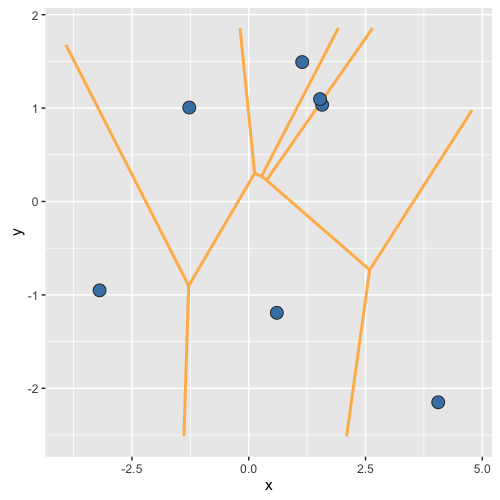<figcaption><b>Figure 12: Voronoi diagrams on class means from LDA on PCA of untransformed correlation matrices</b><br><br></figcaption></figure>

Recall that these are two-dimensional visualizations of a 24-dimensional
structure. 


```r
pred <- lapply(lapply(lda.fit, predict), '[[', 1)

tabN <- paste0("Table for F", 0:5)
for( i in 1:length(pred)) {
 print(tabN[i])
 print(table(truth,pred = pred[[i]]) )
}
```

```
# [1] "Table for F0"
#        pred
# truth   ex in other
#   ex    11  0     0
#   in     0  6     0
#   other  0  0     7
# [1] "Table for F1"
#        pred
# truth   ex in other
#   ex    11  0     0
#   in     0  6     0
#   other  0  0     7
# [1] "Table for F2"
#        pred
# truth   ex in other
#   ex    11  0     0
#   in     0  6     0
#   other  0  0     7
# [1] "Table for F3"
#        pred
# truth   ex in other
#   ex    11  0     0
#   in     0  6     0
#   other  0  0     7
# [1] "Table for F4"
#        pred
# truth   ex in other
#   ex    11  0     0
#   in     0  6     0
#   other  0  0     7
# [1] "Table for F5"
#        pred
# truth   ex in other
#   ex    11  0     0
#   in     0  6     0
#   other  0  0     7
```

```r
lda.err <- list()
for(i in 1:length(pred)) {
 pr <- as.numeric(pred[[i]])
 lda.err[[i]] <- sum( tr != pr ) / length(tr)
}

Reduce('c', lda.err)
```

```
# [1] 0 0 0 0 0 0
```

The above gives the LDA re-substitution error rates for each of the features.


<footer>
<p> [Back to Top][Data]</p>
</footer>
