# Introduction

> On Fri, Dec 11, 2015 at 11:53 AM, joshua vogelstein <jovo@jhu.edu> wrote:  
> we will get n=10^6 points, each in d=25 dimensions.  
> i want to hierarchically cluster them, in a ways:  

1. recursive k-means on the data, maybe 5 levels
2. compute approximate k-neighbors, svd in d=dimensions, and then #1
3. maybe some other ways.

# Data
> The corresponds to 24 channels x 6 features per synapse, ordered like
> c0f0,c0f1,c0f2,c0f3,c0f4,c0f5,c1f0,c1f1... etc
>
>f0 = integrated brightness  
>f1 = local brightness  
>f2 = distance to Center of Mass  
>f3 = moment of inertia around synapsin maxima  
>f4,f5 are features that I forget what they are.. would need to ask brad.   
>i would throw them out, I did so in my kohonen code (which you have, its in matlab).

and

> On Feb 8, 2016, at 2:00 PM, Kristina Micheva <kmicheva@stanford.edu> wrote:

* <FONT COLOR="red">_Excitatory presynaptic: 'Synap', 'Synap', 'VGlut1', 'VGlut1', 'VGlut2'_</FONT>,
* <FONT COLOR="gold">_Excitatory postsynaptic: 'psd', 'glur2', 'nmdar1', 'nr2b', 'NOS', 'Synapo'_</FONT> (but further away than PSD, gluR2, nmdar1 and nr2b)
* <FONT COLOR="green">_Inhibitory presynaptic: 'gad', 'VGAT', 'PV'_</FONT>,
* <FONT COLOR="springgreen">_Inhibitory postsynaptic: 'Gephyr', 'GABAR1', 'GABABR', 'NOS'_</FONT>,
* <FONT COLOR="deepskyblue">_At a very small number of inhibitory: 'Vglut3' (presynaptic), 'CR1'(presynaptic)_</FONT>,
* <FONT COLOR="mediumblue">_Other synapses:'5HT1A', 'TH', 'VACht'_</FONT>,
* <FONT COLOR="magenta">_Not at synapses: 'tubuli', 'DAPI'_</FONT>.


```r
feat <- fread("../Data/synapsinR_7thA.tif.Pivots.txt.2011Features.txt",showProgress=FALSE)
dim(feat)
```

```
## [1] 1119299     144
```

```r
channel <- c('Synap','Synap','VGlut1','VGlut1','VGlut2','Vglut3',
              'psd','glur2','nmdar1','nr2b','gad','VGAT',
              'PV','Gephyr','GABAR1','GABABR','CR1','5HT1A',
              'NOS','TH','VACht','Synapo','tubuli','DAPI')
channel.type <- c('ex.pre','ex.pre','ex.pre','ex.pre','ex.pre','in.pre.small',
                  'ex.post','ex.post','ex.post','ex.post','in.pre','in.pre',
                  'in.pre','in.post','in.post','in.post','in.pre.small','other',
                  'ex.post','other','other','ex.post','none','none')
nchannel <- length(channel)
nfeat <- ncol(feat) / nchannel
fchannel <- as.numeric(as.factor(channel.type))
ccol <- rainbow(max(fchannel))[fchannel]

# The corresponds to 24 channels x 6 features per synapse, ordered like
# c0f0,c0f1,c0f2,c0f3,c0f4,c0f5,c1f0,c1f1... etc
#
#f0 = integrated brightness
#f1 = local brightness
#f2 = distance to Center of Mass
#f3 = moment of inertia around synapsin maxima
#f4,f5 are features that I forget what they are.. would need to ask brad. 
#i would throw them out, I did so in my kohonen code (which you have, its in matlab).
fname <- as.vector(sapply(channel,function(x) paste0(x,1:6)))
names(feat) <- fname
fcol <- rep(ccol, each=6)
mycol <- colorpanel(100,"blue","grey","red")

# ignore f4,f5
f4 <- seq(5,ncol(feat),by=6)
f5 <- seq(6,ncol(feat),by=6)
#feat <- as.matrix(feat)[,-c(f4,f5)] 
feat <- subset(feat, select=-c(f4,f5))
nfeat <- ncol(feat) / nchannel
```


# Using "integrated brightness" features (`f0`) only

> On Jan 19, 2016, at 11:54 AM, jovo Vogelstein <jovo@jhu.edu> wrote:  
> the channels have an arbitrary independent linear transform,  
> so doing pca on the raw data is fairly meaningless.  
> also, the 6 features are fundamentally different, they are even different units,  
> so it is difficult to understand linear combinations across features.  
> converting to z-scores, or quantiles, is required to make sense of the resulting data.  
> so, i'd start with: just look at the first 24 features, which are the "integrated brightness" for each of the channels,  and linearly transform to z-scores.  
> and then just do iterated k-means.  


```r
f0 <- seq(1,ncol(feat),by=nfeat)
feat3 <- as.matrix(feat)[,f0]
zfeat3 <- scale(feat3,center=TRUE,scale=TRUE)

#mycol2 <- matlab.like(nchannel)
df <- melt(feat3)
names(df) <- c("ind","channel","value")
ggplot(df, aes(x=value)) + 
    scale_color_manual(values=ccol) +
    scale_x_log10(limits=c(1e+03,1e+06), breaks=c(1e+03,5e+03,1e+04,5e+04,1e+05,5e+05,1e+06))+
    geom_density(aes(group=channel, colour=channel))
```

```
## Warning: Removed 24091 rows containing non-finite values (stat_density).
```

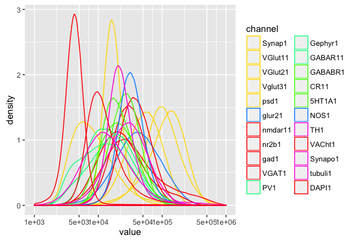

```r
pr2 <- prcomp(zfeat3)
(elb <- getElbows(pr2$x,3,plot=TRUE))
```

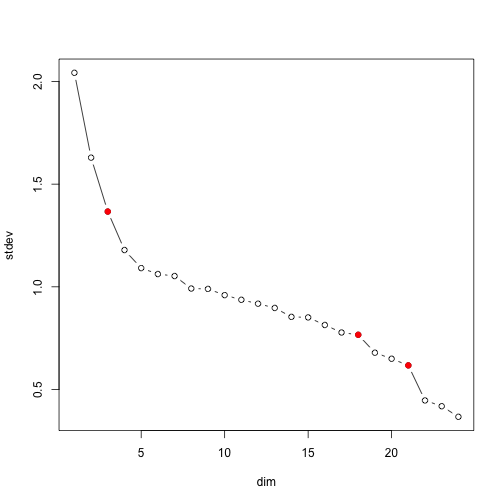

```
## [1]  3 18 21
```

```r
X <- pr2$x[,1:elb[3]]
```

```r
out <- doIDT(as.matrix(X),
             FUN="pamk",
             Dmax=ncol(X), ## max dim for clustering
             Kmax=9,  ## max K for clustering 
             maxsamp=nrow(X), ## max n for clustering
             samp=1, # 1: no sampling, else n/sample sampling
             maxdepth=5, # termination, maximum depth for idt
             minnum=100, # termination, minimum observations per branch
             verbose=FALSE)  
```

```
## number of leaves (clusters) =  194
```

```r
idtlab <- out$class
plot(X, pch=".",col=idtlab)
```

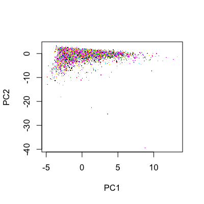

```r
feat4 <- aggregate(zfeat3, by=list(lab=idtlab), FUN=mean)
feat4 <- feat4[,-1]
#image(Matrix(as.matrix(feat4)),lwd=0, aspect="fill")

# cluster rows and columns
heatmap.2(as.matrix(feat4), trace="none", col=mycol, cexRow=0.5, keysize=1, colCol=ccol,srtCol=90)
```

```
##  [1] "#0092FFFF" "#4900FFFF" "#FF0000FF" "#FF00DBFF" "#FF00DBFF"
##  [6] "#FFDB00FF" "#0092FFFF" "#49FF00FF" "#00FF92FF" "#00FF92FF"
## [11] "#49FF00FF" "#49FF00FF" "#FF0000FF" "#FF0000FF" "#FF00DBFF"
## [16] "#00FF92FF" "#FF0000FF" "#4900FFFF" "#FFDB00FF" "#FFDB00FF"
## [21] "#FFDB00FF" "#FFDB00FF" "#FF0000FF" "#FF0000FF"
```

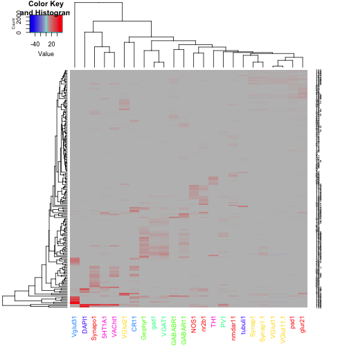

## Level 1


```r
# cut tree at level 1
idtall <- out$idtall
ppp <- sapply(idtall, function(x) x$depth==2)
qqq <- which(ppp==TRUE)
tree1 <- idtall[qqq]
(n1 <- sapply(tree1, function(x) length(x$ids)))
```

```
## [1] 709107 277157 126907   6128
```

```r
lab1 <- rep(1:length(n1), times=n1)
```

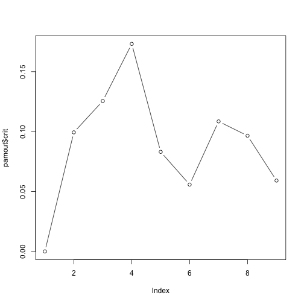
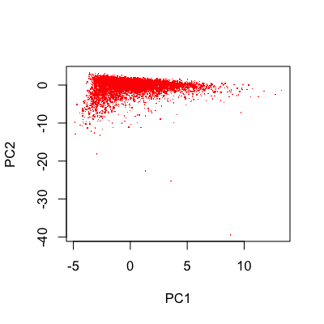

```r
feat5 <- aggregate(zfeat3, by=list(lab=lab1), FUN=mean)
feat5 <- feat5[,-1]
rownames(feat5) <- paste0("C",1:length(n1),", ",n1)
#image(Matrix(as.matrix(feat4)),lwd=0, aspect="fill")

# cluster rows and columns
heatmap.2(as.matrix(feat5), trace="none", col=mycol, keysize=1, colCol=ccol,srtCol=90,cexRow=0.7)
```

```
##  [1] "#FFDB00FF" "#FF0000FF" "#FFDB00FF" "#FFDB00FF" "#FF00DBFF"
##  [6] "#FF0000FF" "#49FF00FF" "#FF0000FF" "#49FF00FF" "#FF0000FF"
## [11] "#FFDB00FF" "#00FF92FF" "#4900FFFF" "#00FF92FF" "#00FF92FF"
## [16] "#FF0000FF" "#49FF00FF" "#FF0000FF" "#0092FFFF" "#FF00DBFF"
## [21] "#FFDB00FF" "#0092FFFF" "#4900FFFF" "#FF00DBFF"
```


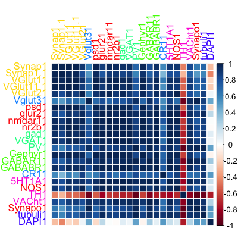
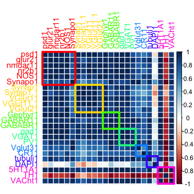

# Using "integrated brightness" features (`f0`) only and without "other"={`5HT1A`,`TH`,`VACht`} and "none"={`tubuli`,`DAPI`} channels


```
## [1] "5HT1A"  "TH"     "VACht"  "tubuli" "DAPI"
```

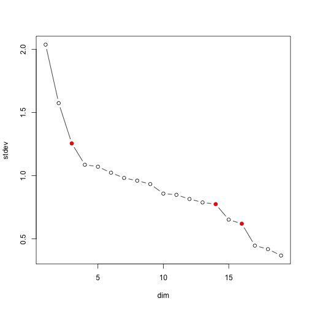

```
## [1]  3 14 16
```

```r
out <- doIDT(as.matrix(X),
             FUN="pamk",
             Dmax=ncol(X),    # max dim for clustering
             Kmax=9,          # max K for clustering 
             maxsamp=nrow(X), # max n for clustering
             samp=1,          # 1: no sampling, else n/sample sampling
             maxdepth=5,      # termination, maximum depth for idt
             minnum=100,      # termination, minimum observations per branch
             verbose=FALSE)  
```

```
## number of leaves (clusters) =  74
```

```r
idtlab <- out$class
plot(X, pch=".",col=idtlab)
```

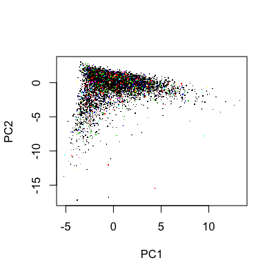

```
##  [1] "#0092FFFF" "#49FF00FF" "#49FF00FF" "#49FF00FF" "#FFDB00FF"
##  [6] "#0092FFFF" "#FFDB00FF" "#FFDB00FF" "#FF0000FF" "#FF0000FF"
## [11] "#FF0000FF" "#FF0000FF" "#FF0000FF" "#FF0000FF" "#FFDB00FF"
## [16] "#FFDB00FF" "#00FF92FF" "#00FF92FF" "#00FF92FF"
```

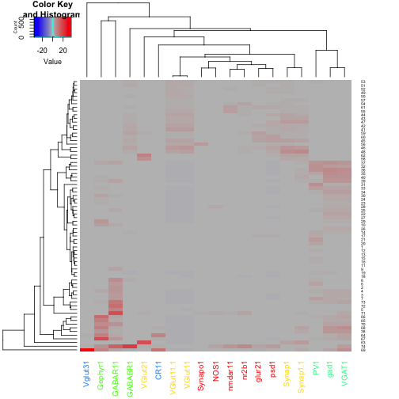

## Level 1


```
## [1] 790708 150883 172509   5199
```
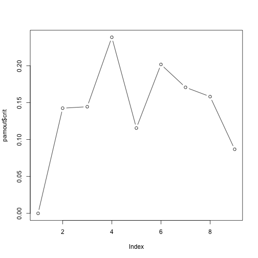

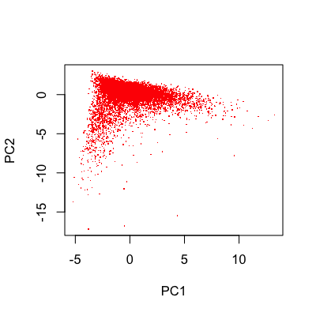

```
##  [1] "#00FF92FF" "#00FF92FF" "#FFDB00FF" "#FF0000FF" "#FF0000FF"
##  [6] "#49FF00FF" "#49FF00FF" "#FFDB00FF" "#0092FFFF" "#FF0000FF"
## [11] "#0092FFFF" "#FF0000FF" "#FFDB00FF" "#FFDB00FF" "#FFDB00FF"
## [16] "#FF0000FF" "#49FF00FF" "#FF0000FF" "#00FF92FF"
```

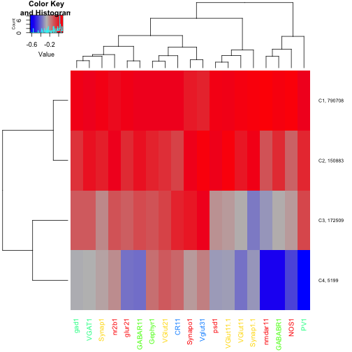
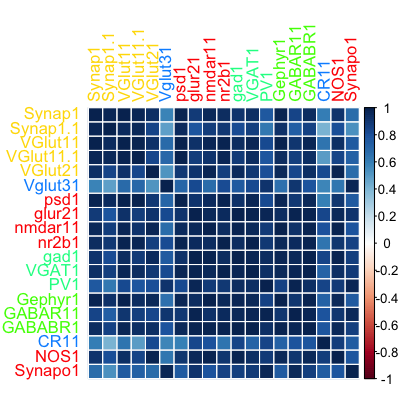
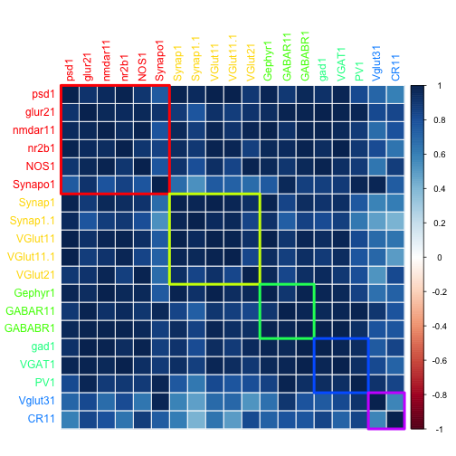

## Using "scaled" == "z-transformed"

On Feb 10, 2016, at 6:47 AM, jovo Vogelstein <jovo@jhu.edu> wrote:

> i wonder if there are simply too many non-synapses, and their variance
is big, so they are swamping the signal.

> 3) i'm scared of using ZG, pamk, etc.  can we *just* do 2-means on the
"raw" data, where "raw" means z-transformed and only using the 5
groups you did, but no embedding.  and then plot the scaled means plot
and correlations?


```
##  [1] "#00FF92FF" "#00FF92FF" "#00FF92FF" "#49FF00FF" "#FF0000FF"
##  [6] "#49FF00FF" "#0092FFFF" "#0092FFFF" "#FF0000FF" "#FFDB00FF"
## [11] "#FF0000FF" "#FF0000FF" "#FF0000FF" "#49FF00FF" "#FFDB00FF"
## [16] "#FF0000FF" "#FFDB00FF" "#FFDB00FF" "#FFDB00FF"
```

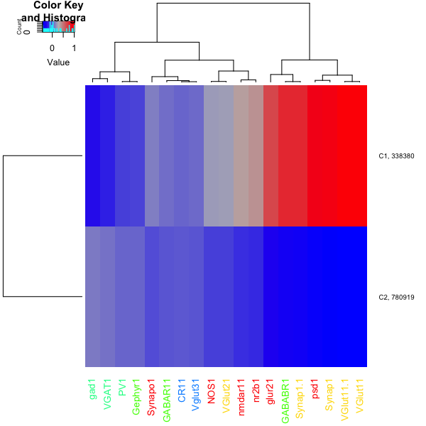
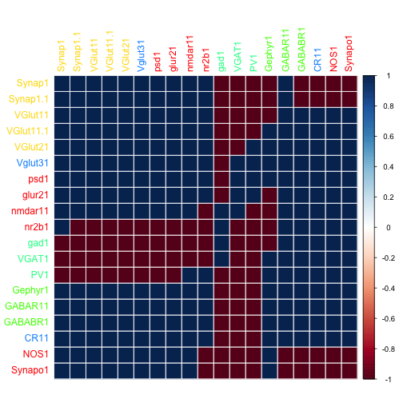
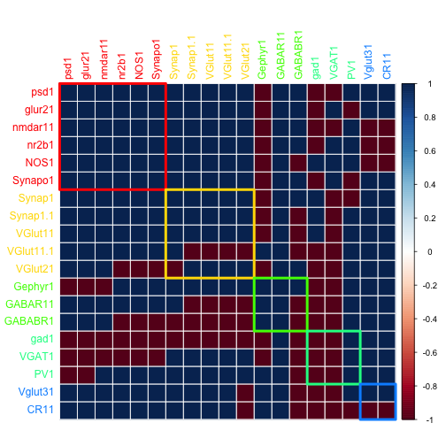


