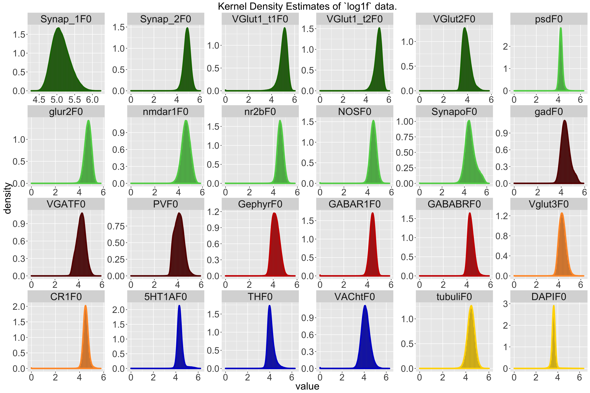
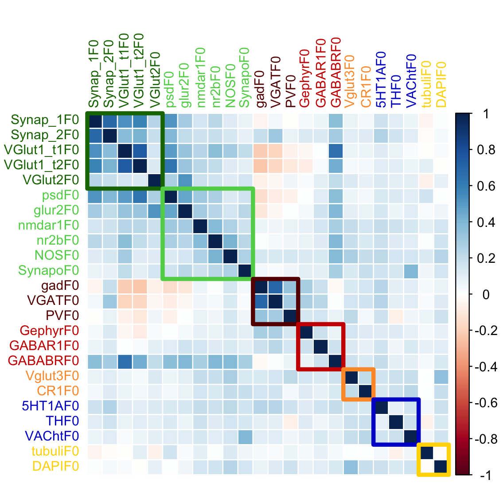
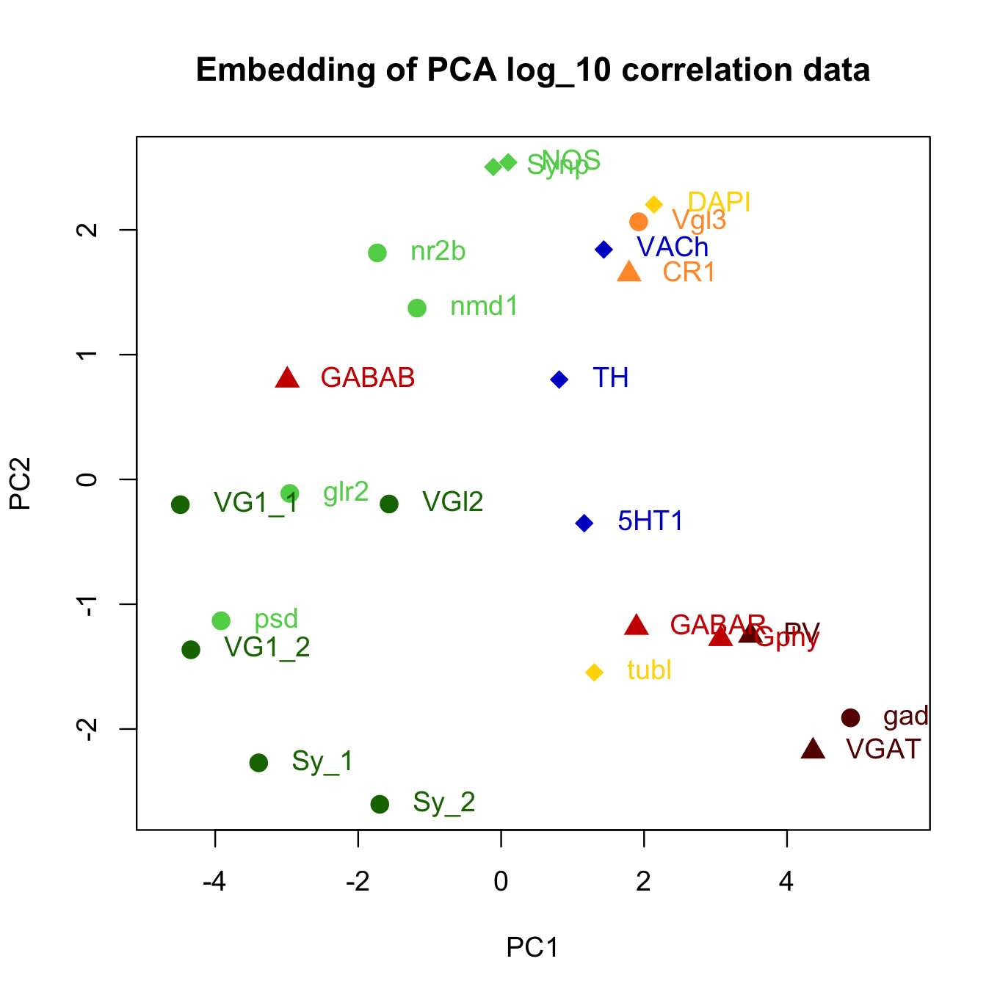
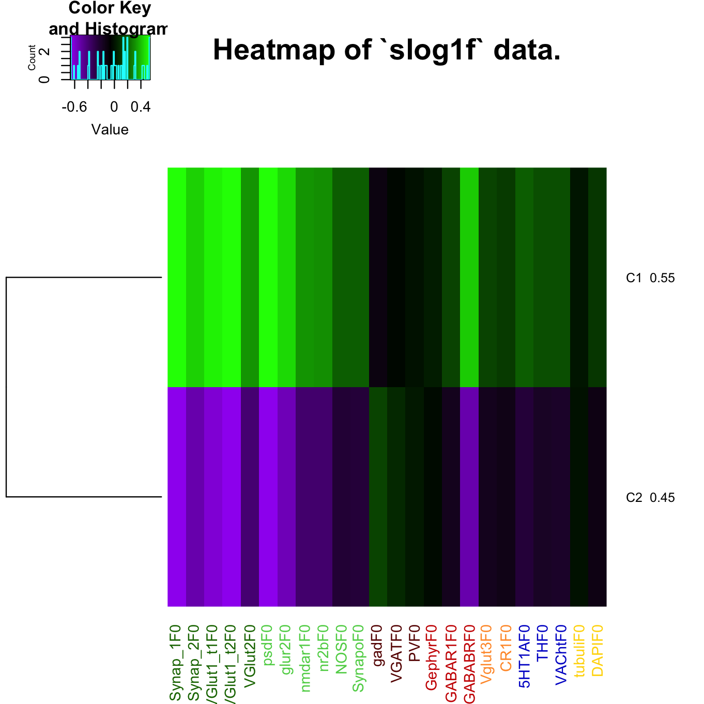
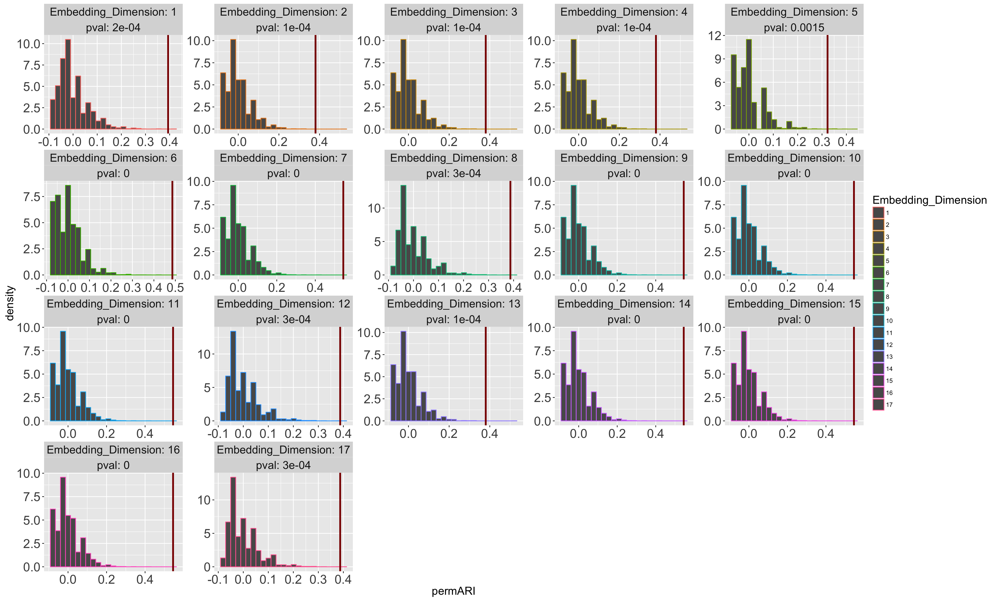
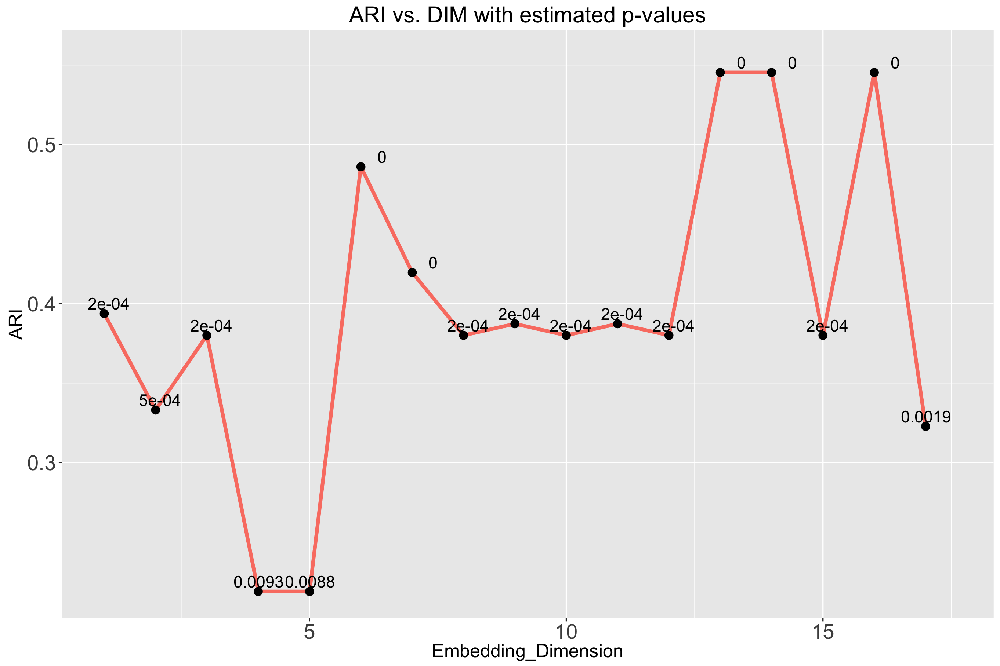

# Synapse Clustering: Y2 Progress Report
Jesse Leigh Patsolic  
`r Sys.Date()`  


# Introduction

> On Fri, Dec 11, 2015 at 11:53 AM, joshua vogelstein <jovo@jhu.edu> wrote:  
> we will get n=10^6 points, each in d=25 dimensions.  
> i want to hierarchically cluster them, in a ways:  

1. recursive k-means on the data, maybe 5 levels
2. compute approximate k-neighbors, svd in d=dimensions, and then #1
3. maybe some other ways.

# Data
> This corresponds to 24 channels x 6 features per synapse, ordered like
> c0f0,c0f1,c0f2,c0f3,c0f4,c0f5,c1f0,c1f1... etc
>
>f0 = integrated brightness  
>f1 = local brightness  
>f2 = distance to Center of Mass  
>f3 = moment of inertia around synapsin maxima  
>f4,f5 are features that I forget what they are.. would need to ask brad.   
>i would throw them out, I did so in my kohonen code (which you have, its in matlab).

and

> On Feb 8, 2016, at 2:00 PM, Kristina Micheva <kmicheva@stanford.edu> wrote:

* <FONT COLOR=#197300>_Excitatory presynaptic: 'Synap', 'Synap', 'VGlut1', 'VGlut1', 'VGlut2'_</FONT>,
* <FONT COLOR=#5ed155>_Excitatory postsynaptic: 'psd', 'glur2', 'nmdar1', 'nr2b', 'NOS', 'Synapo'_</FONT> (but further away than PSD, gluR2, nmdar1 and nr2b)
* <FONT COLOR=#660000>_Inhibitory presynaptic: 'gad', 'VGAT', 'PV'_</FONT>,
* <FONT COLOR=#ff3333>_Inhibitory postsynaptic: 'Gephyr', 'GABAR1', 'GABABR', 'NOS'_</FONT>,
* <FONT COLOR=#ff9933>_At a very small number of inhibitory: 'Vglut3' (presynaptic), 'CR1'(presynaptic)_</FONT>,
* <FONT COLOR="mediumblue">_Other synapses:'5HT1A', 'TH', 'VACht'_</FONT>,
* <FONT COLOR="gold">_Not at synapses: 'tubuli', 'DAPI'_</FONT>.

and 

> On March 10, 2016, 00:29:04 (UTC), Kristina Micheva <kmicheva@stanford.edu> wrote:

There are 2 different Synap channels (2 different antibodies were
used), so that part is fine.
And 2 different VGluT1 channels (same antibody but done at different
times)
The NOS channel is the same, so count it as one even though it appears
twice. It is listed two times because it can be found at both excitatory
and inhibitory synapses. This is where your count of 25 comes, even
though there are 24 channels.
I would also add the 2 Synap channels to the Inhibitory presynaptic
category - there is supposed to be synapsin there, but at lower levels
compared to excitatory presynaptic category.

- Note:  The order of the channels are given by line `227` in the `kohenen.m` file which can be found in the dropbox folder. 
- `Synap` and `Synap` have been augmented to `Synap_1` and `Synap_2` for clarity. 
- `VGlut1` and `VGlut1` have been augmented to `VGlut1_t1` and `VGlut1_t2` to distinguish between the different times of collection (which are unknown).


```r
feat <- fread("../Data/synapsinR_7thA.tif.Pivots.txt.2011Features.txt",showProgress=FALSE)
dim(feat)
```

```
# [1] 1119299     144
```

```r
channel <- c('Synap_1','Synap_2','VGlut1_t1','VGlut1_t2','VGlut2','Vglut3',
              'psd','glur2','nmdar1','nr2b','gad','VGAT',
              'PV','Gephyr','GABAR1','GABABR','CR1','5HT1A',
              'NOS','TH','VACht','Synapo','tubuli','DAPI')
channel.type <- c('ex.pre','ex.pre','ex.pre','ex.pre','ex.pre','in.pre.small',
                  'ex.post','ex.post','ex.post','ex.post','in.pre','in.pre',
                  'in.pre','in.post','in.post','in.post','in.pre.small','other',
                  'ex.post','other','other','ex.post','none','none')
nchannel <- length(channel)
nfeat <- ncol(feat) / nchannel
ffchannel <- (factor(channel.type,
    levels= c("ex.pre","ex.post","in.pre","in.post","in.pre.small","other","none")
    ))
fchannel <- as.numeric(factor(channel.type,
    levels= c("ex.pre","ex.post","in.pre","in.post","in.pre.small","other","none")
    ))
ford <- order(fchannel)
Syncol <- c("#197300","#5ed155","#660000","#cc0000","#ff9933","mediumblue","gold")
ccol <- Syncol[fchannel]

exType <- factor(c(rep("ex",11),rep("in",6),rep("other",7)),ordered=TRUE)
exCol<-exType;levels(exCol) <- c("#197300","#990000","mediumblue");
exCol <- as.character(exCol)

fname <- as.vector(sapply(channel,function(x) paste0(x,paste0("F",0:5))))
names(feat) <- fname
fcol <- rep(ccol, each=6)
mycol <- colorpanel(100, "purple", "black", "green")
mycol2 <- matlab.like(nchannel)
```

## Transformations

We will consider only the `f0` (integrated brightness) features, and will transform the raw data by
scaling and filtering.


```r
f0 <- seq(1,ncol(feat),by=nfeat)
featF0 <- subset(feat, select=f0)
f01e3 <- 1e3*data.table(apply(X=featF0, 2, function(x){((x-min(x))/(max(x)-min(x)))}))

fs <- f01e3

### Taking log_10 on data + 1.
log1f <- log10(featF0 + 1)
slog1f <- scale(log1f, center=TRUE,scale=TRUE)
```

We now have the following data sets:

- `featF0`: Raw data looking only at the integrated brightness features.
- `fs`: Raw data scaled between $[0,1000]$.
- `slog1f`: The raw data, plus one, $log_{10}$, then scaled by
  subtractng mean and dividing by statndard deviation.

### Kernel Density Estimates of the marginals


```r
df <- melt(as.matrix(log1f))
names(df) <- c("ind","channel","value")
df$type <- factor(rep(ffchannel,each=dim(fs)[1]),levels=levels(ffchannel))

lvo <- c(1:5,7:10,19,22,11:16,6,17,18,20,21,23,24)
levels(df$channel)<-levels(df$channel)[lvo]

ts <- 22

gg1 <- ggplot(df, aes(x=value)) + 
    scale_color_manual(values=ccol[lvo]) +
    scale_fill_manual(values=ccol[lvo]) +
    geom_histogram(aes(y=..density..,group=channel,colour=channel),bins=100) +
    geom_density(aes(group=channel, color=channel),size=1.5) +
    facet_wrap( ~ channel, scale='free', ncol=6) +
    theme(plot.title=element_text(size=ts),
          axis.title.x=element_text(size=ts),
          axis.title.y=element_text(size=ts),
          legend.title=element_text(size=ts),
          legend.text=element_text(size=ts-2),
          axis.text=element_text(size=ts-2),
          strip.text=element_text(size=ts), 
          legend.position='none')+
    ggtitle("Kernel Density Estimates of `log1f` data.")

print(gg1)
```

<figure><figcaption><b>Figure 1: Kernel density estimates for each channel, on `log` data.</b><br><br></figcaption></figure>


## Correlations


```r
tmp <- as.numeric(table(fchannel))
cmatslog1f <- cor(slog1f)
corrplot(cmatslog1f[ford,ford],method="color",tl.col=ccol[ford], tl.cex=0.8)
corrRect(tmp,col=Syncol,lwd=4)
```

<figure><figcaption><b>Figure 2: Correlation on log_10  data, reordered by synapse type.</b><br><br></figcaption></figure>
### PCA on the Correlation Matrix


```r
pcaLog <- prcomp(cmatslog1f,scale=TRUE, center=TRUE)
elLog <- getElbows(pcaLog$sdev, plot=FALSE) 
```

We run K-means for $K=3$ on the PCA embedded in $\mathbb{R}^3$ of the correlation matrix.


```r
K1 <- c(3)  ## The set of K's.

## Run kmeans on the untransformed data
kvecCor <- foreach(i = K1) %dopar% {
    set.seed(2^13 - 1)
    kmeans(pcaLog$x[,1:3],centers=i)
}
```
### Plots of embeddings


```r
plot(pcaLog$x[,1:2],
     col=ccol,
     pch=as.numeric(exType)+15,
     cex=1.5,
     xlim=c(min(pcaLog$x[,1])-0.2,max(pcaLog$x[,1])+0.7),
     main="Embedding of PCA log_10 correlation data")
text(pcaLog$x[,1:2],col=ccol,label=abbreviate(channel),offset=1, pos=4)
```

<figure><figcaption></figcaption></figure>


```r
pca <- pcaLog$x[,1:3]
rgl::plot3d(pca[,1],pca[,2],pca[,3],type='s',col=ccol, size=1, main="Log")
rgl::rgl.texts(pca[,1],pca[,2],pca[,3],abbreviate(channel), col=ccol, adj=c(0,1.5))
subid <- currentSubscene3d()
rglwidget(elementId="plot3dLog")
```

<!--html_preserve--><div id="plot3dLog" style="width:908px;height:908px;" class="rglWebGL html-widget"></div>
<script type="application/json" data-for="plot3dLog">{"x":{"material":{"color":["#197300","#197300","#197300","#197300","#197300","#FF9933","#5ED155","#5ED155","#5ED155","#5ED155","#660000","#660000","#660000","#CC0000","#CC0000","#CC0000","#FF9933","#0000CD","#5ED155","#0000CD","#0000CD","#5ED155","#FFD700","#FFD700"],"alpha":1,"lit":true,"ambient":"#000000","specular":"#FFFFFF","emission":"#000000","shininess":50,"smooth":true,"front":"filled","back":"filled","size":3,"lwd":1,"fog":true,"point_antialias":false,"line_antialias":false,"texture":null,"textype":"rgb","texmipmap":false,"texminfilter":"linear","texmagfilter":"linear","texenvmap":false,"depth_mask":true,"depth_test":"less"},"rootSubscene":1,"objects":{"28":{"id":28,"type":"spheres","material":{"fog":false},"vertices":[[-3.39182114601135,-2.27109670639038,0.656724393367767],[-1.69754791259766,-2.60349535942078,1.42130172252655],[-4.48793411254883,-0.202551424503326,0.430361151695251],[-4.34017896652222,-1.3648989200592,-0.716880619525909],[-1.56729328632355,-0.196844756603241,-1.09952795505524],[1.92431938648224,2.06457686424255,0.984056532382965],[-3.91787767410278,-1.1330019235611,-0.827346503734589],[-2.95746397972107,-0.112002536654472,-0.792052030563354],[-1.17620873451233,1.37282967567444,0.593183636665344],[-1.73187613487244,1.81524384021759,1.68998348712921],[4.88882446289062,-1.91025424003601,0.75267618894577],[4.36339855194092,-2.17829585075378,1.0740954875946],[3.48899865150452,-1.25020337104797,0.628915965557098],[3.07091498374939,-1.27674269676208,-0.270633071660995],[1.89284253120422,-1.18715167045593,-0.369651913642883],[-2.99234485626221,0.794857203960419,1.36505258083344],[1.79005563259125,1.64624738693237,-0.802343845367432],[1.16247415542603,-0.350813806056976,1.74415242671967],[0.0992156937718391,2.54106569290161,1.81841206550598],[0.812258958816528,0.800241649150848,-1.30901741981506],[1.43625056743622,1.84220731258392,-2.33946537971497],[-0.110030122101307,2.50411367416382,-1.58317124843597],[1.30361700057983,-1.54668581485748,-3.51740455627441],[2.13740587234497,2.20265579223633,0.46857887506485]],"colors":[[0.0980392172932625,0.450980395078659,0,1],[0.0980392172932625,0.450980395078659,0,1],[0.0980392172932625,0.450980395078659,0,1],[0.0980392172932625,0.450980395078659,0,1],[0.0980392172932625,0.450980395078659,0,1],[1,0.600000023841858,0.200000002980232,1],[0.368627458810806,0.819607853889465,0.333333343267441,1],[0.368627458810806,0.819607853889465,0.333333343267441,1],[0.368627458810806,0.819607853889465,0.333333343267441,1],[0.368627458810806,0.819607853889465,0.333333343267441,1],[0.400000005960464,0,0,1],[0.400000005960464,0,0,1],[0.400000005960464,0,0,1],[0.800000011920929,0,0,1],[0.800000011920929,0,0,1],[0.800000011920929,0,0,1],[1,0.600000023841858,0.200000002980232,1],[0,0,0.803921580314636,1],[0.368627458810806,0.819607853889465,0.333333343267441,1],[0,0,0.803921580314636,1],[0,0,0.803921580314636,1],[0.368627458810806,0.819607853889465,0.333333343267441,1],[1,0.843137264251709,0,1],[1,0.843137264251709,0,1]],"radii":[[0.115012496709824]],"centers":[[-3.39182114601135,-2.27109670639038,0.656724393367767],[-1.69754791259766,-2.60349535942078,1.42130172252655],[-4.48793411254883,-0.202551424503326,0.430361151695251],[-4.34017896652222,-1.3648989200592,-0.716880619525909],[-1.56729328632355,-0.196844756603241,-1.09952795505524],[1.92431938648224,2.06457686424255,0.984056532382965],[-3.91787767410278,-1.1330019235611,-0.827346503734589],[-2.95746397972107,-0.112002536654472,-0.792052030563354],[-1.17620873451233,1.37282967567444,0.593183636665344],[-1.73187613487244,1.81524384021759,1.68998348712921],[4.88882446289062,-1.91025424003601,0.75267618894577],[4.36339855194092,-2.17829585075378,1.0740954875946],[3.48899865150452,-1.25020337104797,0.628915965557098],[3.07091498374939,-1.27674269676208,-0.270633071660995],[1.89284253120422,-1.18715167045593,-0.369651913642883],[-2.99234485626221,0.794857203960419,1.36505258083344],[1.79005563259125,1.64624738693237,-0.802343845367432],[1.16247415542603,-0.350813806056976,1.74415242671967],[0.0992156937718391,2.54106569290161,1.81841206550598],[0.812258958816528,0.800241649150848,-1.30901741981506],[1.43625056743622,1.84220731258392,-2.33946537971497],[-0.110030122101307,2.50411367416382,-1.58317124843597],[1.30361700057983,-1.54668581485748,-3.51740455627441],[2.13740587234497,2.20265579223633,0.46857887506485]],"ignoreExtent":false,"flags":3},"30":{"id":30,"type":"text","material":{"lit":false,"fog":false},"vertices":[[0.200445175170898,3.52787828445435,2.84191060066223]],"colors":[[0,0,0,1]],"texts":[["Log"]],"cex":[[1]],"adj":[[0.5,0.5]],"centers":[[0.200445175170898,3.52787828445435,2.84191060066223]],"family":[["sans"]],"font":[[1]],"ignoreExtent":true,"flags":40},"31":{"id":31,"type":"text","material":{"lit":false,"fog":false},"vertices":[[0.200445175170898,-3.59030795097351,-4.54090309143066]],"colors":[[0,0,0,1]],"texts":[["pca[, 1]"]],"cex":[[1]],"adj":[[0.5,0.5]],"centers":[[0.200445175170898,-3.59030795097351,-4.54090309143066]],"family":[["sans"]],"font":[[1]],"ignoreExtent":true,"flags":40},"32":{"id":32,"type":"text","material":{"lit":false,"fog":false},"vertices":[[-6.28655242919922,-0.0312148332595825,-4.54090309143066]],"colors":[[0,0,0,1]],"texts":[["pca[, 2]"]],"cex":[[1]],"adj":[[0.5,0.5]],"centers":[[-6.28655242919922,-0.0312148332595825,-4.54090309143066]],"family":[["sans"]],"font":[[1]],"ignoreExtent":true,"flags":40},"33":{"id":33,"type":"text","material":{"lit":false,"fog":false},"vertices":[[-6.28655242919922,-3.59030795097351,-0.849496304988861]],"colors":[[0,0,0,1]],"texts":[["pca[, 3]"]],"cex":[[1]],"adj":[[0.5,0.5]],"centers":[[-6.28655242919922,-3.59030795097351,-0.849496304988861]],"family":[["sans"]],"font":[[1]],"ignoreExtent":true,"flags":40},"34":{"id":34,"type":"text","material":{"lit":false},"vertices":[[-3.39182114601135,-2.27109670639038,0.656724393367767],[-1.69754791259766,-2.60349535942078,1.42130172252655],[-4.48793411254883,-0.202551424503326,0.430361151695251],[-4.34017896652222,-1.3648989200592,-0.716880619525909],[-1.56729328632355,-0.196844756603241,-1.09952795505524],[1.92431938648224,2.06457686424255,0.984056532382965],[-3.91787767410278,-1.1330019235611,-0.827346503734589],[-2.95746397972107,-0.112002536654472,-0.792052030563354],[-1.17620873451233,1.37282967567444,0.593183636665344],[-1.73187613487244,1.81524384021759,1.68998348712921],[4.88882446289062,-1.91025424003601,0.75267618894577],[4.36339855194092,-2.17829585075378,1.0740954875946],[3.48899865150452,-1.25020337104797,0.628915965557098],[3.07091498374939,-1.27674269676208,-0.270633071660995],[1.89284253120422,-1.18715167045593,-0.369651913642883],[-2.99234485626221,0.794857203960419,1.36505258083344],[1.79005563259125,1.64624738693237,-0.802343845367432],[1.16247415542603,-0.350813806056976,1.74415242671967],[0.0992156937718391,2.54106569290161,1.81841206550598],[0.812258958816528,0.800241649150848,-1.30901741981506],[1.43625056743622,1.84220731258392,-2.33946537971497],[-0.110030122101307,2.50411367416382,-1.58317124843597],[1.30361700057983,-1.54668581485748,-3.51740455627441],[2.13740587234497,2.20265579223633,0.46857887506485]],"colors":[[0.0980392172932625,0.450980395078659,0,1],[0.0980392172932625,0.450980395078659,0,1],[0.0980392172932625,0.450980395078659,0,1],[0.0980392172932625,0.450980395078659,0,1],[0.0980392172932625,0.450980395078659,0,1],[1,0.600000023841858,0.200000002980232,1],[0.368627458810806,0.819607853889465,0.333333343267441,1],[0.368627458810806,0.819607853889465,0.333333343267441,1],[0.368627458810806,0.819607853889465,0.333333343267441,1],[0.368627458810806,0.819607853889465,0.333333343267441,1],[0.400000005960464,0,0,1],[0.400000005960464,0,0,1],[0.400000005960464,0,0,1],[0.800000011920929,0,0,1],[0.800000011920929,0,0,1],[0.800000011920929,0,0,1],[1,0.600000023841858,0.200000002980232,1],[0,0,0.803921580314636,1],[0.368627458810806,0.819607853889465,0.333333343267441,1],[0,0,0.803921580314636,1],[0,0,0.803921580314636,1],[0.368627458810806,0.819607853889465,0.333333343267441,1],[1,0.843137264251709,0,1],[1,0.843137264251709,0,1]],"texts":[["Sy_1"],["Sy_2"],["VG1_1"],["VG1_2"],["VGl2"],["Vgl3"],["psd"],["glr2"],["nmd1"],["nr2b"],["gad"],["VGAT"],["PV"],["Gphy"],["GABAR"],["GABAB"],["CR1"],["5HT1"],["NOS"],["TH"],["VACh"],["Synp"],["tubl"],["DAPI"]],"cex":[[1]],"adj":[[0,1.5]],"centers":[[-3.39182114601135,-2.27109670639038,0.656724393367767],[-1.69754791259766,-2.60349535942078,1.42130172252655],[-4.48793411254883,-0.202551424503326,0.430361151695251],[-4.34017896652222,-1.3648989200592,-0.716880619525909],[-1.56729328632355,-0.196844756603241,-1.09952795505524],[1.92431938648224,2.06457686424255,0.984056532382965],[-3.91787767410278,-1.1330019235611,-0.827346503734589],[-2.95746397972107,-0.112002536654472,-0.792052030563354],[-1.17620873451233,1.37282967567444,0.593183636665344],[-1.73187613487244,1.81524384021759,1.68998348712921],[4.88882446289062,-1.91025424003601,0.75267618894577],[4.36339855194092,-2.17829585075378,1.0740954875946],[3.48899865150452,-1.25020337104797,0.628915965557098],[3.07091498374939,-1.27674269676208,-0.270633071660995],[1.89284253120422,-1.18715167045593,-0.369651913642883],[-2.99234485626221,0.794857203960419,1.36505258083344],[1.79005563259125,1.64624738693237,-0.802343845367432],[1.16247415542603,-0.350813806056976,1.74415242671967],[0.0992156937718391,2.54106569290161,1.81841206550598],[0.812258958816528,0.800241649150848,-1.30901741981506],[1.43625056743622,1.84220731258392,-2.33946537971497],[-0.110030122101307,2.50411367416382,-1.58317124843597],[1.30361700057983,-1.54668581485748,-3.51740455627441],[2.13740587234497,2.20265579223633,0.46857887506485]],"family":[["sans"]],"font":[[1]],"ignoreExtent":false,"flags":40},"5":{"id":5,"type":"light","vertices":[[0,0,1]],"colors":[[1,1,1,1],[1,1,1,1],[1,1,1,1]],"viewpoint":true,"finite":false},"6":{"id":6,"type":"background","colors":[[1,1,1,1]],"centers":[[0,0,0]],"sphere":false,"fogtype":"none"},"29":{"id":29,"type":"bboxdeco","material":{"color":"#000000","front":"lines","back":"lines","fog":false},"vertices":[[-4,null,null],[-2,null,null],[0,null,null],[2,null,null],[4,null,null],[null,-2,null],[null,-1,null],[null,0,null],[null,1,null],[null,2,null],[null,null,-3],[null,null,-2],[null,null,-1],[null,null,0],[null,null,1]],"colors":[[0,0,0,1]],"draw_front":true,"newIds":[42,43,44,45,46,47,48]},"1":{"id":1,"type":"subscene","par3d":{"antialias":8,"FOV":30,"ignoreExtent":false,"listeners":1,"mouseMode":{"left":"trackball","right":"zoom","middle":"fov","wheel":"pull"},"observer":[0,0,30.2227153778076],"modelMatrix":[[0.7359419465065,0,0,-0.147516012191772],[0,0.458774924278259,1.21529352664948,1.04670774936676],[0,-1.26047372817993,0.442330688238144,-29.886302947998],[0,0,0,1]],"projMatrix":[[3.73205065727234,0,0,0],[0,3.73205065727234,0,0],[0,0,-3.86370348930359,-108.949394226074],[0,0,-1,0]],"skipRedraw":false,"userMatrix":[[1,0,0,0],[0,0.342020143325668,0.939692620785909,0],[0,-0.939692620785909,0.342020143325668,0],[0,0,0,1]],"scale":[0.7359419465065,1.34136807918549,1.29328835010529],"viewport":{"x":0,"y":0,"width":1,"height":1},"zoom":1,"bbox":[-4.64421319961548,5.04510354995728,-2.68923807144165,2.62680840492249,-3.60633492469788,1.90734231472015],"windowRect":[0,45,256,301],"family":"sans","font":1,"cex":1,"useFreeType":true,"fontname":"/Users/JLP/R_libs/rgl/fonts/FreeSans.ttf","maxClipPlanes":6},"embeddings":{"viewport":"replace","projection":"replace","model":"replace"},"objects":[6,29,28,30,31,32,33,34,5,42,43,44,45,46,47,48],"subscenes":[],"flags":1195},"42":{"id":42,"type":"lines","material":{"lit":false,"front":"lines","back":"lines"},"vertices":[[-4,-2.76897883415222,-3.689040184021],[4,-2.76897883415222,-3.689040184021],[-4,-2.76897883415222,-3.689040184021],[-4,-2.90586686134338,-3.83101725578308],[-2,-2.76897883415222,-3.689040184021],[-2,-2.90586686134338,-3.83101725578308],[0,-2.76897883415222,-3.689040184021],[0,-2.90586686134338,-3.83101725578308],[2,-2.76897883415222,-3.689040184021],[2,-2.90586686134338,-3.83101725578308],[4,-2.76897883415222,-3.689040184021],[4,-2.90586686134338,-3.83101725578308]],"colors":[[0,0,0,1]],"centers":[[0,-2.76897883415222,-3.689040184021],[-4,-2.8374228477478,-3.76002883911133],[-2,-2.8374228477478,-3.76002883911133],[0,-2.8374228477478,-3.76002883911133],[2,-2.8374228477478,-3.76002883911133],[4,-2.8374228477478,-3.76002883911133]],"ignoreExtent":true,"origId":29,"flags":128},"43":{"id":43,"type":"text","material":{"lit":false,"front":"lines","back":"lines"},"vertices":[[-4,-3.17964339256287,-4.11497163772583],[-2,-3.17964339256287,-4.11497163772583],[0,-3.17964339256287,-4.11497163772583],[2,-3.17964339256287,-4.11497163772583],[4,-3.17964339256287,-4.11497163772583]],"colors":[[0,0,0,1]],"texts":[["-4"],["-2"],["0"],["2"],["4"]],"cex":[[1]],"adj":[[0.5,0.5]],"centers":[[-4,-3.17964339256287,-4.11497163772583],[-2,-3.17964339256287,-4.11497163772583],[0,-3.17964339256287,-4.11497163772583],[2,-3.17964339256287,-4.11497163772583],[4,-3.17964339256287,-4.11497163772583]],"family":[["sans"]],"font":[[1]],"ignoreExtent":true,"origId":29,"flags":40},"44":{"id":44,"type":"lines","material":{"lit":false,"front":"lines","back":"lines"},"vertices":[[-4.78955316543579,-2,-3.689040184021],[-4.78955316543579,2,-3.689040184021],[-4.78955316543579,-2,-3.689040184021],[-5.03905296325684,-2,-3.83101725578308],[-4.78955316543579,-1,-3.689040184021],[-5.03905296325684,-1,-3.83101725578308],[-4.78955316543579,0,-3.689040184021],[-5.03905296325684,0,-3.83101725578308],[-4.78955316543579,1,-3.689040184021],[-5.03905296325684,1,-3.83101725578308],[-4.78955316543579,2,-3.689040184021],[-5.03905296325684,2,-3.83101725578308]],"colors":[[0,0,0,1]],"centers":[[-4.78955316543579,0,-3.689040184021],[-4.91430282592773,-2,-3.76002883911133],[-4.91430282592773,-1,-3.76002883911133],[-4.91430282592773,0,-3.76002883911133],[-4.91430282592773,1,-3.76002883911133],[-4.91430282592773,2,-3.76002883911133]],"ignoreExtent":true,"origId":29,"flags":128},"45":{"id":45,"type":"text","material":{"lit":false,"front":"lines","back":"lines"},"vertices":[[-5.53805255889893,-2,-4.11497163772583],[-5.53805255889893,-1,-4.11497163772583],[-5.53805255889893,0,-4.11497163772583],[-5.53805255889893,1,-4.11497163772583],[-5.53805255889893,2,-4.11497163772583]],"colors":[[0,0,0,1]],"texts":[["-2"],["-1"],["0"],["1"],["2"]],"cex":[[1]],"adj":[[0.5,0.5]],"centers":[[-5.53805255889893,-2,-4.11497163772583],[-5.53805255889893,-1,-4.11497163772583],[-5.53805255889893,0,-4.11497163772583],[-5.53805255889893,1,-4.11497163772583],[-5.53805255889893,2,-4.11497163772583]],"family":[["sans"]],"font":[[1]],"ignoreExtent":true,"origId":29,"flags":40},"46":{"id":46,"type":"lines","material":{"lit":false,"front":"lines","back":"lines"},"vertices":[[-4.78955316543579,-2.76897883415222,-3],[-4.78955316543579,-2.76897883415222,1],[-4.78955316543579,-2.76897883415222,-3],[-5.03905296325684,-2.90586686134338,-3],[-4.78955316543579,-2.76897883415222,-2],[-5.03905296325684,-2.90586686134338,-2],[-4.78955316543579,-2.76897883415222,-1],[-5.03905296325684,-2.90586686134338,-1],[-4.78955316543579,-2.76897883415222,0],[-5.03905296325684,-2.90586686134338,0],[-4.78955316543579,-2.76897883415222,1],[-5.03905296325684,-2.90586686134338,1]],"colors":[[0,0,0,1]],"centers":[[-4.78955316543579,-2.76897883415222,-1],[-4.91430282592773,-2.8374228477478,-3],[-4.91430282592773,-2.8374228477478,-2],[-4.91430282592773,-2.8374228477478,-1],[-4.91430282592773,-2.8374228477478,0],[-4.91430282592773,-2.8374228477478,1]],"ignoreExtent":true,"origId":29,"flags":128},"47":{"id":47,"type":"text","material":{"lit":false,"front":"lines","back":"lines"},"vertices":[[-5.53805255889893,-3.17964339256287,-3],[-5.53805255889893,-3.17964339256287,-2],[-5.53805255889893,-3.17964339256287,-1],[-5.53805255889893,-3.17964339256287,0],[-5.53805255889893,-3.17964339256287,1]],"colors":[[0,0,0,1]],"texts":[["-3"],["-2"],["-1"],["0"],["1"]],"cex":[[1]],"adj":[[0.5,0.5]],"centers":[[-5.53805255889893,-3.17964339256287,-3],[-5.53805255889893,-3.17964339256287,-2],[-5.53805255889893,-3.17964339256287,-1],[-5.53805255889893,-3.17964339256287,0],[-5.53805255889893,-3.17964339256287,1]],"family":[["sans"]],"font":[[1]],"ignoreExtent":true,"origId":29,"flags":40},"48":{"id":48,"type":"lines","material":{"lit":false,"front":"lines","back":"lines"},"vertices":[[-4.78955316543579,-2.76897883415222,-3.689040184021],[-4.78955316543579,2.70654916763306,-3.689040184021],[-4.78955316543579,-2.76897883415222,1.99004745483398],[-4.78955316543579,2.70654916763306,1.99004745483398],[-4.78955316543579,-2.76897883415222,-3.689040184021],[-4.78955316543579,-2.76897883415222,1.99004745483398],[-4.78955316543579,2.70654916763306,-3.689040184021],[-4.78955316543579,2.70654916763306,1.99004745483398],[-4.78955316543579,-2.76897883415222,-3.689040184021],[5.19044351577759,-2.76897883415222,-3.689040184021],[-4.78955316543579,-2.76897883415222,1.99004745483398],[5.19044351577759,-2.76897883415222,1.99004745483398],[-4.78955316543579,2.70654916763306,-3.689040184021],[5.19044351577759,2.70654916763306,-3.689040184021],[-4.78955316543579,2.70654916763306,1.99004745483398],[5.19044351577759,2.70654916763306,1.99004745483398],[5.19044351577759,-2.76897883415222,-3.689040184021],[5.19044351577759,2.70654916763306,-3.689040184021],[5.19044351577759,-2.76897883415222,1.99004745483398],[5.19044351577759,2.70654916763306,1.99004745483398],[5.19044351577759,-2.76897883415222,-3.689040184021],[5.19044351577759,-2.76897883415222,1.99004745483398],[5.19044351577759,2.70654916763306,-3.689040184021],[5.19044351577759,2.70654916763306,1.99004745483398]],"colors":[[0,0,0,1]],"centers":[[-4.78955316543579,-0.0312148332595825,-3.689040184021],[-4.78955316543579,-0.0312148332595825,1.99004745483398],[-4.78955316543579,-2.76897883415222,-0.849496364593506],[-4.78955316543579,2.70654916763306,-0.849496364593506],[0.200445175170898,-2.76897883415222,-3.689040184021],[0.200445175170898,-2.76897883415222,1.99004745483398],[0.200445175170898,2.70654916763306,-3.689040184021],[0.200445175170898,2.70654916763306,1.99004745483398],[5.19044351577759,-0.0312148332595825,-3.689040184021],[5.19044351577759,-0.0312148332595825,1.99004745483398],[5.19044351577759,-2.76897883415222,-0.849496364593506],[5.19044351577759,2.70654916763306,-0.849496364593506]],"ignoreExtent":true,"origId":29,"flags":128}},"width":257,"height":257,"sphereVerts":{"material":[],"it":[[0,6,7,19,4,8,6,22,2,7,8,25,7,6,8,26,0,7,9,27,2,10,7,24,5,9,10,32,9,7,10,33,0,11,6,18,3,12,11,37,4,6,12,39,6,11,12,40,0,9,11,34,5,13,9,31,3,11,13,44,11,9,13,45,1,14,15,47,2,8,14,49,4,15,8,21,15,14,8,52,1,16,14,46,5,10,16,55,2,14,10,29,14,16,10,57,1,15,17,58,4,12,15,51,3,17,12,36,17,15,12,62,1,17,16,53,3,13,17,61,5,16,13,42,16,17,13,65],[18,20,19,18,21,23,22,21,24,26,25,24,20,23,26,20,19,28,27,19,29,30,24,29,31,33,32,31,28,30,33,28,34,35,18,34,36,38,37,36,22,40,39,22,35,38,40,35,27,41,34,27,42,43,31,42,37,45,44,37,41,43,45,41,46,48,47,46,25,50,49,25,51,52,21,51,48,50,52,48,53,54,46,53,32,56,55,32,49,57,29,49,54,56,57,54,47,59,58,47,39,60,51,39,61,62,36,61,59,60,62,59,58,63,53,58,44,64,61,44,55,65,42,55,63,64,65,63],[19,18,20,20,22,21,23,23,25,24,26,26,26,20,23,23,27,19,28,28,24,29,30,30,32,31,33,33,33,28,30,30,18,34,35,35,37,36,38,38,39,22,40,40,40,35,38,38,34,27,41,41,31,42,43,43,44,37,45,45,45,41,43,43,47,46,48,48,49,25,50,50,21,51,52,52,52,48,50,50,46,53,54,54,55,32,56,56,29,49,57,57,57,54,56,56,58,47,59,59,51,39,60,60,36,61,62,62,62,59,60,60,53,58,63,63,61,44,64,64,42,55,65,65,65,63,64,64]],"vb":[[-1,1,0,0,0,0,-0.707106781186548,-0.707106781186548,0,-0.707106781186548,0,-0.707106781186548,0,0,0.707106781186548,0.707106781186548,0.707106781186548,0.707106781186548,-0.934997526317783,-0.934997526317783,-0.770440042047682,0,-0.354654234120539,-0.450789386304495,-0.354654234120539,0,-0.450789386304495,-0.934997526317783,-0.770440042047682,0,-0.450789386304495,-0.354654234120539,0,-0.450789386304495,-0.934997526317783,-0.770440042047682,0,-0.354654234120539,-0.450789386304495,0,-0.450789386304495,-0.770440042047682,0,-0.450789386304495,0,-0.450789386304495,0.934997526317783,0.934997526317783,0.770440042047682,0.354654234120539,0.450789386304495,0.354654234120539,0.450789386304495,0.934997526317783,0.770440042047682,0.354654234120539,0.450789386304495,0.450789386304495,0.934997526317783,0.770440042047682,0.450789386304495,0.354654234120539,0.450789386304495,0.770440042047682,0.450789386304495,0.450789386304495],[0,0,-1,1,0,0,0,-0.707106781186548,-0.707106781186548,0,-0.707106781186548,0.707106781186548,0.707106781186548,0.707106781186548,-0.707106781186548,0,0,0.707106781186548,0,-0.354654234120539,-0.450789386304495,-0.354654234120539,0,-0.450789386304495,-0.934997526317783,-0.934997526317783,-0.770440042047682,0,-0.450789386304495,-0.934997526317783,-0.770440042047682,0,-0.354654234120539,-0.450789386304495,0.354654234120539,0.450789386304495,0.934997526317783,0.934997526317783,0.770440042047682,0.354654234120539,0.450789386304495,0.450789386304495,0.354654234120539,0.450789386304495,0.934997526317783,0.770440042047682,-0.354654234120539,0,-0.450789386304495,-0.934997526317783,-0.770440042047682,0,-0.450789386304495,0,-0.450789386304495,0,-0.450789386304495,-0.770440042047682,0.354654234120539,0.450789386304495,0.450789386304495,0.934997526317783,0.770440042047682,0.450789386304495,0.770440042047682,0.450789386304495],[0,0,0,0,-1,1,-0.707106781186548,0,-0.707106781186548,0.707106781186548,0.707106781186548,0,-0.707106781186548,0.707106781186548,0,-0.707106781186548,0.707106781186548,0,-0.354654234120539,0,-0.450789386304495,-0.934997526317783,-0.934997526317783,-0.770440042047682,0,-0.354654234120539,-0.450789386304495,0.354654234120539,0.450789386304495,0.354654234120539,0.450789386304495,0.934997526317783,0.934997526317783,0.770440042047682,0,-0.450789386304495,-0.354654234120539,0,-0.450789386304495,-0.934997526317783,-0.770440042047682,0.450789386304495,0.934997526317783,0.770440042047682,0.354654234120539,0.450789386304495,0,-0.354654234120539,-0.450789386304495,0,-0.450789386304495,-0.934997526317783,-0.770440042047682,0.354654234120539,0.450789386304495,0.934997526317783,0.770440042047682,0.450789386304495,0,-0.450789386304495,-0.770440042047682,0,-0.450789386304495,0.450789386304495,0.450789386304495,0.770440042047682]],"primitivetype":"triangle"}},"evals":[],"jsHooks":[]}</script><!--/html_preserve-->

## K-Means Level 1

Next we run K-means with $K=3$.

** <FONT COLOR=#ff3333> Note that a seed is being set for the random initialization of K-means. </FONT> **


```r
K2 <- c(2)  ## The set of K's.

## Run kmeans on the untransformed data
kvecslog1f <- foreach(i = K2) %dopar% {
    set.seed(2^13 - 1)
    kmeans(slog1f,centers=i)
}
```


### Heat maps: scaled data.

For the following we manualy choose 2 clusters.


```r
## Formatting data for heatmap
aggslog1f <- aggregate(slog1f,by=list(lab=kvecslog1f[[1]]$cluster),FUN=mean)
aggslog1f <- as.matrix(aggslog1f[,-1])
rownames(aggslog1f) <- clusterFraction(kvecslog1f[[1]])

ford <- order(fchannel)
```


```r
heatmap.2(as.matrix(aggslog1f[,ford]),dendrogram='row',Colv=NA,trace="none", col=mycol,colCol=ccol[ford],cexRow=0.8, keysize=1.25,symkey=FALSE,symbreaks=FALSE,scale="none", srtCol=90,main="Heatmap of `slog1f` data.") 
```

```
#  [1] "#197300"    "#197300"    "#197300"    "#197300"    "#197300"   
#  [6] "#5ed155"    "#5ed155"    "#5ed155"    "#5ed155"    "#5ed155"   
# [11] "#5ed155"    "#660000"    "#660000"    "#660000"    "#cc0000"   
# [16] "#cc0000"    "#cc0000"    "#ff9933"    "#ff9933"    "mediumblue"
# [21] "mediumblue" "mediumblue" "gold"       "gold"
```

<figure><figcaption><b>Figure 3: Heatmap of the cluster means vs channels. Rows and columns are rearranged according to synapse type.</b><br><br></figcaption></figure>

Percentage of data within cluster is presented on the right side of the heatmap.


# Exploring pair-wise relationships with `GABABR`


```r
### Sampling to reduce size
set.seed(2^13 - 2)
s1 <- sample(dim(slog1f)[1],2.5e5)
dlog1f <- data.table(log1f[s1,])

## re-formatting data for use in lattice 
dlog1f2 <- data.table(stack(dlog1f, select=-GABABRF0))[,.(values)]
dlog1f2$GABABR <- dlog1f$GABABRF0

### Adding relationship factor variables
nd <- paste0("GABABR","~",abbreviate(channel[-16]))

dlog1f2$ind <- factor(rep(nd,each=dim(dlog1f)[1]), ordered=TRUE,levels=nd)
head(dlog1f2$ind)
```

```
# [1] GABABR~Sy_1 GABABR~Sy_1 GABABR~Sy_1 GABABR~Sy_1 GABABR~Sy_1 GABABR~Sy_1
# 23 Levels: GABABR~Sy_1 < GABABR~Sy_2 < GABABR~VG1_1 < ... < GABABR~DAPI
```

```r
names(dlog1f2) <- c("x","y","g")

rg1 <- xyplot(y ~ x | g, data=dlog1f2,
       as.table=TRUE,
       colramp=BTC,
       pch='.',
       scales = list(y = list(relation = "free"),x = list(relation = "free")),
       panel=function(x,y,...){
           panel.hexbinplot(x,y,...)
           panel.loess(x,y,col='red', lwd=2,...)
        }
       )
```

<figure><figcaption><b>Figure 4: Lattice plot of pairwise regressions involving `GABABR`</b><br><br></figcaption></figure>


# ARI


Here we consider the channel types to be the "ground truth" and computer
the Adjusted Rand Index of between that and the output from k-means.


## Approximate permutation test.

```r
levels(ffchannel) <- c(rep("ex", 2), rep("in", 2), rep("other", 3))
levels(ffchannel)
```

```
# [1] "ex"    "in"    "other"
```

```r
truth <- as.numeric(ffchannel)
```


Makeing a data.table of the permutation data for ggplot.

```r
DT <- data.table(avd(pcaLog, elLog[2], truth),key='Embedding_Dimension') 

DT <- DT[,phat := sum(permARI>=ari)/length(permARI),by=Embedding_Dimension]

ua <- DT[,unique(ari),by=Embedding_Dimension]
arid <- data.frame(Embedding_Dimension=as.numeric(ua$Emb),
                   ARI=ua$V1,
                   phat=DT[,unique(phat),by=Embedding_Dimension]$V1)
```


```r
gg3 <- ggplot(data=DT,aes(x=permARI, y=..density..,color=Embedding_Dimension,label=phat)) + 
        #geom_histogram(binwidth=3.49*sd(DT$permARI)*length(DT$permARI)^(-1/3)) +
        geom_histogram(bins=25)+
        geom_vline(aes(xintercept=ari),colour='darkred',size=1.2)+
        #geom_text(aes(x=(ari-ari/2),y=7))+
        facet_wrap(~Embedding_Dimension+phat,scale='free',labeller=label_both)
print(gg3)
```

<figure><figcaption><b>Figure 5: ARI Permutation Tests</b><br><br></figcaption></figure>


```r
gg5 <- ggplot(data=arid,aes(x=Embedding_Dimension,y=ARI,label=phat)) + 
        geom_line(size=1.5,colour='salmon') + geom_point(size=3) +
            geom_text(hjust='right',vjust='top',nudge_x=0.5,nudge_y=0.01,size=5)+
            theme(axis.text=element_text(size=18),
                  title=element_text(size=16)) + 
            ggtitle("ARI vs. DIM with estimated p-values")
print(gg5)
```

<figure><figcaption></figcaption></figure>


<footer>
<p> [Back to top][Introduction]</p>
</footer>
