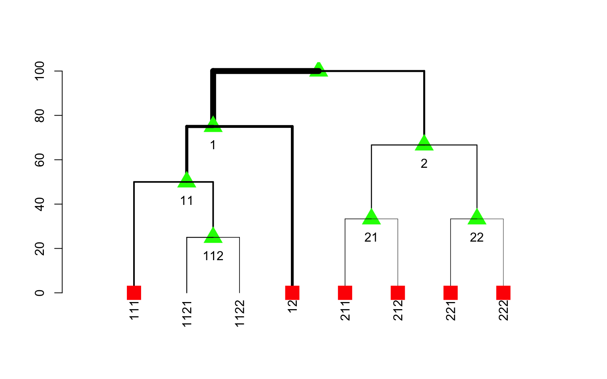
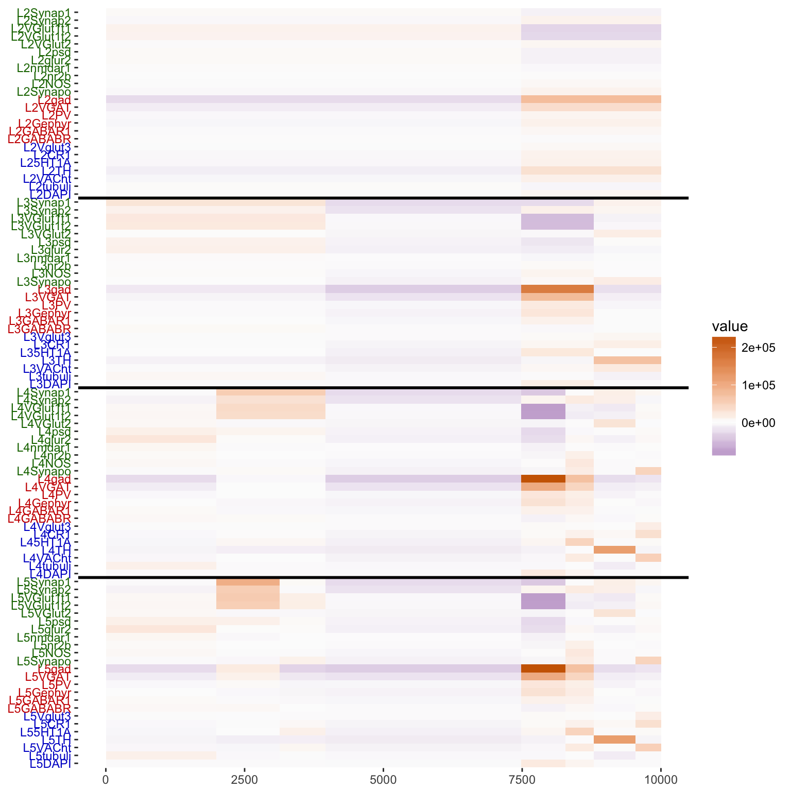
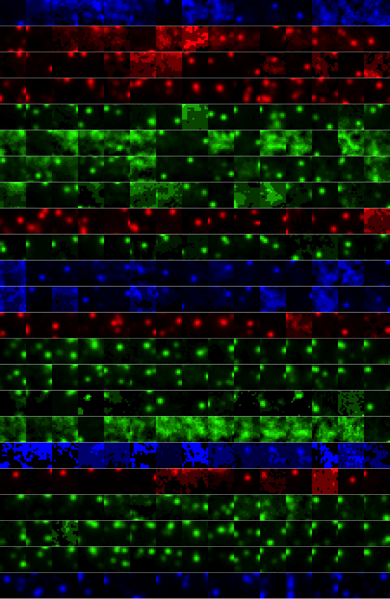

## TRA Synaptomes of Mouse and Man: Year 3 Progress

The JHU team has created a set of statistical exploratory data analysis
notebooks to investigate the data, as viewed in different viewpoints.
The viewpoints that have been selected and refined as an ongoing
development of a top ten checklist of data summaries that should be
viewed before any other data analysis is run.

Binary Hierarchical Gaussian Mixture Modeling has been one of the
viewpoints explored.  The Bayesian information criterion is used to
determine if the data should be split into two clusters or left as one.
Performing this on different transformations of the data yield differing
numbers of clusters, some of which appear to be quite interesting
statistically.  Data-points in each cluster are taken and plotted as
"synaptograms" --- a method of viewing multi-dimensional data in
2-dimensions --- to visually assess reliability of taxonomies from
clustering results. 

A statistical toolbox, called "meda", that includes all of the functions
being used for this analysis is available on GitHub as a library for the
R programming language and environment for statistical computing.

## TRA Synaptomes of Mouse and Man: Year 4 Goals

We anticipate iterating on feedback from field experts on the biological
value of the clusters obtained to determine if they will be of use in
taxonomic discovery.  

## TRA Addendum Report:

### Joshua T. Vogelstein, PhD, The Johns Hopkins University, Statistics
#### Technical progress update summary:

- Continued exploratory data analysis on the
  synapsinR_7thA.tif.Pivots.txt.2011Features.txt data and analysis on a
  portion of the Weiler dataset as well. 
- Clustering with binary hierarchical Gaussian mixture modeling to 5 levels has been performed and refined. 
- Synaptograms are now available for use in cluster assessment.
- Lab notebooks can be found here: http://docs.neurodata.io/meda/
- Development of an [R](https://www.r-project.org) package is ongoing
  with development version available on GitHub https://github.com/neurodata/meda  

#### Detailed Technical progress:

Clustering is being performed by using the Bayesian information
criterion (BIC) to choose if the data should be split into two clusters
via Gaussian mixture modeling.  This procedure is repeated on each
successive cluster until BIC decides to stop or we have reached 5
levels.  This structure is represented as a dendrogram. 

The cluster means across features are then plotted in a stacked fashion
that corresponds to the cluster dendrogram.

Representative putative synapses from each cluster can then be viewed as
synaptograms to determine the usefulness of this procedure.

#### Statement of Work / Major Tasks / Milestones:

##### Statistics -- Milestone 6.1 (a): Mouse Taxonomy Learned

- Begin to explore screening analytics & deploy on existing screens to obtain feedback from other consortium members. (JHU) **DONE**
- Build synaptome learning toolbox v0.1 to operate on high dimensional synapse features. (JHU) **DONE**
- Begin to explore reliability of learned synaptomes across datasets and address batch effects. (JHU, Duke) **DONE**
- Apply Synaptome Learning Toolkit to existing data. (JHU)  **Applied
  Kristina15 and portions of the Weier dataset. DONE**

##### Statistics -- Milestone 6.2 (b): Principles of mouse elucidated

- Complete preliminary exploration of existing dataset. (JHU) **DONE**
- Deploy an R package for use on new datasets. (JHU) **DONE**
- Run analyses on Weiler datasets. (JHU, Duke) **Partially Done**
- Combine results across datasets to reveal consistent principles of synaptic diversity in mammalian cortex. (JHU, Duke) **Not completed**

#### Anticipated work for next period:

We anticipate iterating on feedback from field experts on the biological
value of the clusters obtained to determine if they will be of use in
taxonomic discovery.  
